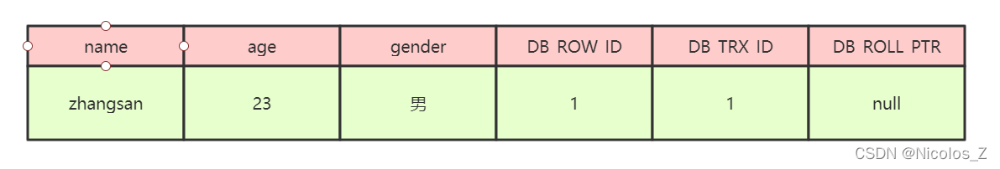
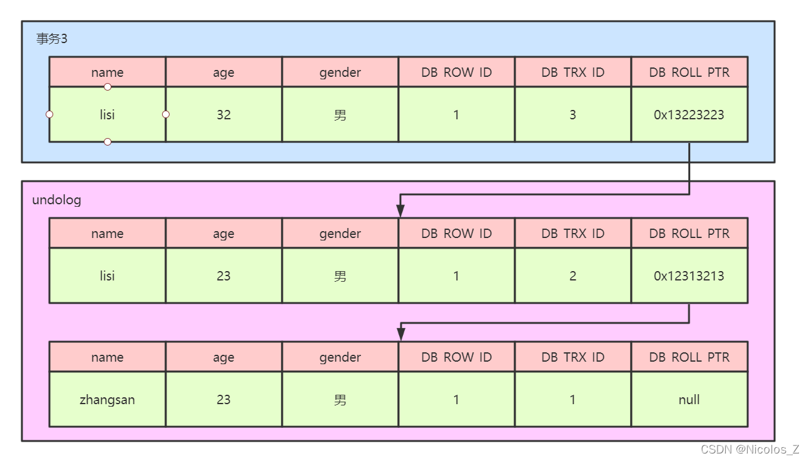
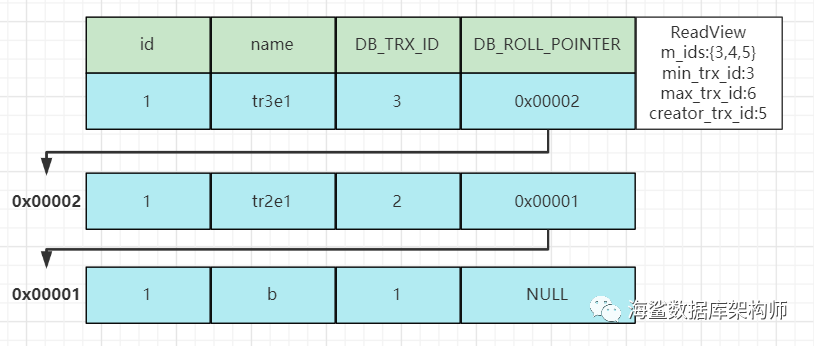
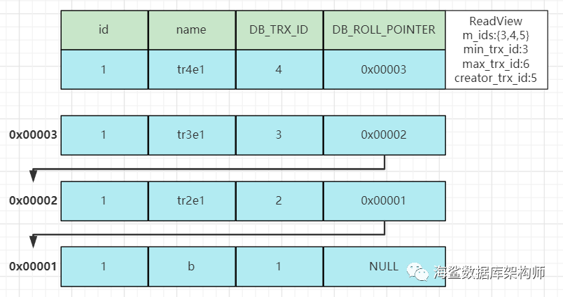

---
title:
---
#  mysql 事务管理

## 概念
### ACID是衡量事务的四个特性：
* 原子性：（Atomicity）(同时)
* 一致性：（Consistency）(弱一致性，最终一致性)
* 隔离性：（Isolation）
* 持久性：（Durability）
### mysql 日志
MySQL的日志有很多种，如二进制日志、错误日志、查询日志、慢查询日志等，此外InnoDB存储引擎还提供了两种事务日志：redo log(重做日志)和undo log(回滚日志)
* binlog 
* Redo log
* Undo log (记录的是和执行语句相反的sql)

## 事务的执行过程
mysql 日志


## 原理
 1. undo log。实现`原子性`的关键，当发生回滚时，InnoDB会根据undo log的内容做与之前相反的工作
 2. 利用MVCC实现一致性非锁定读，这就有保证在同一个事务中多次读取相同的数据返回的结果是一样的，解决了`不可重复读`的问题
 3. 利用Gap Locks和Next-Key可以阻止其它事务在锁定区间内插入数据，因此解决了`幻读`问题
### 出现的问题
#### 更新丢失
#### 脏读
在一个事务中读到了另一个事务`未提交`的记录 
#### 幻读
 mysql 的幻读并非什么读取两次返回结果集不同，而是事务在插入事先检测不存在的记录时，惊奇的发现这些数据已经存在了，之前的检测读获取到的数据如同鬼影一般。
#### 不可重复读
一个事务读取`同一条(同一范围)记录`2次，得到的结果不一致
#### 死锁

### 事务隔离级别
* Read Uncommitted（读取未提交内容):这会带来脏读，幻读，不可重复读，基本没用
* Read Committed（读取提交内容）: ，但仍然存在不可重复读和幻读问题。
* Repeatable Read（可重读）:同一个事务中多次读取相同的数据返回的结果是一样的。其避免了脏读和不可重复读问题，但幻读依然存在。
* Serializable（可串行化）: 事务串行执行.


### 用到的技术
#### 乐观锁
使用数据版本（Version）记录机制实现，这是乐观锁最常用的一种实现方式。何谓数据版本？即为数据增加一个版本标识，一般是通过为数据库表增加一个数字类型的 “version” 字段来实现。当读取数据时，将version字段的值一同读出，数据每更新一次，对此version值加一。当我们提交更新的时候，判断数据库表对应记录的当前版本信息与第一次取出来的version值进行比对，如果数据库表当前版本号与第一次取出来的version值相等，则予以更新，否则认为是过期数据。
解决更新丢失
#### 行锁(读锁、写锁)
RC级别，提供了读锁和写锁，解决了赃读问题。
#### 间隙锁
RR级别，在已有读锁和写锁的基础上，增加了gap锁，即间隙锁，解决了幻读的问题

对`批量操作较多`，且操作结果有要求的系统，需要使用RR级别，如果都是按主健单条处理数据，完全不需要这个级别。
### MVCC
mvcc的实现原理主要依赖于记录中的三个隐藏字段，undolog，read view来实现的。

**MVCC原理** 
InnoDB会给数据库中的每一行增加三个字段，它们分别是DB_TRX_ID、DB_ROLL_PTR、DB_ROW_ID。
读取创建版本小于或等于当前事务版本号，并且删除版本为空或大于当前事务版本号的记录。
增,删,改 时 更新其版本号


快照读和当前读
* 快照读：读取的是快照版本，也就是历史版本
* 当前读：读取的是最新版本

普通的SELECT就是快照读，而UPDATE、DELETE、INSERT、SELECT ...  LOCK IN SHARE MODE、SELECT ... FOR UPDATE是当前读。

#### 三个隐藏字段

* DB_TRX_ID: 当前最近修改的事务ID
* DB_ROLL_PTR：用于回滚的 undolog 的回滚指针
* DB_ROW_ID：隐藏的主键ID



#### undoLog

ndolog被称之为回滚日志，表示在进行insert，delete，update操作的时候产生的方便回滚的日志

 当进行insert操作的时候，产生的undolog只在事务回滚的时候需要，并且在事务提交之后可以被立刻丢弃

 当进行update和delete操作的时候，产生的undolog不仅仅在事务回滚的时候需要，在快照读的时候也需要，所以不能随便删除，只有在快照读或事务回滚不涉及该日志时，对应的日志才会被purge线程统一清除（当数据发生更新和删除操作的时候都只是设置一下老记录的deletedbit，并不是真正的将过时的记录删除，因为为了节省磁盘空间，innodb有专门的purge线程来清除deletedbit为true的记录，如果某个记录的deletedid为true，并且DBTRX_ID相对于purge线程的read view 可见，那么这条记录一定时可以被清除的）



#### read view

Read View的最大作用是用来做可见性判断的，也就是说当某个事务在执行快照读的时候，对该记录创建一个Read View的视图，把它当作条件去判断当前事务能够看到哪个版本的数据，有可能读取到的是最新的数据，也有可能读取的是当前行记录的undolog中某个版本的数据

##### read view 构成

* trx_list: 记录了当前活动的事务列表，其中每个事务包含一个事务ID和一个读视图。
* up_limit_id: **活跃的事务中最小的事务 ID。**
* low_limit_id: **表示生成ReadView时系统中应该分配给下一个事务的 id 值。low_limit_id 是系 统最大的事务id值，这里要注意是系统中的事务id，需要区别于正在活跃的事务ID。**
* creator_trx_id: 创建这个 Read View 的事务 ID。

***注意：low_limit_id并不是trx_ids中的最大值，事务id是递增分配的。比如，现在有id为1，2，3这三个事务，之后id为3的事务提交了。那么一个新的读事务在生成ReadView时，trx_ids就包括1和2，up_limit_id的值就是1，low_limit_id的值就是4。***



##### read view 可见性规则：

1. 如果被访问版本的trx_id属性值与ReadView中的 creator_trx_id 值相同，意味着当前事务在访问 它自己修改过的记录，所以该版本可以被当前事务访问。

```
如果 行里面的XID 是我本家事务的, 那就选择这行数据了
if ( DB_TRX_ID == creator_trx_id)
{
  return this->rows;
}
```


2. 如果被访问版本的trx_id属性值小于ReadView中的 up_limit_id 值，表明生成该版本的事务在当前 事务生成ReadView前已经提交，所以该版本可以被当前事务访问。

```
如果 行里面的XID 小于 最小的事务ID, 说明行里的事务已经提交了
if ( DB_TRX_ID < min_trx_id)
{
  return this->rows;
}
```


3. 如果被访问版本的trx_id属性值大于或等于ReadView中的 low_limit_id 值，表明生成该版本的事 务在当前事务生成ReadView后才开启，所以该版本不可以被当前事务访问。

```
如果 行里面的XID 大于等于,最大事务ID,这里的最大要+1,表示将来的事务
if ( DB_TRX_ID >= max_trx_id)
{
  通过 DB_ROLL_PTR 指针去寻找;
}
```


4. 如果被访问版本的trx_id属性值在ReadView的 up_limit_id 和 low_limit_id 之间，那就需要判 断一下trx_id属性值是不是在 trx_ids 列表中。

```
如果 行里面的XID 介于最小和最大事务ID中间呢? 同样就行从UNDO 找

if ( DB_TRX_ID < max_trx_id) && ( DB_TRX_ID >=min_trx_id)
{
  通过 DB_ROLL_PTR 指针去寻找;
}
```


```
如果在，说明创建ReadView时生成该版本的事务还是活跃的，该版本不可以被访问。

如果不在，说明创建ReadView时生成该版本的事务已经被提交，该版本可以被访问。
```

##### RC ,RR 关于 readview 区别

RC隔离级别 读提交级别, 基本上每个语句重新构造自己的READVIEW.也就是获得当前语句开始运行时候的活跃事务数组.
那怕你开启了事务语句,把10个语句包裹在一起,它们也是各自构造自己的活跃事务数组. 事务只是完成一致性撤销而已,要么提交,要么滚回去. 就没有其他啥了

RR级别,叫可重复读. 其实命名也难以理解. 难道行可以读很多次,本来行就可以读很多次的嘛! 为啥呢,多此一举呢.

应该叫 读开始 ! 读取事务开始时候的数据. 事务开始的时候就构造出活跃事务数组. 事务后面的SELECT 都以这个事务数组为标准,大家使用同一个事务数组.
这样我们事务里面所有的SELECT语句读取的数据是一样的,那怕在其中有其他事务提交了数据,我们都视而不见!




## 问题

### ACID问题：

* 为什么InnoDB能够保证原子性？用的什么方式？
* 为什么InnoDB能够保证一致性？用的什么方式？
* 为什么InnoDB能够保证持久性？用的什么方式？

### 隔离性里隔离级别的问题：

* 为什么RU级别会发生脏读，而其他的隔离级别能够避免？
* 为什么RC级别不能重复读，而RR级别能够避免？
* 为什么InnoDB的RR级别能够防止幻读？


## 参考
* [一篇文章带你学习分布式事务](https://www.infoq.cn/article/g1avP9FUA6CDOYRAlv4R)
* [讲清楚分布式事务选型：XA、2PC、TCC、Saga、阿里Seata](https://mp.weixin.qq.com/s?__biz=MzIxMzEzMjM5NQ==&mid=2651033136&idx=1&sn=9a91289141bf24bf242ada7e676f0ddb&chksm=8c4c5b34bb3bd2227d025f2c9f1043ed07594bd08072f41336fb591e479e444c3ffba5bf8582&scene=27#wechat_redirect)
* [深入分析MySQL InnoDB的事务ACID特性](https://mp.weixin.qq.com/s?__biz=MzIwMzY1OTU1NQ==&mid=2247484137&idx=1&sn=f79302b061418771fc413c4b19a6218e&chksm=96cd42a5a1bacbb3dc9f2b6cc923b6a1fb021e467b8c4726078b499cef576b80c0dd86a1c131&scene=27#wechat_redirect)
* [MySQL 乱七八糟的可重复读隔离级别实现](https://mp.weixin.qq.com/s?__biz=MzUzMTA2NTU2Ng==&mid=2247484915&idx=2&sn=a4c247a6bde0b3897be871a9706f3f1c&chksm=fa497a42cd3ef3541743cd9c835bf8a7a2100d0a0ab38ad63a4f943077f375e5bff75a937af9&scene=27#wechat_redirect)
* [一文了解InnoDB事务实现原理](https://zhuanlan.zhihu.com/p/48327345)
* [Mysql中的MVCC](https://blog.csdn.net/chen77716/article/details/6742128)
* `*****`[MySQL事务隔离级别的实现原理](https://www.cnblogs.com/cjsblog/p/8365921.html)
* `*****`[MySQL 加锁处理分析](http://hedengcheng.com/?p=771#_Toc374698312)
* ***** 【】
