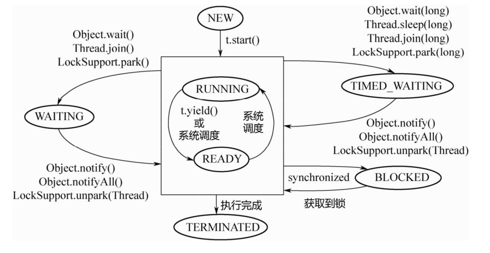

---
title:
---
# 多线程
## 实现方式
- Thread
- runnable
- callable 和 Feature

前两种都存在以下问题
- 无法获取子线程的返回值
- run方法不可以抛出异常

## 线程状态

在任意时间点，一个线程只有一种状态
\* 新建(New)：创建后尚未启动
\* 运行(Runable)：正在执行或正在等待CPU为它分配执行时间
\* 等待(Waiting)：
\* 无限等待(Waiting)：线程不会被分配CPU执行时间，等待被其他线程显式地唤醒。
\* 期限等待(Timed Waiting)：线程不会被分配CPU执行时间，无须等待被其他线程显式地唤醒，在一定时间后它们会由系统自动唤醒。
\* 阻塞(Blocked)：被阻塞
\* 阻塞和等待的区别：`阻塞状态`在等待着获取到一个排他锁，这个事件将在另外一个线程放弃这个锁的时候发生；而`等待状态`则是在等待一段时间，或者唤醒动作的发生。在程序等待进入同步区域的时候，线程将进入这种状态。

t.interrupted（）的精确含义是“唤醒轻量级阻塞”，而不是字面意思“中断一个线程”。

synchronized关键字其实是“给某个对象加了把锁”，



## volatile
- 可见性  （任何进程在读取的时候，都会清空本进程里面持有的共享变量的值，强制从主存里面获取；
任何进程在写入完毕的时候，都会强制将共享变量的值写会主存。）
- 指令重排 （增加内存屏障）

### 实现Runnable接口和Callable接口的区别
如果想让线程池执行任务的话需要实现的Runnable接口或Callable接口。 Runnable接口或Callable接口实现类都可以被ThreadPoolExecutor或ScheduledThreadPoolExecutor执行。
两者的区别

- 方法签名不同，void Runnable.run(), V Callable.call() throws Exception
- 是否允许有返回值，Callable允许有返回值（回调）
- 是否允许抛出异常，Callable允许抛出异常。

### sleep 和wait 区别
- sleep 没有释放锁 ，wait释放锁
- wait 用于线程间通讯 ,sleep 用于暂停执行
- wait 调用后线程不会自动苏醒，需要notify ,sleep 执行完成后线程会自动苏醒。
### Thread 和 Runnable 区别
实际上 Thread 类和 Runnable 接口之间在使用上也是有区别的，如果一个类继承 Thread类，则不适合于多个线程共享资源，而实现了 Runnable 接口，就可以方便的实现资源的共享。
### 为什么我们调用start() 会执行run() ,而不能直接调用run()
 调用start() 会执行线程的相应的准备工作，然后其中的线程自动执行run();而直接调用run() 会把她当成main()下的普通方法，并不是多线程工作。

### ThreadLocal 
线程私有
                                                                                                                             
每个THread 中都具备一个ThreadLocalMap ，而 ThreadLocalMap可以存储以ThreadLocal为Key的键值对。

#### ThreadLocal 内存泄露问题

使用的 key 为 ThreadLocal 的弱引用,而value是强引用。所以如果ThreadLocal没有被外部强引用的情况下，在垃圾回收的时候，key 会被清理掉，而value 不会被清理掉。这样一来,ThreadLocalMap 中出现了key 为null 的Entry。加入没有任何措施的话，value 永远不会被GC回收，这个时候会产生内存泄露。
最好使用完ThreadLocal后手动调用remove()方法。

## 如何创建线程池

### 线程池
方法名	功能
newFixedThreadPool(int nThreads)	创建固定大小的线程池
newSingleThreadExecutor()	创建只有一个线程的线程池
newCachedThreadPool()	创建一个不限线程数上限的线程池，任何提交的任务都将立即执行

阿里开发手册中强制线程池不允许使用 Executors去创建,而是通过 ThreadPoolExecutor 的方式，避免资源耗尽的风险。
Executors线程池对象弊端如下：

- FixedThreadPool 和SingleThreadPool 允许队列的长度为Integer.Max_value ，可能堆积大量的请求，导致OOM。
- CachedThreadPool 和 ScheduledThreadPool 允许创建的线程数量为 Integer.Max_value 可能创建大量线程 ，导致OOM 。

### 如何正确使用线程池

### ThreadPoolExecutor 重要参数 

- corePoolSize :核心线程数
- maximumPoolSize: 最大线程数
- workQueue: 达到最大线程数，会放到队列中

常见参数：
- keepAliveTime: 大于核心线程数 又没有新任务 等待时间，线程空闲了多久会被回收

- unit：等待时间单位
- threadFactory 
- handler: 饱和策略

### 饱和策略 
- AbortPolicy： 抛异常
- CallerRUnsPolicy: 调用执行自己的线程运行任务,会降低新任务提交速度，影响性能，适合不能丢任务的请求。
- DiscardPolicy： 不处理新任务
- DiscardOldestPolicy: 丢弃最早的未处理的任务。

```aidl
class Demo {
 executor
 
 class runner{}
 
 executor.execute(runner)
 executor.shutdown();
}
```

## 核心参数设置
### 核心线程数
CPU密集型：核心线程数 = CPU核数 + 1 (计算比较多)(这里核心线程数不是等于CPU核心数，是因为考虑CPU密集型任务由于某些原因而暂停，此时有额外的线程能确保CPU这个时刻不会浪费。但同时也会增加一个CPU上下文切换，因此核心线程数是等于CPU核心数？还是CPU核心数+1？可以根据实际情况来确定)

IO密集型：核心线程数 = CPU核数 * 2  （硬盘内存 读写 操作比较多）

注：IO密集型（某大厂实践经验）
       核心线程数 = CPU核数 / （1-阻塞系数）     例如阻塞系数 0.8，CPU核数为4
       则核心线程数为20

## AQS
### 实现
AQS的实现依赖内部的同步队列,也就是FIFO的双向队列，如果当前线程竞争锁失败，那么AQS会把当前线程以及等待状态信息构造成一个Node加入到同步队列中，同时再阻塞该线程。当获取锁的线程释放锁以后，会从队列中唤醒一个阻塞的节点(线程)。
### Sync 
sync是一个静态内部类，它继承了AQS这个抽象类，前面说过AQS是一个同步工具，主要用来实现同步控制。我们在利用这个工具的时候，会继承它来实现同步控制功能。
通过进一步分析，发现Sync这个类有两个具体的实现，分别是NofairSync(非公平锁),FailSync(公平锁).
### acquire

### 年，表结点Node的值就是每一个请求当前锁的线程。公平锁则在于每次都是依次从队首取值。
```
public final void acquire(int arg) {
        if (!tryAcquire(arg) &&
            acquireQueued(addWaiter(Node.EXCLUSIVE), arg))
            selfInterrupt();
    }
```
这个方法的主要逻辑是

- 通过tryAcquire尝试获取独占锁，如果成功返回true，失败返回false
- 如果tryAcquire失败，则会通过addWaiter方法将当前线程封装成Node添加到AQS队列尾部
- acquireQueued，将Node作为参数，通过自旋去尝试获取锁。

### addWaiter
当tryAcquire方法获取锁失败以后，则会先调用addWaiter将当前线程封装成Node，然后添加到AQS队列

## 公平锁和非公平锁
公平锁：

公平和非公平锁的队列都基于锁内部维护的一个双向链表，表结点Node的值就是每一个请求当前锁的线程。公平锁则在于每次都是依次从队首取值。
锁的实现方式是基于如下几点：
表结点Node和状态state的volatile关键字。
sum.misc.Unsafe.compareAndSet的原子操作(见附录)。

非公平锁：

在等待锁的过程中， 如果有任意新的线程妄图获取锁，都是有很大的几率直接获取到锁的。

```
ReentrantLock锁都不会使得线程中断，除非开发者自己设置了中断位。
ReentrantLock获取锁里面有看似自旋的代码，但是它不是自旋锁。
ReentrantLock公平与非公平锁都是属于排它锁。
```

## 参考
- [Java线程池详解](https://www.cnblogs.com/CarpenterLee/p/9558026.html)
- [java线程池如何合理配置核心线程数？](https://blog.csdn.net/weixin_44777693/article/details/95246059)
- [深入分析AQS实现原理](https://segmentfault.com/a/1190000017372067)
- [Java中的公平锁和非公平锁实现详解](https://www.cnblogs.com/little-fly/p/10365109.html)


