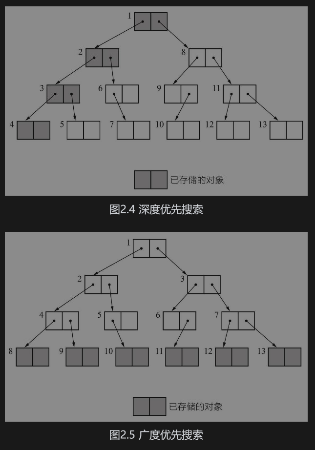

---
title:
---
# 算法

## LRU 最少使用算法

## 堆排序
### 特性
- 左子节点：2i+1
- 右子节点：2i+2
- 父节点：(i-1)/2
- 最后一个非叶子节点:(arr.length-1-1)/2=arr.length/2-1

### 步骤
1. 构建大顶堆，从最后一个非叶子结点开始，先比较左右子节点找到最大的，然后将最大的和父节点比较，看是否替换；一次比较完了，还要看替换的子节点下在进行一次相同的比较。
2. 开始替换根节点和最后一个节点的值，再次进行构建大顶堆，范围比上一次少一个节点。

## 快排
步骤：
1. 从0开始，拿出值， 先从后边比较，再从开始比较，大于0的放后边小于零的放前边，最终找到0拿出来的值最合适的位置，将其置换
2. 然后分成两部分，分别递归。

## 深度优先搜索和广度优先搜索

对象旁边的号码表示搜索顺序。

## 回溯算法

思路  

1. 准备  待遍历数组 ，当前元素取值位置，预备结果集，是否使用过标识

2. 遍历数组 ，每个数组元素进行一次 dfs ，填装结果集（可能进行深copy） 

3. dfs 一次是 深度加1 ，然后递归
4.  枝剪 ：结果集超了位置则进行回溯，（一般在dfs 递归调用下边）回溯退回一个元素，然后下边的继续遍历 终止条件 当深度足够或 结果集合适 则添加结果集  

每一次尝试都「复制」，则不需要回溯
如果在每一个 非叶子结点 分支的尝试，都创建 新的变量 表示状态，那么

在回到上一层结点的时候不需要「回溯」；
在递归终止的时候也不需要做拷贝。

做题的时候，建议 ==先画树形图== ，画图能帮助我们想清楚递归结构，想清楚如何剪枝。拿题目中的示例，想一想人是怎么做的，一般这样下来，这棵递归树都不难画出。

在画图的过程中思考清楚：

分支如何产生；
题目需要的解在哪里？是在叶子结点、还是在非叶子结点、还是在从跟结点到叶子结点的路径？
哪些搜索会产生不需要的解的？例如：产生重复是什么原因，如果在浅层就知道这个分支不能产生需要的结果，应该提前剪枝，剪枝的条件是什么，代码怎么写？

## 算法总结

算法总结
1. 巧用递归，一定要设定终止位置 ，否则很危险
2. 栈 可用来解决 对称 匹配 出战入栈 （「[{}]」）
3. 队列 可用于各种结构按自定义顺序入队列 比如二叉树 根据遍历方式不同 入队列 广度优先遍历
4. 可引入map（无重复），数组（下标对应）用空间换时间的方式做一些优化 统计个数的时候可以考虑用hashMap做去重

5. 回溯法，动态规划法，双指针+排序
6. 摩尔投票法 ，两两抵消 ，留下最多；
7. 优先队列  用堆    前多少 个元素，后多少个元素， 只用跟对顶对比  ： 思路  堆未满 先填充，堆满了 跟堆顶比较 ，合适就进堆，不合适 下一个，最后输出堆。
8. 算法中使用list 别忘了值传递 要用 深copy  new ArrayList<>(arr);
9. 回溯算法思路  （
    0） 准备  待遍历数组，当前元素取值位置，预备结果集，是否使用过标识
  1)  遍历数组 ，每个数组元素进行一次 dfs ，填装结果集（可能进行深copy） 
  2)  dfs 一次是 深度加1 ，然后递归
    3） 枝剪 ：结果集超了位置则进行回溯，（一般在dfs 递归调用下边）回溯退回一个元素，然后下边的继续遍历 终止条件 当深度足够或 结果集合适 则添加结果集  

）

## 算法思路

### 1）回溯法总结 Backtracking（回溯法）

场景 
除了可以解决与集合排列、组合相关的问题，回溯法还能解决很多算法面试题。如果解决一个问题需要若干步骤，并且每一步都面临若干选项，当在某一步做了某个选择之后前往下一步仍然面临若干选项，那么可以考虑尝试用回溯法解决。通常，回溯法可以用递归的代码实现。

思路
8. 一般都是按步骤来，把一道题抽象成很多步骤组成。
2. 注意数据的copy 问题
3. 标记当前位置
7. 执行下一步所有可能情况。也就是转化成树的结构，然后深度遍历
4. 给定所有可用元素 一般  数字范围，数组 二维数组
5. 结果集 用来装所有结果
6. 重复判断 重复判断方式 可以用 map，set ,数组 位置
1. list.remove() 进行回退，

变种

分治、贪心、回溯和动态规划等算法思想，二分查找、深度优先遍历和广度优先遍历、双指针、滑动窗口、位运算、并查集等解题思路和技巧，以及通用解题“套路”和解题模板等内容

算法总结
1. 巧用递归，一定要设定终止位置 ，否则很危险
2. 栈 可用来解决 对称 匹配 出战入栈 （「[{}]」）
3. 队列 可用于各种结构按自定义顺序入队列 比如二叉树 根据遍历方式不同 入队列
4. 可引入map（无重复），数组（下标对应）用空间换时间的方式做一些优化
5. 回溯法，动态规划法，双指针+排序

## 算法题

1. 算法：二叉树给个头节点，求树高
2. 数组只有一个元素出现一次，怎么找出来，时间和空间复杂度是多少

