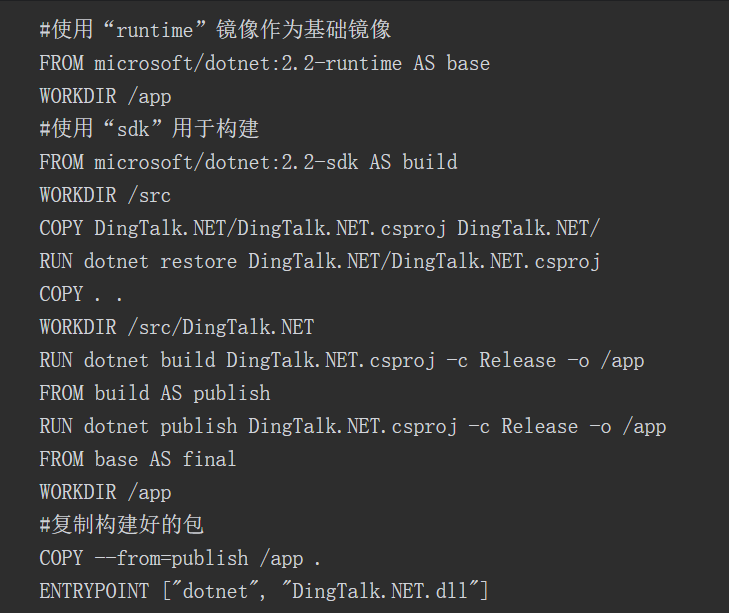
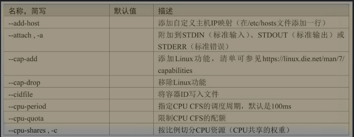
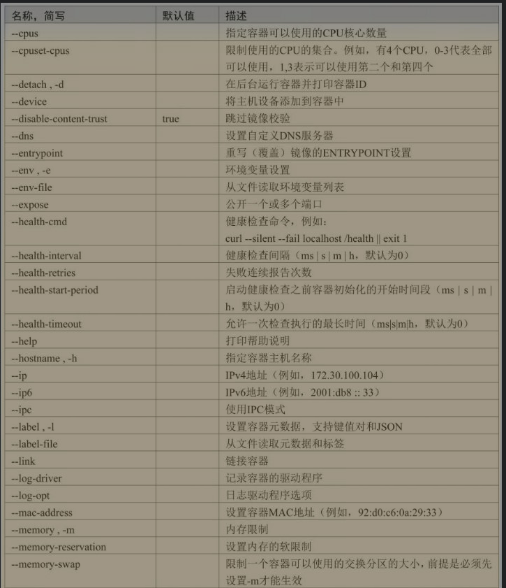
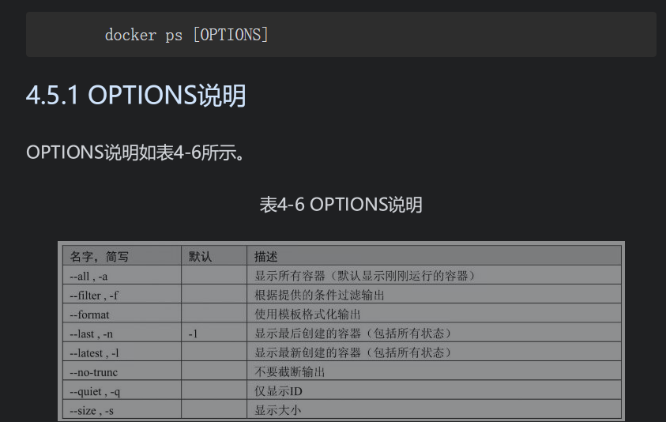
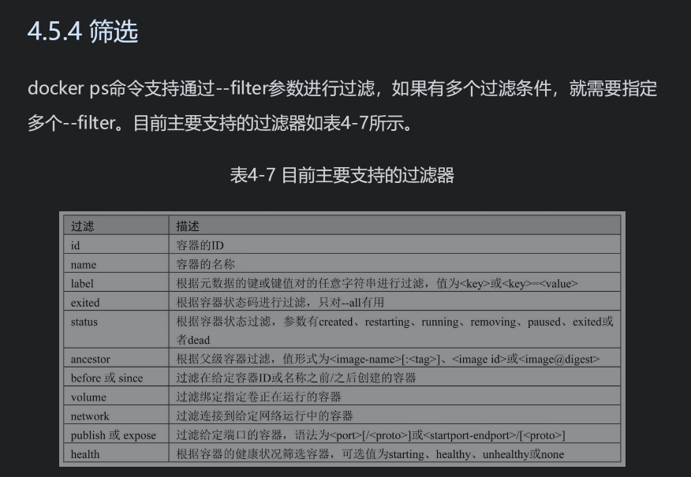
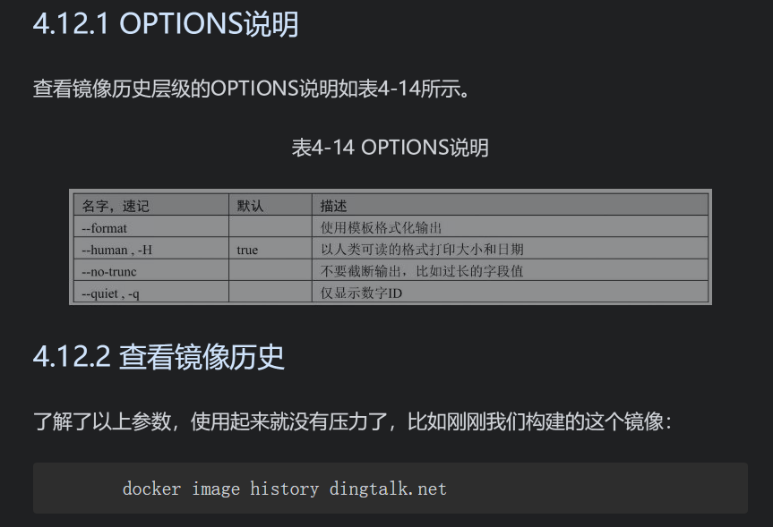

---
title:
---
# docker
## 
每一个指令都会创建一层，并构成新的镜像。当运行多个指令时，会产生一些非常臃肿、非常多层的镜像，既增加了构建部署的时间，也很容易出错。因此，在很多情况下，可以合并指令并运行
## 镜像存储方式


1. 镜像中心域名 
3. 命名空间
3. 仓库名称
4. 标签

## docker-compose

### docker-compose.yml 属性

- **version**：指定 docker-compose.yml 文件的写法格式
- **services**：多个容器集合
- **build**：配置构建时，Compose 会利用它自动构建镜像，该值可以是一个路径，也可以是一个对象，用于指定 Dockerfile 参数

```
build: ./dir
---------------
build:
    context: ./dir
    dockerfile: Dockerfile
    args:
        buildno: 1
```

- **command**：覆盖容器启动后默认执行的命令

```
command: bundle exec thin -p 3000
----------------------------------
command: [bundle,exec,thin,-p,3000]
```

- **dns**：配置 dns 服务器，可以是一个值或列表

```
dns: 8.8.8.8
------------
dns:
    - 8.8.8.8
    - 9.9.9.9
```

- **dns_search**：配置 DNS 搜索域，可以是一个值或列表

```
dns_search: example.com
------------------------
dns_search:
    - dc1.example.com
    - dc2.example.com
```

- **environment**：环境变量配置，可以用数组或字典两种方式

```
environment:
    RACK_ENV: development
    SHOW: 'ture'
-------------------------
environment:
    - RACK_ENV=development
    - SHOW=ture
```

- **env_file**：从文件中获取环境变量，可以指定一个文件路径或路径列表，其优先级低于 environment 指定的环境变量

```
env_file: .env
---------------
env_file:
    - ./common.env
```

- **expose**：暴露端口，只将端口暴露给连接的服务，而不暴露给主机

```
expose:
    - "3000"
    - "8000"
```

- **image**：指定服务所使用的镜像

```
image: java
```

- **network_mode**：设置网络模式

```
network_mode: "bridge"
network_mode: "host"
network_mode: "none"
network_mode: "service:[service name]"
network_mode: "container:[container name/id]"
```

- **ports**：对外暴露的端口定义，和 expose 对应

```
ports:   # 暴露端口信息  - "宿主机端口:容器暴露端口"
- "8763:8763"
- "8763:8763"
```

- **links**：将指定容器连接到当前连接，可以设置别名，避免ip方式导致的容器重启动态改变的无法连接情况

```
links:    # 指定服务名称:别名 
    - docker-compose-eureka-server:compose-eureka
```

- **volumes**：卷挂载路径

```
volumes:
  - /lib
  - /var
```

- **logs**：日志输出信息

```
--no-color          单色输出，不显示其他颜.
-f, --follow        跟踪日志输出，就是可以实时查看日志
-t, --timestamps    显示时间戳
--tail              从日志的结尾显示，--tail=200
```

### 常见命令

- **ps**：列出所有运行容器

```
docker-compose ps
```

- **logs**：查看服务日志输出

```
docker-compose logs
```

- **port**：打印绑定的公共端口，下面命令可以输出 eureka 服务 8761 端口所绑定的公共端口

```
docker-compose port eureka 8761
```


- **kill**：通过发送 SIGKILL 信号来停止指定服务的容器

```
docker-compose kill eureka
```

- **pull**：下载服务镜像
- **scale**：设置指定服务运气容器的个数，以 service=num 形式指定

```
docker-compose scale user=3 movie=3
```

- **run**：在一个服务上执行一个命令

```
docker-compose run web bash
```

## dockerFile
* ENTRYPOINT是配置容器启动后执行的指令，并且不可被docker run提供的参数覆盖。每个Dockerfile中只能有一个ENTRYPOINT，当指定多个时，只有最后一个生效。
* ADD指令与COPY指令非常类似，但它包含了更多的功能。除了将文件从主机复制到容器镜像外，ADD指令还可以使用URL规范从远程位置复制文件。
* 如果Dockerfile中指定了多个CMD指令，就只会执行最后一个指令。
* 转义字符, Dockerfile指令需要跨多行进行编写，以提高脚本命令的可读性。这可以通过转义字符完成，默认Dockerfile转义字符是反斜杠“\”

### dockerfile 优化
（1）尽量选择官方镜像。

（2）选择合适的基础镜像。
需要特别说明的是，标签中包含“alpine”的镜像是基于体积更小的Alpine Linux发行版制作的，一般情况下可以优先考虑。标签中包含“sdk”的镜像是包含完整的框架SDK的，往往体积比较大，如果仅用于运行托管，尽量选择带“runtime”的镜像
（3）优化指令顺序。Docker会缓存Dockerfile中尚未更改的所有步骤，但是不管更改什么指令，都将重做其后的所有步骤。也就是说，如果指令3有变动，那么4、5、6就会重做。因此，需要将最不可能产生更改的指令放在前面，按照这个顺序来编写Dockerfile指令。这样，在构建过程中就可以节省很多时间。比如，可以把WORKDIR、ENV等放在前面，把COPY、ADD放在后面。总的来说，就是把不需要经常更改的指令放到前面，将最频繁更改的指令放到最后面。

（4）只复制需要的文件，切忌复制所有内容。

（5）最小化可缓存的执行层。	
每一个RUN指令都会被看作是可缓存的执行单元。太多的RUN指令会增加镜像的层数，增大镜像体积，而将所有的命令都放到同一个RUN指令中又会破坏缓存，从而延缓构建周期。当使用包管理器安装软件时，一般都会先更新软件索引信息再安装软件。推荐将更新索引和安装软件放在同一个RUN指令中，这样可以形成一个可缓存的执行单元，否则可能会安装旧的软件包。

（6）使用多阶段构建。

多阶段构建可以由多个FROM指令组成，每一个FROM语句表示一个新的构建阶段，阶段名称可以用AS参数指定。例如，在下面的示例中，指定第一阶段的名称为builder，可以被第二阶段直接引用。两个阶段环境一致，并且第一阶段包含所有构建依赖项。第二阶段是构建最终镜像的最后阶段，包括应用运行时的所有必要条件。



（7）根据情况合并指令。

（8）删除多余文件和清理没用的中间结果。	

（9）使用.dockerignore。


## 快捷键方式

* 拉取镜像: docker pull {imageName}
* 查看镜像: docker images 查看镜像
* 在容器中执行命令: docker exec -it {containerName} /bin/bash   ? /bin/sh
* 查看基本信息: docker inspect {containerName}
* 查看内存: docker stats 
* 查看日志： docker logs
* 查看镜像的历史版本可以执行以下命令：docker history &lt;image_name> 
* 将容器的状态保存为镜像： docker commit $sample_job job1 
* 在registry中的镜像可以使用以下命令查找到： docker search &lt;image-name> 
* docker 查看挂载目录 docker inspect container_name | grep Mounts -A 20
* 查看docker 镜像仓库地址:   cat /etc/docker/daemon.json
* docker run 长久运行: docker run centos ping www.baidu.com / sleep 50s 就是运行结束后重新运行
* 修改镜像名称 docker tag source target 













定时清理不用镜像脚本

```
[root@VM_0_42_centos opt]# cat clean.sh 
sh /opt/docker/lock.sh -t clean -a lock
docker image prune -a -f
docker container prune -f
sh /opt/docker/lock.sh -t clean -a unlock 
dt=$(date)
echo time is $dt
```




## 参考

# [docker-compose 启动容器](https://www.cnblogs.com/liaokui/p/11380590.html)

[微信读书-](https://weread.qq.com/web/reader/13b32c4071cc8f0613bd197kc1632f5021fc16a5320f3dc)