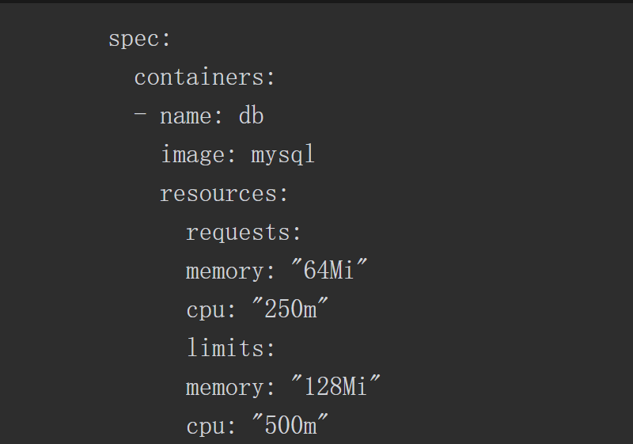

---
title:
---
# kubernetes 基本概念和术语

##  kubernates 架构

 ### 控制平面
 * API服务器
 * etcd 元数据存储 ： 为了保证冗余性，通常由三个或五个etcd实例组成一个集群。如果你丢失了etcd存储中的数据，那么你会丢掉整个集群。
 * 调度器  它实现了一种复杂的调度算法，该算法考虑到多个维度的信息，例如每个节点上的资源可用性、用户指定的各种约束、可用节点的类型、资源限制和配额以及其他因素，例如亲和性、反亲和性、容忍和污点等。
 * 控制器管理器 ： 这些控制器监控着集群事件和对集群的更改并做出响应。
 * 云控制器管理器

## kubernetes 基本概念和术语
Kubernetes中的大部分概念如Node、Pod、ReplicationController、Service等都可以被看作一种资源对象
几乎所有资源对象都可以通过Kubernetes提供的kubectl工具（或者API编程调用）执行增、删、改、查等操作并将其保存在etcd中持久化存储。

Kubernetes其实是一个高度自动化的资源控制系统，它通过跟踪对比etcd库里保存的“资源期望状态”与当前环境中的“实际资源状态”的差异来实现自动控制和自动纠错的高级功能。

## Kubernetes 资源对象
### Master
在每个Kubernetes集群里都需要有一个Master来负责整个集群的管理和控制，基本上Kubernetes的所有控制命令都发给它，它负责具体的执行过程

在Master上运行着以下关键进程。

* Kubernetes API Server（kube-apiserver）：提供了HTTP Rest接口的关键服务进程，是Kubernetes里所有资源的增、删、改、查等操作的唯一入口，也是集群控制的入口进程。
* Kubernetes Controller Manager（kube-controller-manager）：Kubernetes里所有资源对象的自动化控制中心，可以将其理解为资源对象的“大总管”。（控制啥）
* Kubernetes Scheduler（kube-scheduler）：负责资源调度（Pod调度）的进程，相当于公交公司的“调度室”。（调度啥）

另外，在Master上通常还需要部署etcd服务，因为Kubernetes里的所有资源对象的数据都被保存在etcd中。
### Node
Node可以是一台物理主机，也可以是一台虚拟机
Node是Kubernetes集群中的工作负载节点，每个Node都会被Master分配一些工作负载（Docker容器）
当某个Node宕机时，其上的工作负载会被Master自动转移到其他节点上。
在每个Node上都运行着以下关键进程。
* kubelet：负责Pod对应的容器的创建、启停等任务，同时与Master密切协作，实现集群管理的基本功能。
* kube-proxy：实现Kubernetes Service的通信与负载均衡机制的重要组件。
* Docker Engine（docker）：Docker引擎，负责本机的容器创建和管理工作。

在默认情况下kubelet会向`Master`注册自己，这也是Kubernetes推荐的Node管理方式。一旦Node被纳入集群管理范围，kubelet进程就会定时向Master汇报自身的情报，例如操作系统、Docker版本、机器的CPU和内存情况，以及当前有哪些Pod在运行等，这样Master就可以获知每个Node的资源使用情况，并实现`高效均衡的资源调度策略`。而某个Node在超过指定时间不上报信息时，会被Master判定为“失联”，Node的状态被标记为不可用（Not Ready），随后Master会触发“工作负载大转移”的自动流程。
### Pod
我们看到每个Pod都有一个特殊的被称为“根容器”的`Pause容器`

为什么Kubernetes会设计出一个全新的Pod的概念并且Pod有这样特殊的组成结构？
1. 判断死亡率 一杀多
2. 共享 IP ，Volume 解决通讯问题
每个Pod都分配了唯一的IP地址
Kubernetes要求底层网络支持集群内任意两个Pod之间的TCP/IP直接通信，这通常采用虚拟二层网络技术来实现，例如`Flannel、OpenvSwitch`等
在Kubernetes里，一个Pod里的容器与另外主机上的Pod容器能够直接通信。

Pod其实有两种类型：`普通的Pod`及`静态Pod（Static Pod）`。后者比较特殊，它并没被存放在Kubernetes的etcd存储里，而是被存放在某个具体的`Node上的一个具体文件中`，并且只在此Node上启动、运行

在默认情况下，当Pod里的某个容器停止时，Kubernetes会自动检测到这个问题并且重新启动这个Pod（重启Pod里的所有容器），如果Pod所在的Node宕机，就会将这个Node上的所有Pod重新调度到其他节点

可以用kubectl describe pod xxxx来查看它的描述信息，以定位问题的成因

可以对服务器资源设置限额
CPU（Core）设置数量 100~300m 即占用0.1-0.3个CPU
在Kubernetes里，一个计算资源进行配额限定时需要设定以下两个参数。
* Requests：该资源的最小申请量，系统必须满足要求
* Limits：该资源最大允许使用的量，不能被突破，当容器试图使用超过这个量的资源时，可能会被Kubernetes“杀掉”并重启。

### Label 
一个Label是一个key=value的键值对，其中key与value由用户自己指定

Label可以被附加到各种资源对象上，例如Node、Pod、Service、RC等，一个资源对象可以定义任意数量的Label

我们可以通过给指定的资源对象捆绑一个或多个不同的Label来实现多维度的资源分组管理功能

以便灵活、方便地进行资源分配、调度、配置、部署等管理工作。例如，部署不同版本的应用到不同的环境中；监控和分析应用（日志记录、监控、告警）

例如：
* 版本标签："release" : "stable"、"release" : "canary"。
* 环境标签："environment":"dev"、"environment":"qa"、"environment":"production"。
* 分区标签："partition" : "customerA"、"partition" :"customerB"。
* 质量管控标签："track" : "daily"、"track" : "weekly"。

随后可以通过LabelSelector（标签选择器）查询和筛选拥有某些Label的资源对象，Kubernetes通过这种方式实现了类似SQL的简单又通用的对象查询机制。

`当前有两种Label Selector表达式`：基于等式的（Equality-based）和基于集合的（Set-based）

多个表达式之间用“，”进行分隔即可，几个条件之间是“AND”的关系
例如： name=redis-slave,env!=production

### Replication Controller (RC)
简单来说，它其实定义了一个期望的场景，即声明某种Pod的副本数量在任意时刻都符合某个预期值

所以 RC的定义包括如下：
* Pod期待的副本数量。
* 用于筛选目标Pod的Label Selector。
* 当Pod的副本数量小于预期数量时，用于创建新Pod的Pod模板（template）。

在我们定义了一个RC并将其提交到Kubernetes集群中后，Master上的Controller Manager组件就得到通知，定期巡检系统中当前存活的目标Pod，并确保目标Pod实例的数量刚好等于此RC的期望值，如果有过多的Pod副本在运行，系统就会停掉一些Pod，否则系统会再自动创建一些Pod。

删除RC并不会影响通过该RC已创建好的Pod。为了删除所有Pod，可以设置replicas的值为0，然后更新该RC。另外，kubectl提供了stop和delete命令来一次性删除RC和RC控制的全部Pod。

通过RC机制，Kubernetes很容易就实现了这种高级实用的特性，被称为“滚动升级”

同名冲突 所以 所以在Kubernetes 1.2中，升级为另外一个新概念——Replica Set

特性与作用：
在大多数情况下，我们通过定义一个RC实现Pod的创建及副本数量的自动控制。
*  在RC里包括完整的Pod定义模板。
* RC通过Label Selector机制实现对Pod副本的自动控制。
*  通过改变RC里的Pod副本数量，可以实现Pod的扩容或缩容。
* 通过改变RC里Pod模板中的镜像版本，可以实现Pod的滚动升级。

### Deployment 
Deployment是Kubernetes在1.2版本中引入的新概念，用于更好地解决Pod的编排问题
Deployment在内部使用了Replica Set来实现目的  与 RC相似度90%

Deployment相对于RC的一个最大升级是我们可以随时知道当前Pod“部署”的进度。实际上由于一个Pod的创建、调度、绑定节点及在目标Node上启动对应的容器这一完整过程需要一定的时间，所以我们期待系统启动N个Pod副本的目标状态，实际上是一个连续变化的“部署过程”导致的最终状态。

### Horizontal Pod Autoscaler (HPA)
通过手工执行kubectl scale命令，我们可以实现Pod扩容或缩容。HPA 可以实现自动扩容

当这些Pod副本的CPUUtilizationPercentage的值超过90%时会触发自动动态扩容行为，在扩容或缩容时必须满足的一个约束条件是Pod的副本数为1～10。
通过度量指标

### StatefulSet
Pod的管理对象RC、Deployment、DaemonSet和Job都面向无状态的服务。但现实中有很多服务是有状态的，特别是一些复杂的中间件集群，例如MySQL集群、MongoDB集群、Akka集群、ZooKeeper集群等，这些应用集群有4个共同点。

（1）每个节点都有固定的身份ID，通过这个ID，集群中的成员可以相互发现并通信。
（2）集群的规模是比较固定的，集群规模不能随意变动。
（3）集群中的每个节点都是有状态的，通常会持久化数据到永久存储中。
（4）如果磁盘损坏，则集群里的某个节点无法正常运行，集群功能受损。

StatefulSet  就是为了解决这个问题，有以下特性
* StatefulSet里的每个Pod都有稳定、唯一的网络标识，可以用来发现集群内的其他成员。假设StatefulSet的名称为kafka，那么第1个Pod叫kafka-0，第2个叫kafka-1，以此类推。
* StatefulSet控制的Pod副本的启停顺序是受控的，操作第n个Pod时，前n-1个Pod已经是运行且准备好的状态。
* StatefulSet里的Pod采用稳定的持久化存储卷，通过PV或PVC来实现，删除Pod时默认不会删除与StatefulSet相关的存储卷（为了保证数据的安全）。

StatefulSet除了要与PV卷捆绑使用以存储Pod的状态数据，还要与Headless Service配合使用，即在每个StatefulSet定义中都要声明它属于哪个Headless Service。

### Service

每个Service其实就是我们经常提起的微服务架构中的一个微服务。

我们的系统最终由多个提供不同业务能力而又彼此独立的微服务单元组成的，服务之间通过TCP/IP进行通信，从而形成了强大而又灵活的弹性网格，拥有强大的分布式能力、弹性扩展能力、容错能力，程序架构也变得简单和直观许多

运行在每个Node上的kube-proxy进程其实就是一个智能的软件负载均衡器，负责把对Service的请求转发到后端的某个Pod实例上，并在内部实现服务的负载均衡与会话保持机制。但Kubernetes发明了一种很巧妙又影响深远的设计：Service没有共用一个负载均衡器的IP地址，每个Service都被分配了一个全局唯一的虚拟IP地址，这个虚拟IP被称为`Cluster IP`。这样一来，每个服务就变成了具备唯一IP地址的通信节点，服务调用就变成了最基础的TCP网络通信问题。

于是，服务发现这个棘手的问题在Kubernetes的架构里也得以轻松解决：只要用Service的Name与Service的Cluster IP地址做一个DNS域名映射即可完美解决问题 

多端口问题，很多服务都存在多个端口的问题，通常一个端口提供业务服务，另外一个端口提供管理服务，比如Mycat、Codis等常见中间件。 多端口需要给每个端口都命名

待续...

###  JOB

与RC、Deployment、ReplicaSet、DaemonSet类似，Job也控制一组Pod容器。从这个角度来看，Job也是一种特殊的Pod副本自动控制器 同时Job控制Pod副本与RC等控制器的工作机制有以下重要差别。

（1）Job所控制的Pod副本是短暂运行的，可以将其视为一组Docker容器，其中的每个Docker容器都仅仅运行一次。 Kubernetes在1.5版本之后又提供了类似crontab的定时任务——`CronJob`

（2）Job所控制的Pod副本的工作模式能够多实例并行计算，以TensorFlow框架为例，可以将一个机器学习的计算任务分布到10台机器上，在每台机器上都运行一个worker执行计算任务，这很适合通过Job生成10个Pod副本同时启动运算。

### Volume

Volume（存储卷）是Pod中能够被多个容器访问的`共享目录`。Kubernetes的Volume概念、用途和目的与Docker的Volume比较类似，但`两者不能等价`。首先，Kubernetes中的Volume被定义在Pod上，然后被一个Pod里的多个容器挂载到具体的文件目录下；其次，Kubernetes中的Volume与Pod的生命周期相同，但与容器的生命周期不相关，`当容器终止或者重启时，Volume中的数据也不会丢失。`最后，Kubernetes支持多种类型的Volume，例如`GlusterFS、Ceph`等先进的分布式文件系统。

Volume的使用也比较简单，在大多数情况下，我们先在Pod上声明一个Volume，然后在容器里引用该Volume并挂载（Mount）到容器里的某个目录上。

Kubernetes提供了非常丰富的Volume类型
1. emptyDir

   一个emptyDir Volume是在Pod分配到Node时创建的。从它的名称就可以看出，它的初始内容为空，并且无须指定宿主机上对应的目录文件，因为这是Kubernetes自动分配的一个目录，当Pod从Node上移除时，emptyDir中的数据也会被永久删除。

   ◎ `临时空间`，例如用于某些应用程序运行时所需的临时目录，且无须永久保留。

   ◎ 长时间任务的中间过程CheckPoint的临时保存目录。

   ◎ 一个容器需要从另一个容器中获取数据的目录（多容器共享目录）。

   目前，用户无法控制emptyDir使用的介质种类。如果kubelet的配置是使用硬盘，那么所有emptyDir都将被创建在该硬盘上。Pod在将来可以设置emptyDir是位于硬盘、固态硬盘上还是基于内存的tmpfs上，上面的例子便采用了emptyDir类的Volume。

2. hostPath
    hostPath为在Pod上挂载宿主机上的文件或目录，它通常可以用于以下几方面

   * 容器应用程序生成的日志文件需要永久保存时，可以使用宿主机的高速文件系统进行存储。

   * 需要访问宿主机上Docker引擎内部数据结构的容器应用时，可以通过定义hostPath为宿主机/var/lib/docker目录，使容器内部应用可以直接访问Docker的文件系统。

在使用这种类型的Volume时，需要注意以下几点。

   * 在不同的Node上具有相同配置的Pod，可能会因为宿主机上的目录和文件不同而导致对Volume上目录和文件的访问结果不一致。

   * 如果使用了资源配额管理，则Kubernetes无法将hostPath在宿主机上使用的资源纳入管理。

3. gcePersistentDisk
    使用这种类型的Volume表示使用谷歌公有云提供的永久磁盘（Persistent Disk，PD）存放Volume的数据，它与emptyDir不同，PD上的内容会被永久保存，当Pod被删除时，PD只是被卸载（Unmount），但不会被删除。需要注意的是，你需要先创建一个PD，才能使用
    使用gcePersistentDisk时有以下一些限制条件。
    ◎ Node（运行kubelet的节点）需要是GCE虚拟机。
    ◎ 这些虚拟机需要与PD存在于相同的GCE项目和Zone中。

4. awsElasticBlockStore

  该类型的Volume使用亚马逊公有云提供的EBS Volume存储数据

5. NFS
使用NFS网络文件系统提供的共享目录存储数据时，我们需要在系统中部署一个NFS Server

6．其他类型的Volume◎ iscsi：使用iSCSI存储设备上的目录挂载到Pod中。
◎ flocker：使用Flocker管理存储卷。
◎ glusterfs：使用开源GlusterFS网络文件系统的目录挂载到Pod中。
◎ rbd：使用Ceph块设备共享存储（Rados Block Device）挂载到Pod中。
◎ gitRepo：通过挂载一个空目录，并从Git库clone一个git repository以供Pod使用。
◎ secret：一个Secret Volume用于为Pod提供加密的信息，你可以将定义在Kubernetes中的Secret直接挂载为文件让Pod访问。Secret Volume是通过TMFS（内存文件系统）实现的，这种类型的Volume总是不会被持久化的。

### Persistent Volume (PV)
我们通常会先定义一个网络存储，然后从中划出一个“网盘”并挂接到虚拟机上。Persistent Volume（PV）和与之相关联的Persistent Volume Claim（PVC）也起到了类似的作用。

PV可以被理解成Kubernetes集群中的某个网络存储对应的一块存储，它与Volume类似，但有以下区别。
◎ PV只能是网络存储，不属于任何Node，但可以在每个Node上访问。
◎ PV并不是被定义在Pod上的，而是独立于Pod之外定义的。
◎ PV目前支持的类型包括：gcePersistentDisk、AWSElasticBlockStore、AzureFile、AzureDisk、FC（Fibre Channel）、Flocker、NFS、iSCSI、RBD（Rados Block Device）、CephFS、Cinder、GlusterFS、VsphereVolume、Quobyte Volumes、VMware Photon、PortworxVolumes、ScaleIO Volumes和HostPath（仅供单机测试）。

如果某个Pod想申请某种类型的PV，则首先需要定义一个PersistentVolumeClaim对象：

最后说说PV的状态。PV是有状态的对象，它的状态有以下几种。
◎ Available：空闲状态。
◎ Bound：已经绑定到某个PVC上。
◎ Released：对应的PVC已经被删除，但资源还没有被集群收回。
◎ Failed：PV自动回收失败。

### Namespace
Namespace在很多情况下用于实现多租户的资源隔离。Namespace通过将集群内部的资源对象“分配”到不同的Namespace中，形成`逻辑上`分组的不同项目、小组或用户组，便于不同的分组在共享使用整个集群的资源的同时还能被分别管理。

接下来，如果不特别指明Namespace，则用户创建的Pod、RC、Service都将被系统创建到这个默认的名为`default`的Namespace中。

### Annotation
Annotation（注解）与Label类似，也使用key/value键值对的形式进行定义。不同的是Label具有严格的命名规则，它定义的是Kubernetes对象的元数据（Metadata），并且用于Label Selector。Annotation则是用户任意定义的附加信息，以便于外部工具查找。在很多时候，Kubernetes的模块自身会通过Annotation标记资源对象的一些特殊信息。

通常来说，用Annotation来记录的信息如下。
◎ build信息、release信息、Docker镜像信息等，例如时间戳、release id号、PR号、镜像Hash值、Docker Registry地址等。
◎ 日志库、监控库、分析库等资源库的地址信息。
◎ 程序调试工具信息，例如工具名称、版本号等。
◎ 团队的联系信息，例如电话号码、负责人名称、网址等。

### ConfigMap

，Docker通过将程序、依赖库、数据及配置文件“打包固化”到一个不变的镜像文件中的做法，解决了应用的部署的难题，但这同时带来了棘手的问题，`即配置文件中的参数在运行期如何修改的问题`我们不可能在启动Docker容器后再修改容器里的配置文件，然后用新的配置文件重启容器里的用户主进程。为了解决这个问题，Docker提供了两种方式：

* 行时通过容器的环境变量来传递参数；
* Docker Volume将容器外的配置文件映射到容器内。

这些配置项可以作为Map表中的一个项，整个Map的数据可以被持久化存储在Kubernetes的Etcd数据库中，然后提供API以方便Kubernetes相关组件或客户应用CRUD操作这些数据，上述专门用来保存配置参数的Map`就是Kubernetes ConfigMap资源对象`

接下来，Kubernetes提供了一种内建机制，将存储在etcd中的ConfigMap通过`Volume映射`的方式变成目标Pod内的配置文件，不管目标Pod被调度到哪台服务器上，都会完成自动映射。进一步地，如果ConfigMap中的key-value数据被修改，则映射到Pod中的“配置文件”也会`随之自动更新`。于是，KubernetesConfigMap就成了分布式系统中最为简单（使用方法简单，但背后实现比较复杂）且对应用`无侵入的配置中心`。

#### 配置
apiVersion

Kubernetes平台采用了“`核心+外围扩展`”的设计思路
1. v1 核心API
大部分常见的核心资源对象都归属于v1这个核心API: 
* Node、
* Pod、
* Service、
* Endpoints、
* Namespace、
* RC、
* PersistentVolume等
2. 而在1.9版本之后引入了apps/v1这个正式的扩展API
### spec 
Kubernetes 1.8版本以后，Init container特性完全成熟，其定义被放入Pod的spec.initContainers一节

在Kubernetes 1.8中，资源对象中的很多Alpha、Beta版本的Annotations被取消，升级成了常规定义方式，在学习Kubernetes的过程中需要特别注意。

