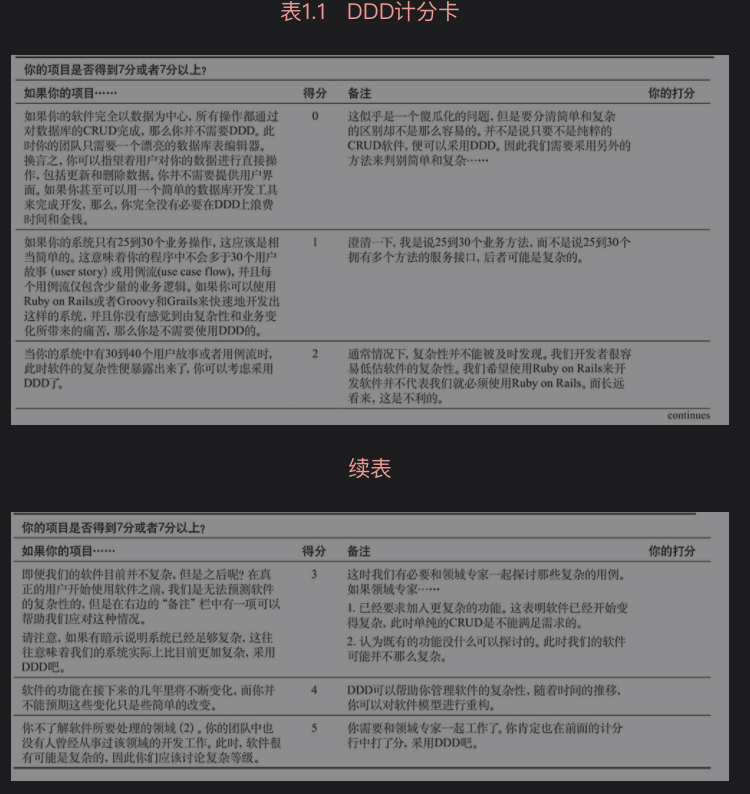

---
title:
---
# 领域驱动设计 （DDD）

## 理论

一. 方式 

   战略设计 ，战术设计两种方式

二. DDD 使用记分卡



当我们在复杂性问题上犯错时，我们很难轻易地扭转颓势。这意味着我们应该在项目计划早期便对简单性和复杂性做出判断，

这将为我们节约很多时间和开销，并免除很多麻烦。

三. 贫血症和失忆症

贫血领域对象（Anemic Domain Object）是指仅用作数据载体，而没有行为和动作的领域对象。

四. 通用语言

五.

解决**复杂和大规模软件**的武器可以被粗略地归为三类：抽象、分治和知识。

**分治** 把问题空间分割为规模更小且易于处理的若干子问题。分割后的问题需要足够小，以便一个人单枪匹马就能够解决他们；其次，必须考虑如何将分割后的各个部分装配为整体。分割得越合理越易于理解，在装配成整体时，所需跟踪的细节也就越少。即更容易设计各部分的协作方式。评判什么是分治得好，即高内聚低耦合。

**抽象** 使用抽象能够精简问题空间，而且问题越小越容易理解。举个例子，从北京到上海出差，可以先理解为使用交通工具前往，但不需要一开始就想清楚到底是高铁还是飞机，以及乘坐他们需要注意什么。

**知识** 顾名思义，DDD可以认为是知识的一种。

DDD提供了这样的知识手段，让我们知道如何抽象出限界上下文以及如何去分治。

六. **限界上下文之间的映射关系**

- 合作关系（Partnership）：两个上下文紧密合作的关系，一荣俱荣，一损俱损。
- 共享内核（Shared Kernel）：两个上下文依赖部分共享的模型。
- 客户方-供应方开发（Customer-Supplier Development）：上下文之间有组织的上下游依赖。
- 遵奉者（Conformist）：下游上下文只能盲目依赖上游上下文。
- 防腐层（Anticorruption Layer）：一个上下文通过一些适配和转换与另一个上下文交互。
- 开放主机服务（Open Host Service）：定义一种协议来让其他上下文来对本上下文进行访问。
- 发布语言（Published Language）：通常与OHS一起使用，用于定义开放主机的协议。
- 大泥球（Big Ball of Mud）：混杂在一起的上下文关系，边界不清晰。
- 另谋他路（SeparateWay）：两个完全没有任何联系的上下文。

## DDD工程实现

一. 模块

一般尽量用一个模块来表示一个领域的限界上下文。

对于模块内的组织结构，一般情况下我们是按照领域对象、领域服务、领域资源库、防腐层等组织方式定义的。

```
import com.company.team.bussiness.lottery.domain.valobj.*;//领域对象-值对象
import com.company.team.bussiness.lottery.domain.entity.*;//领域对象-实体
import com.company.team.bussiness.lottery.domain.aggregate.*;//领域对象-聚合根
import com.company.team.bussiness.lottery.service.*;//领域服务
import com.company.team.bussiness.lottery.repo.*;//领域资源库
import com.company.team.bussiness.lottery.facade.*;//领域防腐层
```

二. 领域对象

### 领域服务


## 参考

# [领域驱动设计在互联网业务开发中的实践](https://tech.meituan.com/2017/12/22/ddd-in-practice.html)

[实现领域驱动设计(微信读书)](https://weread.qq.com/web/reader/3f232740723b60233f23504kd3d322001ad3d9446802347)