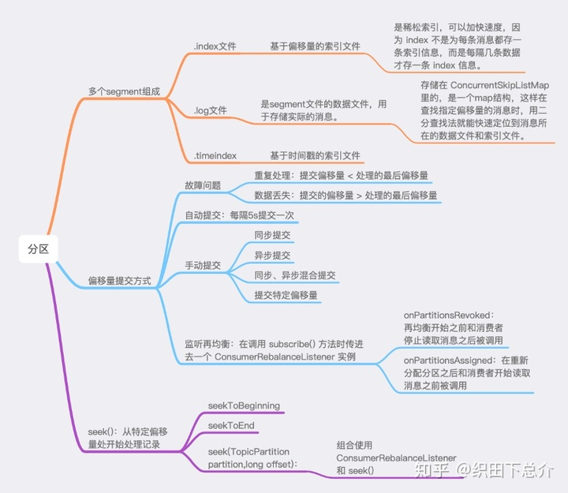

---
title:
---
# kafka 概念篇

## kafka 集群结构


从图上可以看出

- Producer 是单独的多个
- 多了zookeeper 集群，用来收发消息
- kafka 的工作单元是 broker ，它会在 zk上注册
- 消费者可以有 组 group,group 内的消费者可以并行消费，但不会重复消费

### 为什么分区(Partition)能保证并行消费


如果有两个分区，最多两个消费者同时消费，消费的速度肯定会更快。分区的设计大大的提升了kafka的吞吐量！！


从这个图可以看出什么？

- 一个partition只能被同组的一个consumer消费（图中只会有一个箭头指向一个partition）
- 同一个组里的一个consumer可以消费多个partition（图中第一个consumer消费Partition 0和3）
- 消费效率最高的情况是partition和consumer数量相同。这样确保每个consumer专职负责一个partition。
- consumer数量不能大于partition数量。由于第一点的限制，当consumer多于partition时，就会有consumer闲置。

5、consumer group可以认为是一个订阅者的集群，其中的每个consumer负责自己所消费的分区

### 副本怎么高可用

一个topic 下有多个分区 ，每个分区可以有多个副本 ，分区下都是副本 ，但只有一个leader 其他的是 follower，
工作流程:小心进来 先进入leader replica,然后从leader 复制到 follower。`只有复制完成时，consumer 才可以消费此消息`，这是为了确保意外发生，数据可以恢复

### "如果不同partition的leader replica在kafka集群的broker上分布不均匀，就会造成负载不均衡。" 怎么理解这句话？

先看下图


- broker 注册在  zk 上，是最小的工作单元
- 每个broker 上可以有多个 分区，
- 如果有多个分区，每个分区有一个leader replica ，在 broker上分布的越均匀，负载就越好。

### 怎么保证leader replica 均匀分布在broker 上呢？

kafka通过轮询算法保证leader replica是均匀分布在多个broker上。

- Replica均匀分配在Broker上，同一个partition的replica不会在同一个borker上
- 同一个partition的Replica数量不能多于broker数量。多个replica为了数据安全，一台server存多个replica没有意义。server挂掉，上面的副本都要挂掉。
- 分区的leader replica均衡分布在broker上。此时集群的负载是均衡的。这就叫做分区平衡

#### 怎么实现分区平衡？

- AR  分区中的所有副本统称为AR（Assigned Replicas）
- PR (优先 replica) 在分区平衡时 可做参照，优先选择 leader 的 副本。一开始PR是和Leader replica 一致的，当leader 宕机，换了以后，一段时间再进行分区平衡时，就会以这个做参照。
- ISR 同步最新的副本情况。每个patition 都有自己的 ISR ;所有与leader副本保持一定程度同步的副本（包括leader副本在内）组成ISR（In-Sync Replicas）

分区平衡步骤：
当一开始进行分区选举 是平衡的；过一段时间 leader 宕机，follower 当上了leader ，此时应该是不平衡的；一会原来的replica 恢复了，但此时只能做小弟；
kafka 会定时触发分区加平衡操作，也可以主动触发；触发后重新通过选举 ，然后 PR里的有优先选举权，之前的replica又恢复了leader ,平衡操作就是让leader副本归位。

### Partition的读和写


- producer 采用round-robin算法 ，轮训往 partition里写入
- 每个 consumer 都维护了自己的 offset ，就是消费到了 patition什么位置，一个patition最多可被同组内的一个consumer 消费，

1. 每个分区是由多个Segment组成，当Kafka要写数据到一个partition时，它会写入到状态为active的segment中。如果该segment被写满，则一个新的segment将会被新建，然后变成新的“active” segment。

2. 偏移量：分区中的每一条消息都会被分配的一个连续的id值，该值用于唯一标识分区中的每一条消息。

3. 每个segment中则保存了真实的消息数据。每个Segment对应于一个索引文件与一个日志文件。segment文件的生命周期是由Kafka Server的配置参数所决定的。比如说，server.properties文件中的参数项log.retention.hours=168就表示7天后删除老的消息文件。

### kafka 实现高吞吐的原理

- 读写文件依赖OS文件系统的页缓存，而不是在JVM内部缓存数据，利用OS来缓存，内存利用率高
- sendfile技术（零拷贝），避免了传统网络IO四步流程
- 支持End-to-End的压缩
- 顺序IO以及常量时间get、put消息
- Partition 可以很好的横向扩展和提供高并发处理

### kafka 怎么保证不重复消费

- 正常情况下 ,kafka 有 offset ，记录 patition 当前消费的位置
- 异常情况，offset 没更新宕机了，这时要在业务里加幂等性判断。

## Kafka中的消息是否会丢失和重复消费：

###   消息是否会重复消费：

   Kafka消息消费有两个consumer接口，Low-level API和High-level API：

> *Low-level API：消费者自己维护offset等值，可以实现对Kafka的完全控制； ***\*不存在消息丢失\*****
>
> *High-level API：封装了对parition和offset的管理，使用简单；           ***\*会存在消息丢失\*****

​    如果使用***\*高级接口High-level API\****，可能存在一个问题就是当消息消费者从集群中把消息取出来、并提交了新的消息offset值后，还没来得及消费就挂掉了，那么下次再消费时之前没消费成功的消息就“*诡异*”的消失了； 

### kafka的负载均衡算法

```aidl
       1. A=(partition数量/同组内消费者总个数) 
       2. M=对上面所得到的A值小数点第一位向上取整 
       3. 计算出该消费者拉取数据的patition合集：Ci = [P(M*i )~P((i + 1) * M -1)]
```

### *** offset（位移管理）\****

​    老版本的位移是提交到zookeeper中的，但是zookeeper其实并不适合进行大批量的读写操作，尤其是写操作。因此kafka提供了另一种解决方案：增加__consumeroffsets topic，将offset信息写入这个topic，摆脱对zookeeper的依赖(指保存offset这件事情)。__consumer_offsets中的消息保存了每个consumer group某一时刻提交的offset信息。

 ***\*早期版本的 kafka 用 zk 做 meta 信息存储\****，consumer 的消费状态，group 的管理以及 offse t的值。考虑到zk本身的一些因素以及整个架构较大概率存在单点问题，***\*新版本中确实逐渐弱化了zookeeper的作用\****。新的consumer使用了kafka内部的group coordination协议，也减少了对zookeeper的依赖。

###  ***\*（7）Zookeeper 在 Kafka 中的作用\****

   (1.0版本)kafaka集群的 broker，和 Consumer 都需要连接 Zookeeper。Producer 直接连接 Broker，Topic 分区被放在不同的 Broker 中，保证 Producer 和 Consumer 错开访问 Broker，避免访问单个 Broker造成过度的IO压力，使得负载均衡。

### partition是如何与group对应的

原理:Zookeerper中保存这每个topic下的每个partition在每个group中消费的offset 。***\*新版kafka把这个offsert保存到了一个__consumer_offsert的topic下\**** ，这个__consumer_offsert 有50个分区，通过将***\*group的id哈希值%50的值来确定要保存到那一个分区\****。

```shell
计算方法：（放到哪个分区）
int hashCode=Math.abs("${group_name}".hashCode())
int partition= hashCode%50
先计算group的hashCode ,再取余50，可以得到 partition的值
```

## 生产者的负载均衡

 使用Zookeeper进行负载均衡，由于***\*每个Broker启动\****时，都会完成***\*Broker注册过程\****，生产者会通过该***\*节点的变化来动态地感知到Broker服务器列表的变更\****，这样就可以实现***\*动态的负载均衡机制\****。

### 消费者负载均衡

与生产者类似，Kafka中的消费者同样需要进行负载均衡来实现多个消费者合理地从对应的Broker服务器上接收消息，每个消费者分组包含若干消费者，**每条消息都只会发送给分组中的一个消费者**，不同的消费者分组消费自己特定的Topic下面的消息，互不干扰。

## 在集群负载均衡方面

​     kafka采用zookeeper对集群中的broker、consumer进行管理，可以***\*注册topic到zookeeper上\****；通过***\*zookeeper的协调机制\****，producer保存对应topic的broker信息，可以随机或者轮询发送到broker上；并且producer可以基于语义指定分片，消息发送到broker的某分片上。

### 交互过程

1. Partition的多个replica中一个为Leader，其余为follower
2. Producer只与Leader交互，把数据写入到Leader中
3. Followers从Leader中拉取数据进行数据同步
4. Consumer只从Leader拉取数据

### kafka 幂等性 

参考 **Kafka 事务性之幂等性实现**

## 不利的地方

- 重复消息。Kafka 只保证每个消息至少会送达一次，虽然几率很小，但一条消息有可能会被送达多次。 
- 消息乱序。虽然一个Partition 内部的消息是保证有序的，但是如果一个Topic 有多个Partition，Partition 之间的消息送达不保证有序。 
- 复杂性。Kafka需要zookeeper 集群的支持，Topic通常需要人工来创建，部署和维护较一般消息队列成本更高




## kafka零拷贝


## 参考

* 微信读书：深入理解KAFKA：核心设计与实践原理1.1