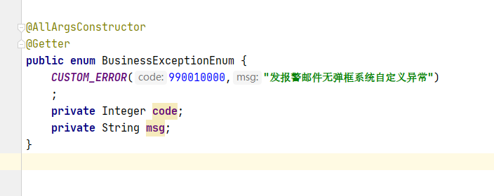
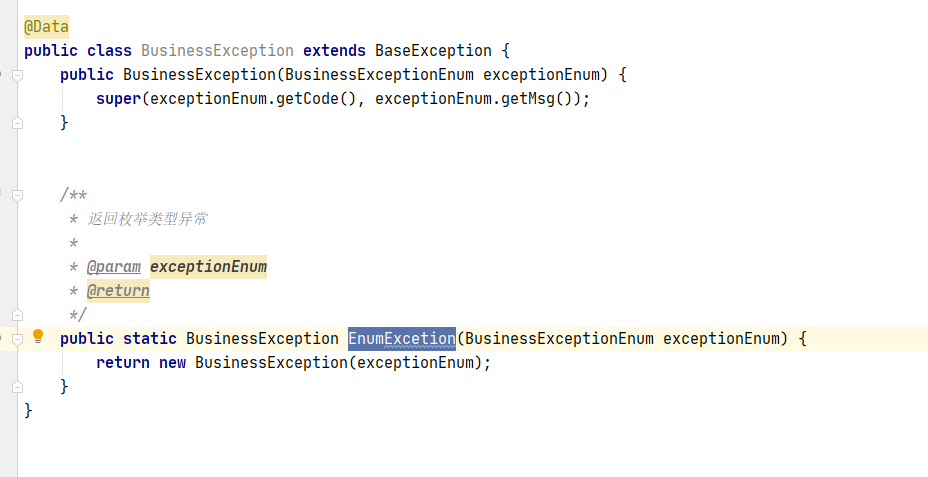

---
title:
---
# 异常规范

## 接入规范

1. gitlab 创建Springboot 脚手架 项目 
2. 向管理人员申请 两位 项目code码
3. 本项目中 创建 BusinessExceptionEnum  如下图:
4. 
5. 按九位异常code码规范 定义自己系统的异常code码
6. 可以在本系统创建 BusinessException 继承 BaseExcepion 类，然后实现 抛出 BusinessExceptionEnum   中定义的异常信息 如下图
7. 
8. 系统触发异常时，抛出BusinessException 异常

## 九位异常code 码规范

0 | 0|0| 00| 0000

### 第一位： 是否发邮件

取值：1-9

* 9-表示:发邮件异常

* 其他-通用异常 无处理

### 第二位：预定义异常，本框架提前定义好的几种异常类型

取值：0-9

* 9-系统异常
* 8-业务异常
* 7-数据库操作条数异常
* 6-权限错误
* 5-会话失效
* 其他-通用异常 无处理

###  第三位：前端弹窗、跳转等交互类型

取值：0-9

* 9- 异常错误 （红色弹框）
* 8-警告错误  （黄色弹窗）
* 7-提醒错误  
* 1- 表示跳转到登录页
* 0- 无弹窗

### 第四五位：微服务唯一标识code

取值：00-99

例子: 

* 01- 《运行评价》微服务 ；
* 02-《系统设置》微服务

### 第六七八九位： 业务自定义异常code码

取值：0000-9999

例子:

* 9998- 查找用户信息不存在
* 9997-数据库连接失败
* 0001-账号密码错误

### 总体例子

* 999019997 表示：发邮件，系统异常，前端红色弹框，运行评价 微服务  数据库连接失败
* 189020001 表示：不发邮件，业务异常，前端红色弹框，系统设置 微服务  账号密码错误

