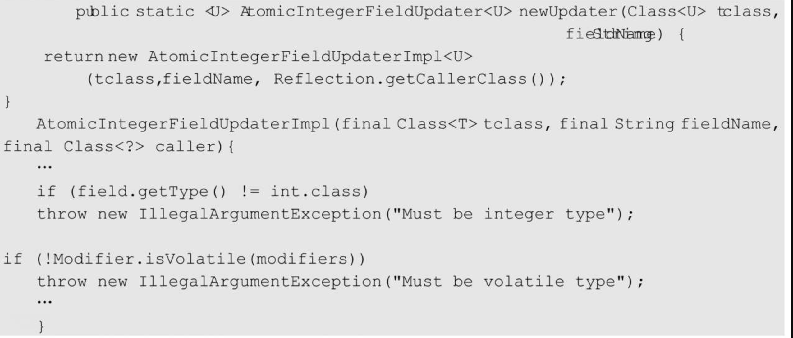
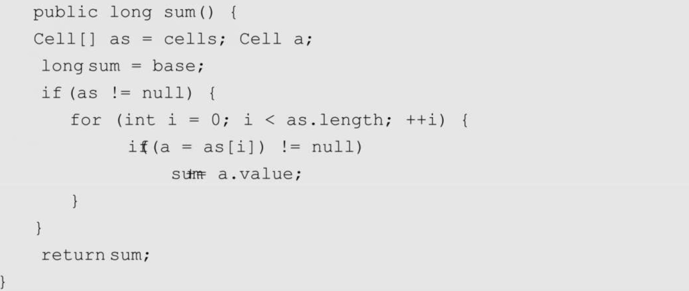
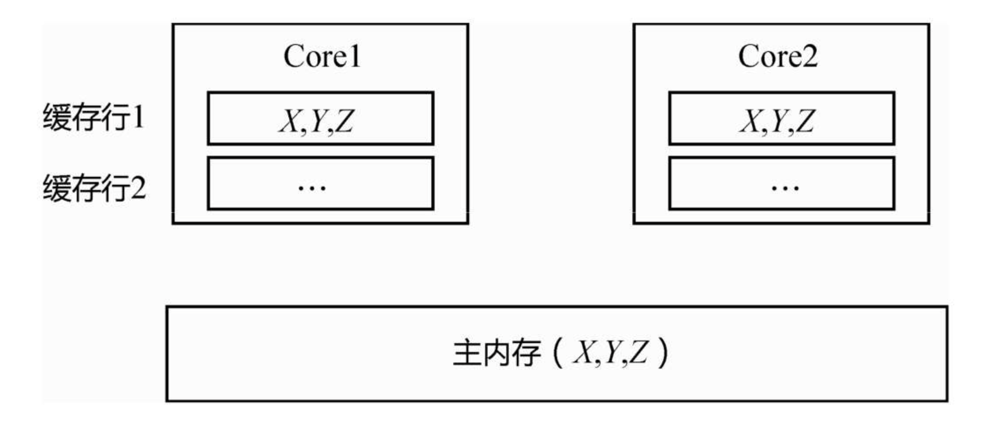
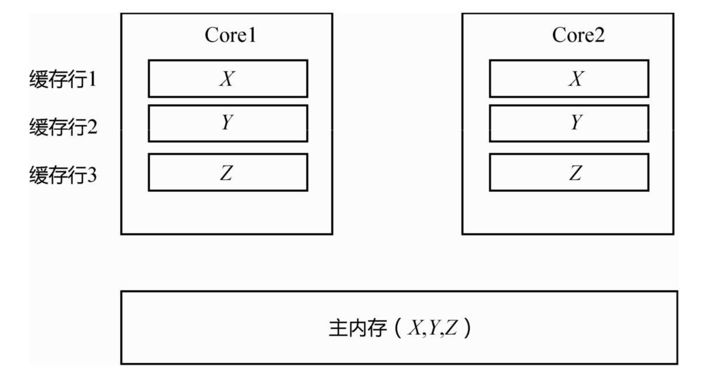
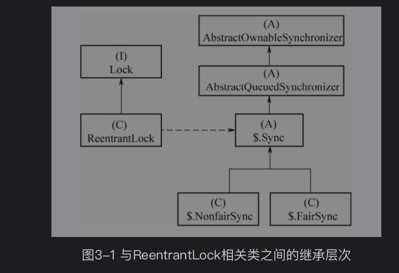
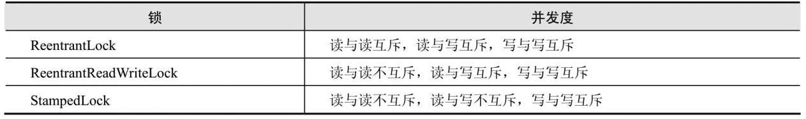

---
title:
---
# Java  锁

## concurent包

Concurrent包中的锁都是“可重入锁”，所以一般都命名为ReentrantX

###  Atomic 类

#####  乐观锁

对于乐观锁，作者认为数据发生并发冲突的概率比较小，所以读操作之前不上锁。等到写操作的时候，再判断数据在此期间是否被其他线程修改了。如果被其他线程修改了，就把数据重新读出来，重复该过程；如果没有被修改，就写回去。判断数据是否被修改，同时写回新值，这两个操作要合成一个原子操作，也就是CAS（Compare And Set）。

CAS函数，其实是封装的Unsafe类中的一个native函数

####  AtomicInteger和AtomicLong

AtomicInteger的实现就是典型的乐观锁 ，CAS 比较 修改int/Long 值

AtomicReference CAS 比较修改特定类型值

####  AtomicStampedReference和AtomicMarkableReference

AtomicStamped-Reference 解决ABA问题 ，增加了版本号概念，赋值时候 同时比较版本号，相同才赋值

==？？为什么没有AtomicStampedInteger或AtomictStampedLong？？==： 因为这里要同时比较数据的“值”和“版本号”，而Integer型或者Long型的CAS没有办法同时比较两个变量，于是只能把值和版本号封装成一个对象，也就是这里面的Pair 内部类，然后通过对象引用的CAS来实现

##### AtomicMarkableReference 

AtomicMarkableReference与AtomicStampedReference原理类似，只是Pair里面的版本号是boolean类型的，而不是整型的累加变量

因为是boolean类型，只能有true、false 两个版本号，所以并不能完全避免ABA问题，只是降低了ABA发生的概率。

###  AtomicXXXFieldUpdater

1. 为什么需要AtomicXXXFieldUpdater？

如果一个类是自己编写的，则可以在编写的时候把成员变量定义为Atomic类型。但如果是一个已经有的类，在不能更改其源代码的情况下，要想实现对其成员变量的原子操作，就需要AtomicIntegerFieldUpdater、AtomicLongFieldUpdater 和AtomicReferenceFieldUpdater

原理和 CAS一样

2. 限制条件

要想使用AtomicIntegerFieldUpdater修改成员变量，成员变量必须是volatile的int类型（不能是Integer包装类），该限制从其构造函数中可以看到：

Concurrent包提供了AtomicIntegerArray、AtomicLongArray、AtomicReferenceArray三个数组元素的原子操作。注意，这里并不是说对整个数组的操作是原子的，而是针对数组中一个元素的原子操作而言。

###  LongAdder

AtomicLong内部是一个volatile long型变量，由多个线程对这个变量进行CAS操作。多个线程同时对一个变量进行CAS操作，在高并发的场景下仍不够快，如果再要提高性能，该怎么做呢？把一个变量拆成多份，变为多个变量，有些类似于ConcurrentHashMap 的分段锁的例子

如果并发度高，冲突大，平摊到这些Cell上。在最后取值的时候，再把base和这些Cell求sum运算。

是位于基类Striped64当中的。英文Striped意为“条带”，也就是分片。

3. 最终一致性

   在sum求和函数中，并没有对cells[]数组加锁。也就是说，一边有线程对其执行求和操作，一边还有线程修改数组里的值，也就是最终一致性，而不是强一致性。这也类似于ConcurrentHashMap 中的clear（）函数，一边执行清空操作，一边还有线程放入数据，clear（）函数调用完毕后再读取，hash map里面可能还有元素。

把它和AtomicLong 的使用场景做了比较。它适合高并发的统计场景，而不适合要对某个Long 型变量进行严格同步的场景。

 ####  伪共享与缓存行填充

主内存中有变量X、Y、Z（假设每个变量都是一个Long型），被CPU1和CPU2分别读入自己的缓存，放在了同一行Cache Line里面。当CPU1修改了X变量，它要失效整行Cache Line，也就是往总线上发消息，通知CPU 2对应的Cache Line失效。由于Cache Line是数据交换的基本单位，无法只失效X，要失效就会失效整行的Cache Line，这会导致Y、Z变量的缓存也失效。

虽然只修改了X变量，本应该只失效X变量的缓存，但Y、Z变量也随之失效。Y、Z变量的数据没有修改，本应该很好地被CPU1和CPU2共享，却没做到，这就是所谓的“伪共享问题”。

问题的原因是，Y、Z和X变量处在了同一行Cache Line里面。要解决这个问题，需要用到所谓的“缓存行填充”，分别在X、Y、Z后面加上7个无用的Long型，填充整个缓存行，让X、Y、Z处在三行不同的缓存行中

而在JDK 8中，就不需要写这种晦涩的代码了，只需声明一个@sun.misc.Contended即可。

回到上面的例子，之所以这个地方要用缓存行填充，是为了不让Cell[]数组中相邻的元素落到同一个缓存行里。

4. LongAccumulator

LongAccumulator的原理和LongAdder类似，只是功能更强大，

LongAdder只能进行累加操作，并且初始值默认为0；LongAccumulator可以自己定义一个二元操作符，并且可以传入一个初始值。¬

## 

### ReentrantLock

很显然，通常的锁都要设计成可重入的，否则就会发生死锁。（自己已经拿到锁了，没有释放的情况再次获取锁，获取不到就发生死锁了）

ReentrantLock本身没有代码逻辑，实现都在其内部类Sync中。

Sync的父类==AbstractQueuedSynchronizer==经常被称作队列同步器（AQS）

它还有很多方法，可以下边慢慢去了解

- lock()
- unlock()
- tryAcquire() 尝试获取资源
- acquireQueued() 使线程在等待队列中等待，首先尝试的去获取资源，如果获得到了资源，直接返回。如果没获取到资源，则将当前线程进行阻塞。等到其他线程执行完成对其进行唤醒。

## ReadWriteLock

- 读写锁 和ReentrantLock 不一样的地方 ，是通过 state 设置高16位 低16位 区分读写；然后其他方面根据逻辑实现 

读锁的公平，读锁的不公平，写锁的公平，写锁的不公平

- 对于读线程的非公平，要做一些“约束”。当发现队列的第1个元素是写线程的时候，读线程也要阻塞一下，不能“肆无忌惮”地直接去抢。

## StampedLock

StampedLock引入了“乐观读”策略，读的时候不加读锁，读出来发现数据被修改了，再升级为“悲观读”，相当于降低了“读”的地位，把抢锁的天平往“写”的一方倾斜了一下，避免写线程被饿死。

从ReentrantLock到StampedLock，并发度依次提高。

到“读”与“写”也不互斥、并发地访问的呢？MySQL 高并发的核心机制MVCC，也就是一份数据多个版本，此处的StampedLock有异曲同工之妙。

读的时候不加读锁，读出来发现数据被修改了，再升级为“悲观读”，相当于降低了“读”的地位，把抢锁的天平往“写”的一方倾斜了一下，避免写线程被饿死。

#### 使用场景 

多线程 并发不间断写 ，偶尔一次读的场景

比如：并发实时更新 坐标位置x,y ,偶尔求一次 坐标距离  （具体参考：Java并发实现原理）

