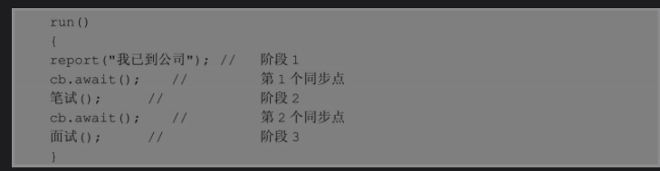
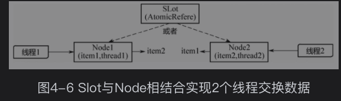
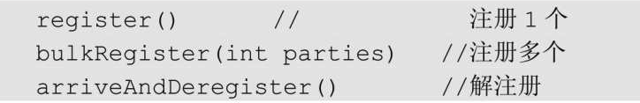
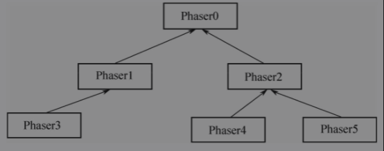
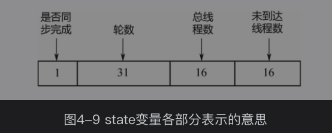
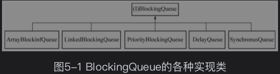
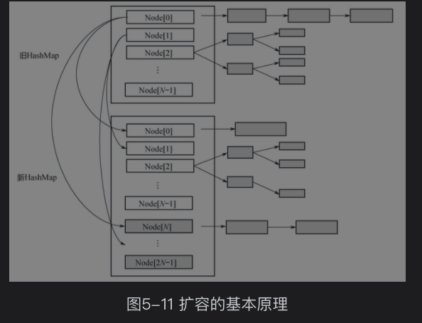

---
title:
---
# JUC   Concurrent包

自旋10次 ，自适应自旋  可能2-3次 ，根据上次枷锁是否成功

高并发技术手段
线程标记 可重入 （偏向锁）
自旋 
Cas 汇编 lock compareChange 
monitor 
信号量

阻塞  unsafe 包里的 pack 和 unpack

先后一致次序（memory_order_seq_cst）、
获取-释放次序（memory_order_consume、memory_order_acquire、memory_order_release和memory_order_acq_rel）、宽松次序（memory_order_relaxed）。

## 锁 相关

## 同步工具

### Semaphore 信号量

它内部的计数器是递增的，并且在一开始初始化Semaphore时可以指定一个初始值，但是并不需要知道需要同步的线程个数，而是在需要同步的地方调用acquire方法时指定需要同步的线程个数。

基于AQS

多个线程(>n)执行，每次state -1,直到 semaphore 为0 其他线程阻塞，有线程执行完，新线程才能抢夺，当只有一个共享资源则 升级为排他锁；

###  CountDownLatch

###  CyclicBarrier

CyclicBarrier基于ReentrantLock+Condition实现。

满足计数器可以重置的需要，JDK开发组提供了CyclicBarrier类，并且CyclicBarrier类的功能并不限于CountDownLatch的功能。从字面意思理解，CyclicBarrier是回环屏障的意思，它可以让一组线程全部达到一个状态后再全部同时执行

第1个同步点，要等所有应聘者都到达公司，再一起开始笔试；第2个同步点，要等所有应聘者都结束笔试，之后一起进入面试环节。具体到每个线程的run（）方法中，就是下面的伪代码：

（1）CyclicBarrier是可以被重用的

（2）CyclicBarrier 会响应中断。10个线程没有到齐，如果有线程收到了中断信号，所有阻塞的线程也会被唤醒，就是上面的breakBarrier（）函数。然后count被重置为初始值（parties），重新开始。

（3）上面的回调函数，barrierAction只会被第10个线程执行1次（在唤醒其他9个线程之前），而不是10个线程每个都执行1次。

###  Exchanger

用于线程之间交换数据

Exchanger的核心机制和Lock一样，也是CAS+park/unpark。

有两个内部类：Slot（AtomicReference存线程要交换的数据）和Node （线程的封装）

Slot的AtomicReference就是指向的一个Node，通过Slot和Node相结合，实现了2个线程之间的数据交换，如图4-6所示。线程1持有数据item1，线程2持有数据item2，各自调用exchange（..），会各自生成一个Node。而Slot只会指向2个Node中的1个：如果是线程1先调用的exchange（..），那么Slot就指向Node1，线程1阻塞，等待线程2来交换；反之，如果是线程2先调用的exchange（..），那么Slot就指向Node2，线程2阻塞，等待线程1来交换数据。

一个Slot只能支持2个线程之间交换数据，要实现多个线程并行地交换数据，需要多个Slot，因此在Exchanger里面定义了Slot数组：

### Phaser

同步点

可以实现 CountDownLatch 和CyclicBarrier

##### Phaser新特性

特性1：动态调整线程个数

特性2：层次Phaser

​	

##### 原理解析

这个64位的state变量被拆成4部分，

阻塞使用的是一个称为Treiber Stack的数据结构，而不是AQS的双向链表。Treiber Stack是一个无锁的栈

它是一个单向链表，出栈、入栈都在链表头部，所以只需要一个head指针，而不需要tail指针。

为了减少并发冲突，这里定义了2个链表，也就是2个Treiber Stack。当phase为奇数轮的时候，阻塞线程放在oddQ里面；当phase为偶数轮的时候，阻塞线程放在evenQ里面。

## 并发容器

### BlockingQueue

BlockingQueue是一个带阻塞功能的队列，当入队列时，若队列已满，则阻塞调用者；当出队列时，若队列为空，则阻塞调用者。

### ArrayBlockingQueue

ArrayBlockingQueue 是一个用数组实现的环形队列，在构造函数中，会要求传入数组的容量。

### LinkedBlockingQueue

LinkedBlockingQueue是一种基于单向链表的阻塞队列。因为队头和队尾是2个指针分开操作的，所以用了2把锁+2个条件，同时有1个AtomicInteger的原子变量记录count数。

### PriorityBlockingQueue

队列通常是先进先出的，而PriorityQueue是按照元素的优先级从小到大出队列的。正因为如此，PriorityQueue中的2个元素之间需要可以比较大小，并实现Comparable接口。

### DelayQueue

DelayQueue即延迟队列，也就是一个按延迟时间从小到大出队的PriorityQueue。所谓延迟时间，就是“未来将要执行的时间”-“当前时间”。为此，放入DelayQueue中的元素，必须实现Delayed接口

### SynchronousQueue

它本身没有容量。先调put（..），线程会阻塞；直到另外一个线程调用了take（），两个线程才同时解锁，反之亦然。对于多个线程而言，例如3个线程，调用3次put（..），3个线程都会阻塞；直到另外的线程调用3次take（），6个线程才同时解锁，反之亦然。

### CopyOnWrite

CopyOnWrite指在“写”的时候，不是直接“写”源数据，而是把数据拷贝一份进行修改，再通过悲观锁或者乐观锁的方式写回。那为什么不直接修改，而是要拷贝一份修改呢？这是为了在“读”的时候不加锁。

#### CopyOnWriteArrayList

读的时候不加锁，写的时候加 lock  悲观锁 ，写完再读

### ConcurrentLinkedQueue/Deque

原理 基于同样是基于CAS

它是一个单向链表

但在ConcurrentLinkedQueue中，head/tail的更新可能落后于节点的入队和出队，因为它不是直接对head/tail指针进行CAS操作的，而是对Node中的item进行操作。

### ConcurrentHashMap

每个Segment都继承自ReentrantLock，Segment的数量等于锁的数量，这些锁彼此之间相互独立，即所谓的“分段锁”

为了提升hash的计算性能，会保证数组的大小始终是2的整数次方。例如设置concurrentyLevel=9，在构造函数里面会找到比9大且距9最近的2的整数次方，也就是ssize=16。对应segmentShift、segmentMask两个变量，是为了方便计算hash使用的。

默认的Segment数组大小是16。

扩容

人在多核模式下为（n＞＞＞3）/NCPU，并且保证步长的最小值是16。显然，需要的线程个数约为n/stride。

### ConcurrentSkipListMap

treeMap 基于红黑树，ConcurrentSkipListMap，是基于SkipList（跳查表）来实现的

2．无锁链表

无锁链表所实现的队列 是在头结点和尾节点增加cas 操作，

但是 当在链表中间插入删除数据 CAS操作就会有问题，所以

## 参考

[**ava并发体系-第三阶段-JUC并发包-[1].md**](https://github.com/youthlql/JavaYouth/blob/main/docs/java_concurrency/Java%E5%B9%B6%E5%8F%91%E4%BD%93%E7%B3%BB-%E7%AC%AC%E4%B8%89%E9%98%B6%E6%AE%B5-JUC%E5%B9%B6%E5%8F%91%E5%8C%85-%5B1%5D.md)

# [AbstractQueuedSynchronizer源码解读--续篇之Condition](https://www.cnblogs.com/micrari/p/7219751.html)

