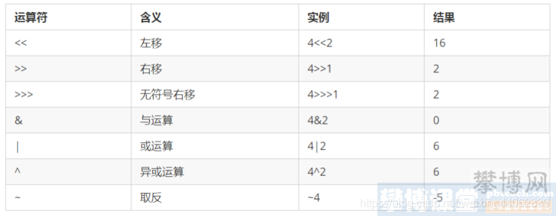

---
title:
---
# 位运算

&与：
两个二进制位只要有一个为0那么结果就为0，否则结果为1。
|或：
两个二进制位只要有一个为1那么结果就为1，否则结果为0。
^异或:
任何相同二进制位进行 ^ 运算，结果是0；不相同二进制位 ^ 运算结果是1。
~取反：
0变1，1变0

## 场景

[判断奇偶数](https://blog.csdn.net/qq_39314099/article/details/110482069?spm=1001.2101.3001.6661.1&utm_medium=distribute.pc_relevant_t0.none-task-blog-2~default~CTRLIST~default-1.no_search_link&depth_1-utm_source=distribute.pc_relevant_t0.none-task-blog-2~default~CTRLIST~default-1.no_search_link&utm_relevant_index=1#t6)

[取余运算](https://blog.csdn.net/qq_39314099/article/details/110482069?spm=1001.2101.3001.6661.1&utm_medium=distribute.pc_relevant_t0.none-task-blog-2~default~CTRLIST~default-1.no_search_link&depth_1-utm_source=distribute.pc_relevant_t0.none-task-blog-2~default~CTRLIST~default-1.no_search_link&utm_relevant_index=1#t7)

[判断一个数是不是2的幂](https://blog.csdn.net/qq_39314099/article/details/110482069?spm=1001.2101.3001.6661.1&utm_medium=distribute.pc_relevant_t0.none-task-blog-2~default~CTRLIST~default-1.no_search_link&depth_1-utm_source=distribute.pc_relevant_t0.none-task-blog-2~default~CTRLIST~default-1.no_search_link&utm_relevant_index=1#t8)

[判断数字的正负号](https://blog.csdn.net/qq_39314099/article/details/110482069?spm=1001.2101.3001.6661.1&utm_medium=distribute.pc_relevant_t0.none-task-blog-2~default~CTRLIST~default-1.no_search_link&depth_1-utm_source=distribute.pc_relevant_t0.none-task-blog-2~default~CTRLIST~default-1.no_search_link&utm_relevant_index=1#t9)

[hashmap的tableSizeFor方法](https://blog.csdn.net/qq_39314099/article/details/110482069?spm=1001.2101.3001.6661.1&utm_medium=distribute.pc_relevant_t0.none-task-blog-2~default~CTRLIST~default-1.no_search_link&depth_1-utm_source=distribute.pc_relevant_t0.none-task-blog-2~default~CTRLIST~default-1.no_search_link&utm_relevant_index=1#t10)

[求相反数](https://blog.csdn.net/qq_39314099/article/details/110482069?spm=1001.2101.3001.6661.1&utm_medium=distribute.pc_relevant_t0.none-task-blog-2~default~CTRLIST~default-1.no_search_link&depth_1-utm_source=distribute.pc_relevant_t0.none-task-blog-2~default~CTRLIST~default-1.no_search_link&utm_relevant_index=1#t11)

[求绝对值](https://blog.csdn.net/qq_39314099/article/details/110482069?spm=1001.2101.3001.6661.1&utm_medium=distribute.pc_relevant_t0.none-task-blog-2~default~CTRLIST~default-1.no_search_link&depth_1-utm_source=distribute.pc_relevant_t0.none-task-blog-2~default~CTRLIST~default-1.no_search_link&utm_relevant_index=1#t12)

[交换两个变量（不引入第三个变量）](https://blog.csdn.net/qq_39314099/article/details/110482069?spm=1001.2101.3001.6661.1&utm_medium=distribute.pc_relevant_t0.none-task-blog-2~default~CTRLIST~default-1.no_search_link&depth_1-utm_source=distribute.pc_relevant_t0.none-task-blog-2~default~CTRLIST~default-1.no_search_link&utm_relevant_index=1#t13)

[判断两个数正负号是否相同](https://blog.csdn.net/qq_39314099/article/details/110482069?spm=1001.2101.3001.6661.1&utm_medium=distribute.pc_relevant_t0.none-task-blog-2~default~CTRLIST~default-1.no_search_link&depth_1-utm_source=distribute.pc_relevant_t0.none-task-blog-2~default~CTRLIST~default-1.no_search_link&utm_relevant_index=1#t14)

[求两个数的平均数](https://blog.csdn.net/qq_39314099/article/details/110482069?spm=1001.2101.3001.6661.1&utm_medium=distribute.pc_relevant_t0.none-task-blog-2~default~CTRLIST~default-1.no_search_link&depth_1-utm_source=distribute.pc_relevant_t0.none-task-blog-2~default~CTRLIST~default-1.no_search_link&utm_relevant_index=1#t15)

[求两个数的最大值](https://blog.csdn.net/qq_39314099/article/details/110482069?spm=1001.2101.3001.6661.1&utm_medium=distribute.pc_relevant_t0.none-task-blog-2~default~CTRLIST~default-1.no_search_link&depth_1-utm_source=distribute.pc_relevant_t0.none-task-blog-2~default~CTRLIST~default-1.no_search_link&utm_relevant_index=1#t16)

[求两个数的最小值](https://blog.csdn.net/qq_39314099/article/details/110482069?spm=1001.2101.3001.6661.1&utm_medium=distribute.pc_relevant_t0.none-task-blog-2~default~CTRLIST~default-1.no_search_link&depth_1-utm_source=distribute.pc_relevant_t0.none-task-blog-2~default~CTRLIST~default-1.no_search_link&utm_relevant_index=1#t17)

## 参考

[Java位运算和几个使用场景解析](https://blog.csdn.net/qq_39314099/article/details/110482069?spm=1001.2101.3001.6661.1&utm_medium=distribute.pc_relevant_t0.none-task-blog-2%7Edefault%7ECTRLIST%7Edefault-1.no_search_link&depth_1-utm_source=distribute.pc_relevant_t0.none-task-blog-2%7Edefault%7ECTRLIST%7Edefault-1.no_search_link&utm_relevant_index=1)