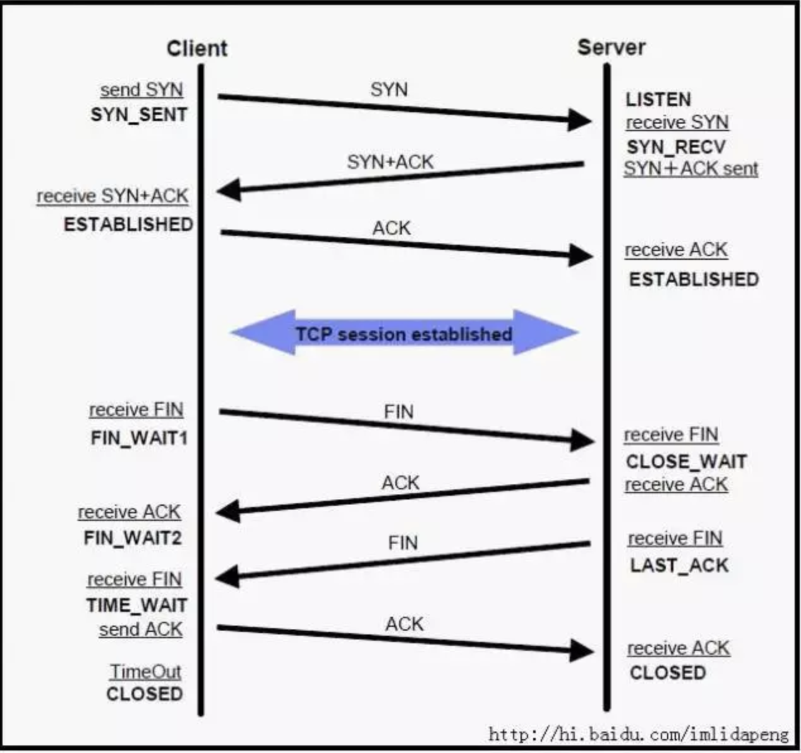

---
title:
---
# 握手挥手

## 问题  什么情况下会出现Closedwait ,以及 解决办法

## 参考

[CLOSE_WAIT状态的原因与解决方法](https://www.cnblogs.com/baishuchao/p/9024205.html)

# [CLOSE_WAIT问题-TCP ](https://www.cnblogs.com/baishuchao/p/9024205.html)

[TCP SYN洪泛攻击的原理及防御方法](https://blog.csdn.net/shixin_0125/article/details/78829069)