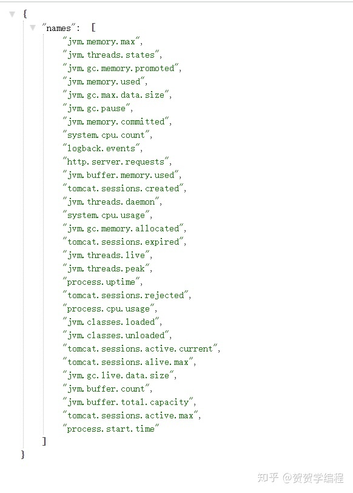
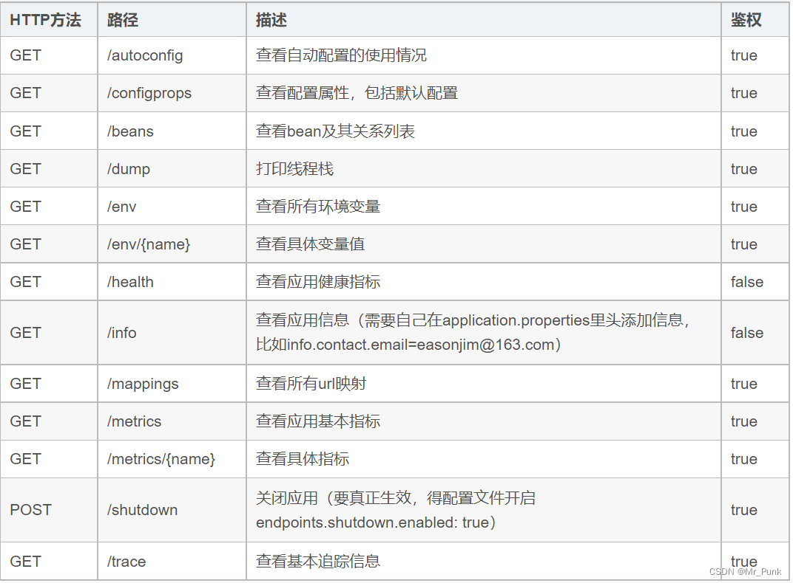

# Actuator

## 配置

```
# actuator 监控配置
management:
  #actuator端口 如果不配置做默认使用上面8080端口
  server:
    port: 8080
  endpoints:
    web:
      exposure:
        #默认值访问health,info端点  用*可以包含全部端点
        include: "*"
      #修改访问路径 2.0之前默认是/; 2.0默认是/actuator可以通过这个属性值修改
      base-path: /actuator
  endpoint:
    shutdown:
      enabled: true #打开shutdown端点
    health:
      show-details: always #获得健康检查中所有指标的详细信息
```

## 常用路由

* 查看一些指标的信息可以进行监控`http://localhost:8080/actuator/metrics`







## 参考

[spring-boot-starter-actuator的简单理解及应用](https://blog.csdn.net/Mr_Punk/article/details/127477279)

[SpringBoot四大核心之actuator——程序监控器](https://zhuanlan.zhihu.com/p/343095559)

