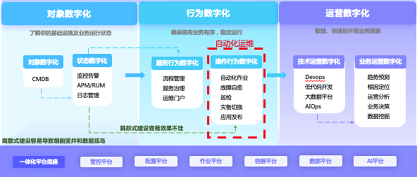

# 自动化运维

[自动化运维](https://xie.infoq.cn/link?target=https%3A%2F%2Fwww.cloudbility.com%2Fclub%2F12258.html)简单来说就是把周期性、重复性、规律性的工作都交给工具或平台去做，把过去的手工执行转为自动化操作。自动化运维是 IT 运维工作的升华，其不单纯是一个维护过程，更是一个管理的提升过程，是 IT 运维的最高层次，也是未来的发展趋势。

## 功能

* 自动化运维之脚本/命令批量执行  
* 自动化运维之文件自动分发/收集
* 自动化运维之任务编排

(脚本执行，批量执行 占技术人员工作的80%，)

（命令批量执行  ）

能够**提升运维效率降低系统风险，促进运维组织的成熟和能力的升级**。

**自动化运维优点**

1、提高 IT 运维工作人员工作效率，提升整体项目效率；

2、提升运维工作价值，管理更多资源，更多服务对象；

3、让运维工作更轻松、灵动；

4、减少人为误操作，让 IT 资产更安全，降低成本；

5、事务留痕，方便跟踪，追述；

6、方便信息传递，配置类信息聚合，信息链更完整；

7、[高可用](https://xie.infoq.cn/link?target=https%3A%2F%2Fwww.cloudbility.com%2Fclub%2F15029.html)，可以监控告警、降低网络停机时间，减少故障

**自动化运维缺点**

1、前期需要运维人员去花时间学习使用；

2、需要运维人员不断监控和调整，确保自动化工具的正常运行和有效性；

3、需要运维人员有一定的技术水平，能维护和优化自动化脚本和工具。

【总结】：自动化运维可以提高运维效率和生产率，降低成本，提高企业 IT 服务的质量和可用性。但需要运维人员的支持，所以选择靠谱的自动化运维软件至关重要。

并支持用户新建各类自定义 Shell/Python/PowerShell/CMD 脚本

用户可以根据业务要求编排运维任务，设置各种触发条件，一旦触发后，系统能够自动执行相应的已编排好的任务，例如：[云主机](https://xie.infoq.cn/link?target=https%3A%2F%2Fwww.cloudbility.com%2Fclub%2F13484.html)自动升级、应用自动部署等，完成企业用户对自动化运维的需求。

## 工具库

* ansible 
* puppet
* saltstack

## 参考

[【保姆级教程】自动化运维工具saltstack介绍、安装、使用](https://zhuanlan.zhihu.com/p/433968130)

