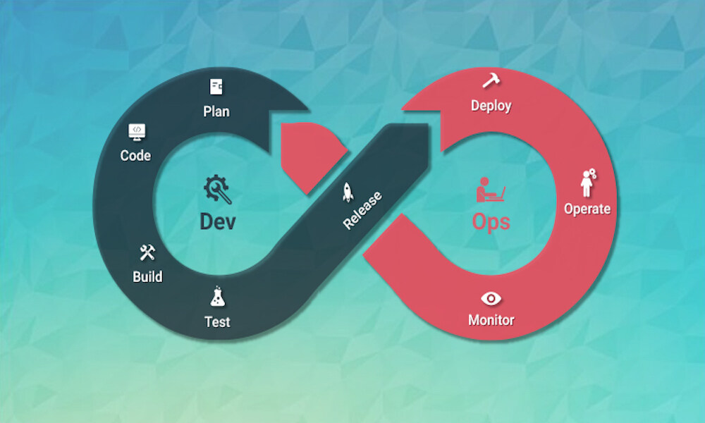
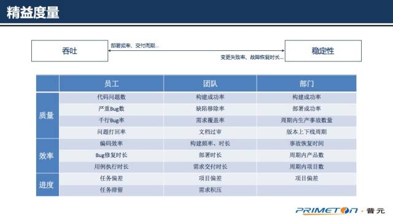
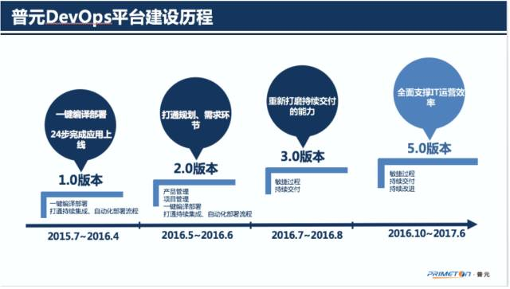

# devops积累

目的： 积累devops 相关材料 ：话术，技术栈，框架，能力，发展趋势

## 话术

DevOps 从字面上看就是开发和运维，也有翻译为开发运维（运营）一体化。我们这里的两个视角不是别的东西，正是开发和运维。这里的开发，不能简单的理解为开发工程师，指代的是整个`软件的研发过程所含的所有要素`，涵盖需求分析、开发、测试等等，其终点是可交付的软件制品。同样运维不仅仅是运维工程师，指代的是`软件交付后投产过程以及后续的运营`，反馈等系列过程，其起点是接受交付的软件制品。

## 技术栈

## 框架

## 能力

## 发展趋势

## 参考

[支撑企业IT精益运营：普元DevOps平台实践之路](https://mp.weixin.qq.com/s?__biz=MzIzNjUxMzk2NQ==&mid=2247485268&idx=1&sn=02926597156b717f23437af192081d47&chksm=e8d7f896dfa07180a74dc7356609b28facadbae55babfb19fe5358755c9d14251e7353274271&scene=27#wechat_redirect)