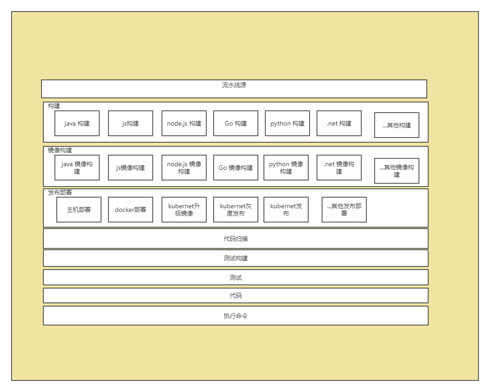
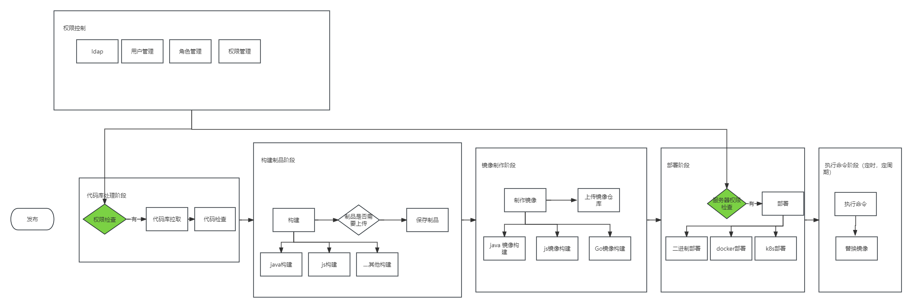

# 研发效能功能对比

1. 自动化运维平台功能架构梳理

2. 云效等devops 平台功能架构梳理

3. 我个人经验

4. 对比差异点

5. 综合自动化运维平台优化点

   

## 流水线方案对比

* 构建部署模块化
* shell 脚本 模板化
* 尝试 java 流程控制 替换 ansible 

### 自动化运维平台流水线架构功能梳理

.png)

### 云效功能梳理

### 研发效能平台功能梳理

### 个人经验

1. 触发方式增加自动化触发 ，可通过gitlab  webhook 实现，方便自动化流程使用。
2. 权限统一收集管理，在流水线各个环节进行动态分配，增加安全性
3. 流水线模块化，方便使用者自由组合，功能可用性，复用性更强。
4. 流水线创建流程简化，实际使用者中很多场景在流水线中只需改动很小的环节，这样不必创建新流水线
5. 镜像制品 增加 构建时 最新commit号，以便于后期排查版本 活避免版本问题
6. dev,test,pre ,prod 环境 权限控制
7. 流水线 构建，部署 模版化， 一是方便扩展，二是提供
8. 增加镜像/二进制制品库管理