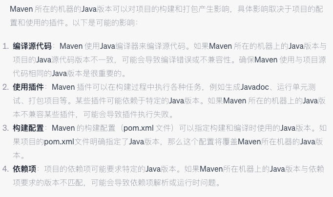
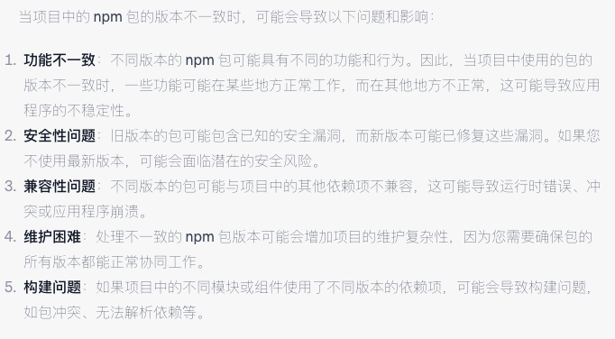

# 自动化运维平台 现状

## 1. 敏捷研发体系建设

## 2. 持续交付工具链

### 2.1 持续集成

#### 现有能力

##### 核心资产管理

* 在自动化运维平台  包含的管理资源有 团队管理、项目管理、服务管理、主机管理、环境管理

* gitlab平台管理  代码库资源

* nexus，harbor 仓库 分别管理  maven 依赖制品 和  docker 镜像制品
  * ==二进制，镜像 制品 等得权限控制待完善， 影响: 制品有被非正常操作风险== 
  * ==前端制品仓库待补充(可基于Nexus)==

##### 代码质量检查

- 项目本地设有代码检测：前端项目集成了eslint ,java 项目 集成了 sonar检测 ，在本地可以提示代码规范 以及代码质量检查

- 代码提交环节增加了代码审查：在代码提交到gitlab 之后,通过gitlab的CICD机制 触发了新提交代码的审查，通过SonarQube进行多项指标检查报告，并将检查结果通过飞书反馈给提交人。 

  - ==代码质量检测综合报告待完善==

  - ==代码质量横向对比（时间维度，项目维度，人员维度）待完善==

  - ==以代码质量检测结果为依据做CICD的流程控制  暂无==

    

##### 安全检查

* ==集成安全扫描工具暂无==
* ==扫描结果控制流程==
* ==自动生成扫描报告==

##### 自动编译

* 目前支持  后端基于maven3 对 java 代码进行自动化 编译 打包 (当前版本 java8)

  * ==当前maven 只能基于java 8进行打包==

    
  *  ==目前只能支持单pom项目结构的项目打包，(宏亮反馈)==

* 支持 前端基于 npm 对前端vue 项目进行 编译打包：目前npm 版本(115-v6.4.1,  117-v6.14.4) 

  * ==目前生产环境自动化运维两台机器，两台机器的npm 版本不一致==

  
	* 
  
* 后端支持构建镜像 ：基于java8 ， 基于skywalking的监控 ，基于felk的日志统一采集监控

  * ==目前只支持基于运维提供自定义的基础镜像进行构建== 问题: a. 非开源镜像，b. 改造困难，c. 等等
  * ==目前制作java 制品和运行制品都在镜像内==，问题: a. 违背镜像轻量原则，占用无谓空间，b. 步骤无法解耦 c. 等等
  * 目前

### 2.2 持续测试

### 2.3 持续部署

## 3. 运行监控

