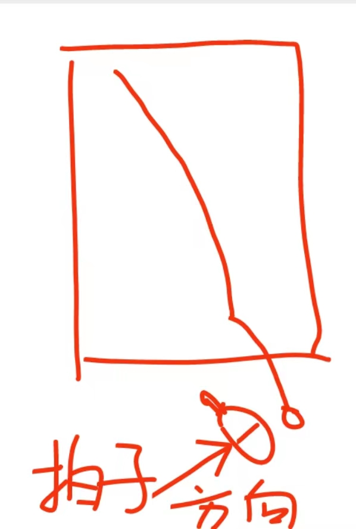
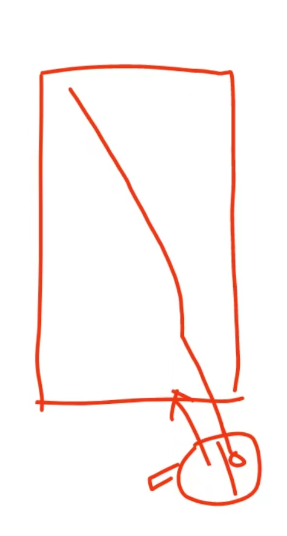

---
title:
tags:
  - 乒乓

---

# 总结_20230423

## 问题

* 接高吊总出台
* 反手比赛不敢用

## 新得

### 打球质量

所有打球的人达到一定水平之后都有各自的特点，常常有人说是力量型选手还是速度型选手。。。

实际上打球综合所有技术打法可以归为以下几类:

* 力量
* 旋转
* 速度
* 线路
* 落点

每一项技术掌握的熟练程度，都可以称为打球的**质量**

### 比赛合理性

比赛通常都是搭配使用达到最大效果

* 力量通常配合旋转
* 速度配合线路
* 线路配合落点

一些常用打法套路

* 旋转抵抗速度:速度型选手通常出手快，线路刁，被调动起来跟不上的话会很被动，如果不想被速度上一直受牵制，可以多加旋转，对方需要更多的思考和判断精力，无论上旋 下旋 通过旋转来限制对方的速度
* 线路来牵制力量：力量型选手通常球很顶很爆，难防，但要达到这种效果 也需要选手脚步和动作到位，遇到这种选手可以多用**线路**和**落点**去调动对方，这样通常对方失误率也会提高
* **此消彼长原则**: 在比赛中，当对方手感上来进攻会多，这时跟对方硬拼进攻，因为热身程度不同，往往受牵制，不如积极防守调度，等对方**手感下降**失误率上来，我方手再积极进攻往往旗开得胜。
* 比赛开始阶段 双方身体都比较紧，不建议大开大合去加力量，多用脚步配合速度线路落点变化去调度对方，等身体热了再加力量往往手感更好。

一些不合理打法

* **对力量型选手去硬碰硬**，通常就会给对方更大的借力和发力空间
* **对速度型选手只拼速度**，因为对方移动快，熟练度高，常常优势球被打成劣势
* 面对进攻不稳定防守稳定的对手，**盲目进攻**就会让对方失误的机会变少，自己失误机会增多
* 面对偏进攻但防守不稳定对手，**一味防守**只会让对方进攻更顺畅，多进攻，尽管失误也会提高，相比让对方进攻得分自己失误还能得到热身，打算对方节奏。
* 高吊旋转多， 还主动发力拍，相当于用力量去对抗旋转，导致失误增多，可以快带一下，用速度压制。

### 其他
* 正手拉下旋：正手准备时，右脚可以根据情况后腿半步来让出空间来，发力更合理
* 反手拉下旋：先不要发全力，训练先去体会动作，力量是在熟练之后合力产生的
* 正手攻球：**手臂挥动时匀速**，用跨找球，顶跨带小臂发力，球速不是靠揮小臂击球产生的，而是靠合力的程度，身体力量传到球上，即使很慢 球速依然很 爆
* 发球：新增两个威胁发球，反手发中路近台侧上，正手发右路外拐短侧下
* 击球尝试找找 **过球原则**，也就是说击球后球拍并不是立马停下来，而是随着速度要揮过球，这样能使动作做完整促进击球后放松

#### 缪教练补充关于拉球 :

**正手拉球或者反手拉球，就是去找到点去拉，看清楚球的下降前期的弧线，先移动步伐找到球的线路，再从后往前击球，把这个点打清楚就行**

拍子方向:不要这样拉球

应该这样：

## 训练

* 正手起下旋
* 反手起下旋
* 正手拉球

## 改善

* 正手拉球