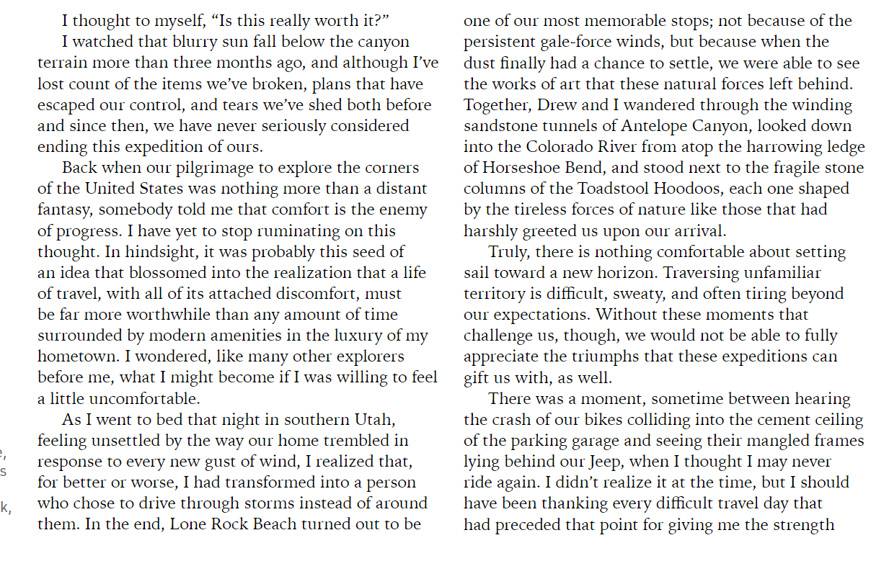

---
title:
---
# 英文单词积累

| 单词                                                         | 翻译                                                         | 出处                                                         | 打分 |
| ------------------------------------------------------------ | ------------------------------------------------------------ | ------------------------------------------------------------ | ---- |
| art                                                          | 艺术                                                         | 目录                                                         |      |
| Classic                                                      | 经典                                                         |                                                              |      |
| Graphic Novels                                               | 图形小说                                                     |                                                              |      |
| Romance                                                      | 浪漫                                                         |                                                              |      |
| community                                                    | 社区                                                         |                                                              |      |
| curious                                                      | 好奇                                                         | https://www.goodreads.com/topic/show/22368772-does-anyone-own-a-book-themed-etsy-business |      |
| blind date                                                   | 男女初次见面(相亲)                                           | I have a small business on mercari, buti don't sell books.  my friend Fabi does! I absolutely recommend her shop!   it's called "mystery books by Fabi"on etsy. She's one of my friends on here.  u can find her shop there! She sells blind date with books. :) |      |
| perfume                                                      | 香水                                                         |                                                              |      |
| literally                                                    | 字面意义                                                     | i literally just bend the corner of the page hahaha          |      |
| memoir                                                       | 回忆录                                                       |                                                              |      |
| autobiography                                                | 自传                                                         |                                                              |      |
| fiction                                                      | 小说                                                         |                                                              |      |
| comfort rules                                                | 舒适性规则                                                   | chrome-extension://ikhdkkncnoglghljlkmcimlnlhkeamad/pdf-viewer/web/viewer.html?file=https%3A%2F%2Fsun6-22.userapi.com%2Fc534536%2Fu448173336%2Fdocs%2Fd42%2F9c20f877211d%2FROVA__October-November_2022.pdf%3Fextra%3DTToRGlY4OApT7mJgC6wMEkbydRbbb9LoHLF1-o8KxBQELzJhnHqc9J5VBIaUDd5At8OXv7FzVQV7DPT6dW-0UyXg8BiYf42IhWZRzM4tVU7xmHwtkFjX2SWAfFu1UsqwFW2_b_DnC7Afpg | 5    |
| Nothing worth doing is easy.                                 | 值得做的没有简单的事                                         |                                                              |      |
| intolerances                                                 | 不耐受                                                       |                                                              |      |
| transformative                                               | 变革性的                                                     |                                                              |      |
| awkward                                                      | 令人尴尬的                                                   |                                                              |      |
| ultimately                                                   | 最终                                                         |                                                              |      |
| mangled                                                      | 破损的                                                       |                                                              |      |
| urges                                                        | 催促，敦促                                                   |                                                              |      |
| introvert                                                    | 内向的人                                                     |                                                              |      |
| frustrations                                                 | 挫折                                                         |                                                              |      |
| in common                                                    | 共同之处                                                     |                                                              |      |
| catalyst                                                     | 催化剂                                                       |                                                              |      |
| immerse yourself in these                                    | 使自己沉浸其中                                               |                                                              |      |
| Soundtrack                                                   | 原声带                                                       |                                                              |      |
| impeccably                                                   | 无可挑剔的                                                   |                                                              |      |
| Calm                                                         | 平静的                                                       |                                                              |      |
| meditative                                                   | 冥想                                                         |                                                              |      |
| anxiety-relieving                                            | 焦虑缓解                                                     |                                                              |      |
| enthusiasts                                                  | 爱好者                                                       |                                                              |      |
| enthusiastic                                                 | 热情                                                         |                                                              |      |
| ridiculous                                                   | 荒唐的                                                       |                                                              |      |
| hilarious                                                    | 令人捧腹的 ，搞笑的                                          |                                                              |      |
| rosemary                                                     | 迷迭香                                                       |                                                              |      |
| spicy margarita                                              | 辛辣的玛格丽特                                               |                                                              |      |
| alcohol                                                      | 酒精                                                         |                                                              |      |
| permanent population                                         | 常驻人口                                                     |                                                              |      |
| Spend time on Mount Desert Island on the top of a mountain, in a boat on the water, or surrounded by the fresh scents of an autumn forest | 花费时间在某岛的山顶上，在水上的船上，在围绕着新鲜气味的秋天的森林里 |                                                              |      |
| priceless                                                    | 无价的                                                       |                                                              |      |
| although                                                     | 尽管                                                         |                                                              |      |
| a distant fantasy,                                           | 遥远的幻想                                                   |                                                              |      |
| ruminate on                                                  | 沉思                                                         | I have yet to stop ruminating on this thought                |      |
| In hindsight,                                                | 事后看来                                                     |                                                              |      |
| blossomed                                                    | 开花                                                         | In hindsight, it was probably this seed of an idea that  blossomed into the realization that a life  of travel, with all of its attached discomfort, must  be far more worthwhile than any amount of time  surrounded by modern amenities in the luxury of my  hometown |      |
| worthwhile                                                   | 值得的                                                       |                                                              |      |
|                                                              |                                                              |                                                              |      |
|                                                              |                                                              |                                                              |      |
|                                                              |                                                              |                                                              |      |

