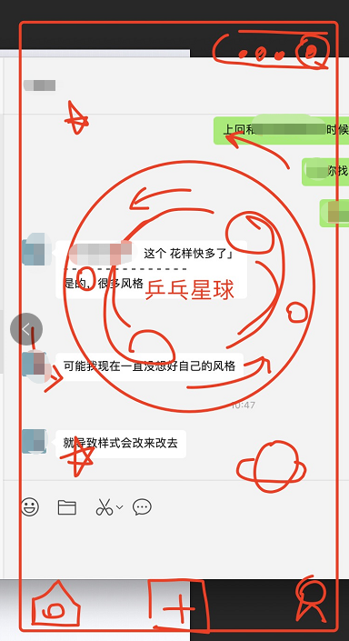
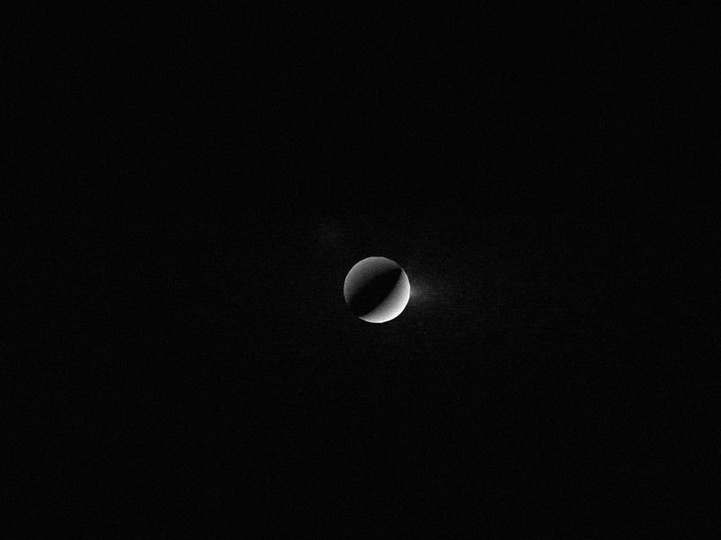

---
title:
tags:
  - 乒乓
  - 小程序自研
---

#  20230322

## 问题

* 目前小程序页面没有突出主旨，太老旧 样式待改进
* 目前小程序功能设计不完善，比如匹配功能 怎么匹配，

## 进展

1. 朋友帮忙设计了一下首页风格，乒乓宇宙，增加宇宙元素，乒乓元素，配色，自传 ，公转  （第一期 极简就行 banner也不要 啥也不要 上来就一个功能约球 在视觉重心那）

* midjourney 生成 背景图 ，包含  乒乓，宇宙，地球自传  公转，星星，极简风格，

* 找到几个国外查看设计图的网址 

| https://dribbble.com/search/shots/popular/mobile?q=table%20tennis |      |      |
| ------------------------------------------------------------ | ---- | ---- |
| https://dribbble.com/shots/5610285-Leapfrog-Sports           |      |      |
| https://dribbble.com/shots/2858519--Rivals                   |      |      |
| https://dribbble.com/shots/3928622-Intergalactic-table-tennis |      |      |

 

*  调研 前端动效网站 https://codepen.io/gaearon/pen/PGEjdG?editors=0010

|                                   |      |                                                  |
| --------------------------------- | ---- | ------------------------------------------------ |
| 有阴影的球                        |      | https://codepen.io/a240277805/pen/QWVZooM        |
| 弹跳的球                          |      | https://codepen.io/jaehee/pen/zNdwZw             |
| 会动的乒乓球拍背景                |      | https://codepen.io/Vizion_Snilloc_jr/pen/YzaOPaK |
| 底部动态扩展                      |      | https://codepen.io/lockingdong/pen/VrxrOE        |
| 鼠标点击有震动效果                |      | https://codepen.io/cmoo317/pen/yMqwNr            |
| 搜索框 上边跳动的乒乓球           |      | https://codepen.io/a240277805/pen/QWVZoeO        |
| 点击按钮会变小，可做 星球点击动效 |      | https://codepen.io/janadau/pen/MBQvxY            |
|                                   |      |                                                  |
|                                   |      |                                                  |

* 流程图 https://www.processon.com/diagraming/641ad34be3f2d746ab8700e9

* 页面内容

  * 首页
    * 匹配按钮
    * 查看匹配列表按钮
    * 搜索筛选
    * 滚动推荐用户卡片
  * 个人信息页：参考初版设计里的约球人信息
  * 匹配列表页: 
    * 约球状态: 待接受，已接受，已匹配，已忽略，已过期
    * 本人约球卡片
      * 姓名
      * 相册
      * 场地
      * 积分
      * 打法
    * 匹配人约球卡片
      * 同上
* 约球详情页
  * 发布约球页
    * 参考初版设计发布约球
  * 腾讯地图展示页
    * 弹窗
      * 约球列表
      * 场地卡片
      * 活动列表(暂时不做)
  * 场地详情页
    * 参考初版设计场地信息
  
   