# 初版设计

## 功能设计

### 登录功能

* 支持微信，手机号-验证码登录，账号密码登录

### 对象设计

#### 活动

标题，海报，地区，详细地址，经纬度，发起人姓名，联系电话，人数 费用  日期，开始结束时间，详情 ，状态

#### 约球

约球人信息，目的（娱乐，训练，比赛） 约球条件：年龄，职业，积分，打法 ，可接受场地类型（距离，室内外，费用）

#### 场地

场地所属地区，经纬度，场地名称，场地介绍，场地类型

#### 约球人

别名，相册，性别，出生日期，职业，积分，打法，常驻地

#### 其他分类

* 职业：孩子，学生，职员，老板，退休
* 底板：直板，横版
* 胶皮: 反胶，长胶，生胶
* 场地类型：室内，户外，活动地点

### 个人中心

* 我发布的活动
* 我发布的场地
* 我发布的约球
* 我的约球信息
* 签到功能
* 设置 昵称，头像，绑定手机
* 问题反馈

### 首页

* 活动相册滚动展出

* 发布的活动列表

  * 支持距离，时间，人员，场地，费用等筛选

* 发布的约球列表

  * 支持场地，距离，打法，积分等筛选

* 发布的场地列表

  * 支持距离 室内外，收费标准，区域筛选

* 地图展示

  * 场地
  * 活动
  * 约球

  

### 发布

* 发布活动
* 发布约球
* 添加场地

## 界面设计稿(20230302)

### 登录

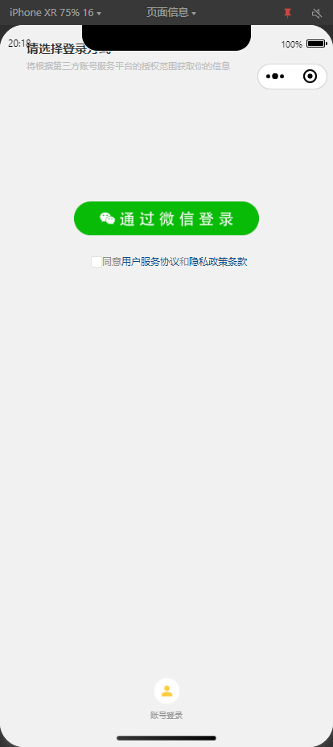

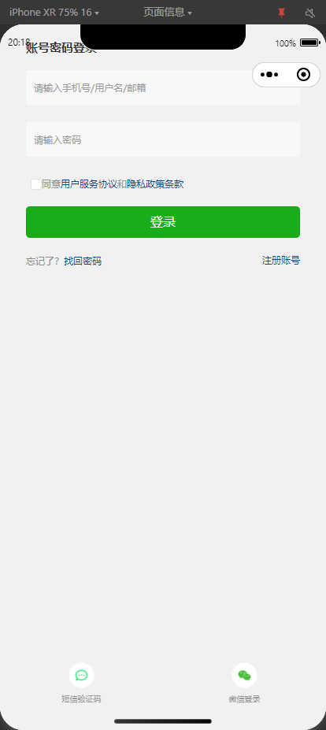

### 发布页

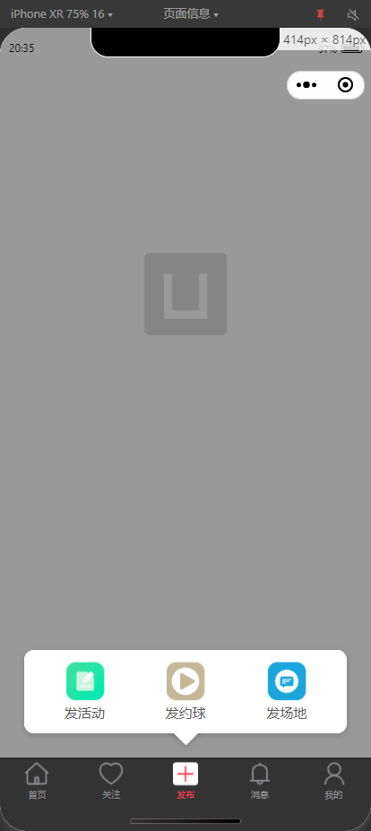

### 发布活动

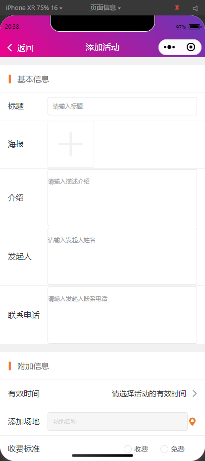

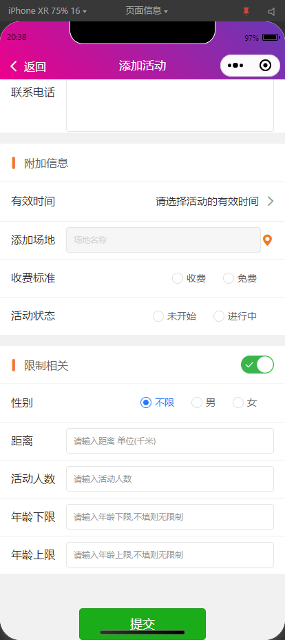

### 发布约球

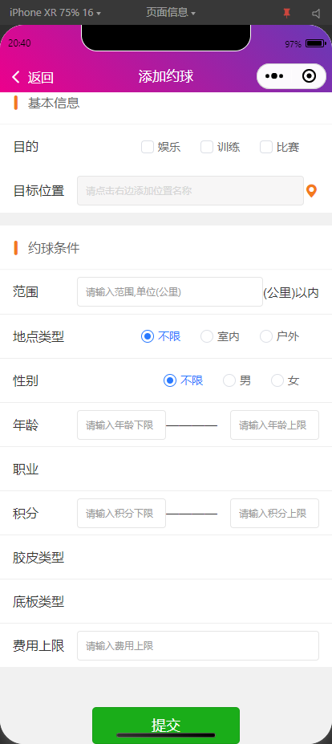

### 添加场地

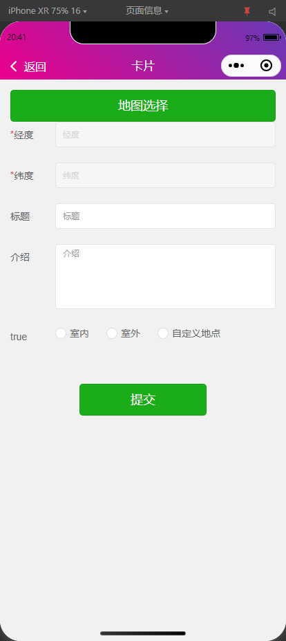

### 添加约球人信息

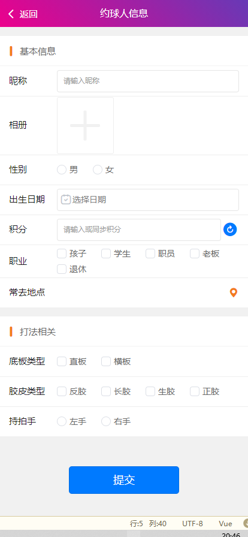

### 首页

#### 首页-活动列表

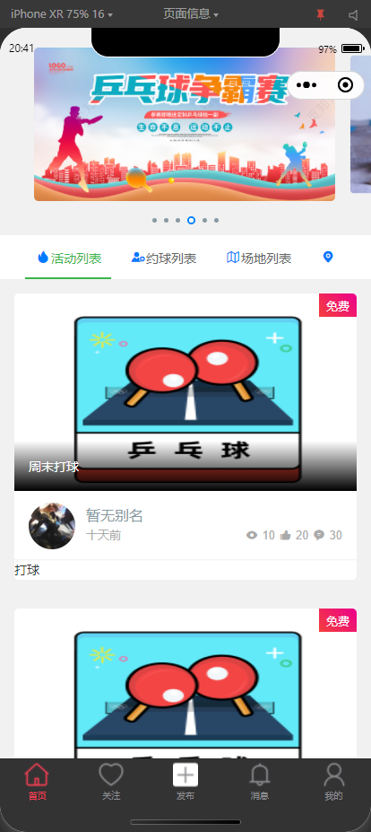

#### 首页-场地列表

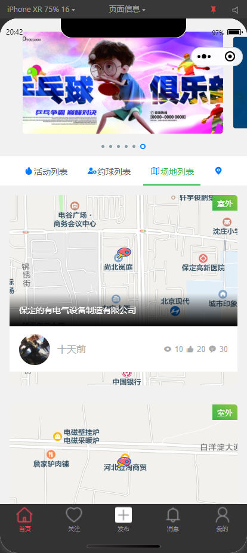

#### 首页-地图视图

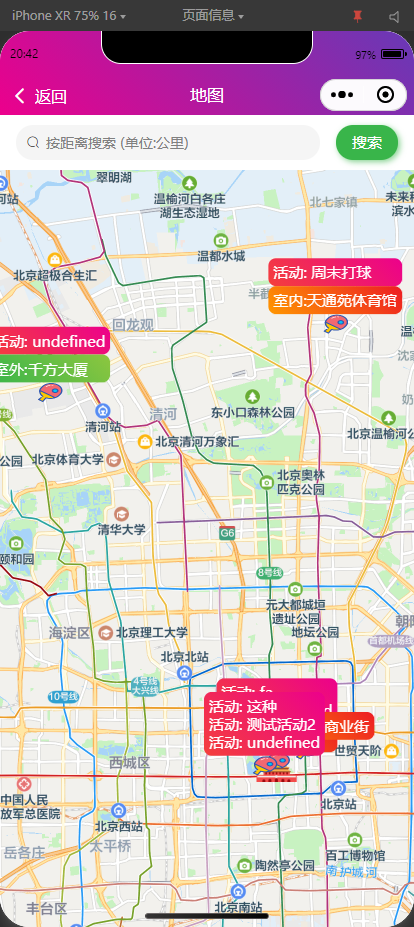

## 要做的功能

 1. 标签功能设计
 2. uni-app 卡片样式  ：Vant Weapp、iView Weapp
 3. 关注功能设计
 4. 消息功能设计
 5. 约球人信息绑定 设计
 5. 修改 约球列表样式
 6. 修改 约球人样式
 7. 添加约球人信息
 8. 约球人信息详情

