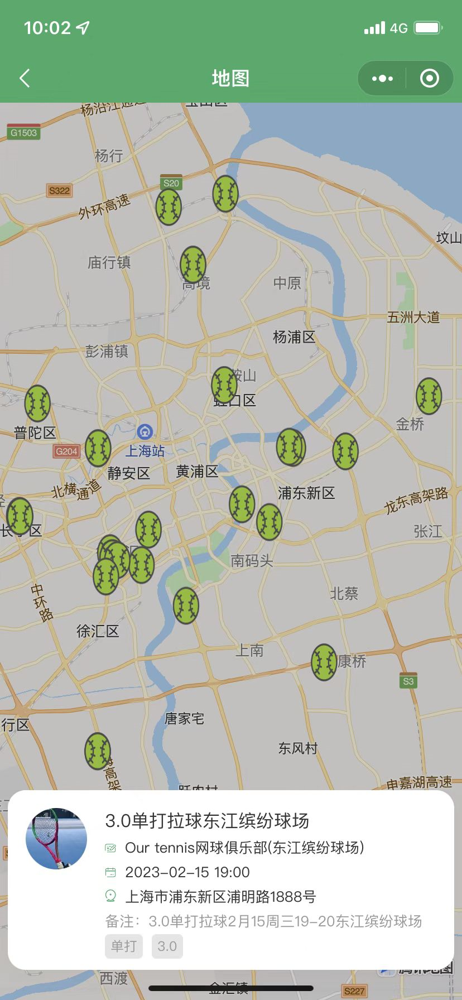

---
title:
tags:
  - 乒乓
  - 小程序自研
plugins:
  mermaid: # Mermaid JS
    enable: true # enable mermaid or not
    version: "9.3.0" # default v9.3.0
---

# 需求分析

**市场分析**

* 首先 乒乓球作为国家的国球拥有大量的群众基础，据非官方统计，我国**经常**打乒乓球的人口约3000多万；

* 然后是国家政策上的支持：在国家级运动口号**"发展体育运动、增强人民体质"**的基础上,乒乓球这项运动在政策上给了相当宽泛的政策发展空间，不会收到各种限制，并且在刘国梁这样一个热爱乒乓球的主席领导下，为了发扬乒乓运动，也在积极做一些大胆的改革，也有显著成效； 

* 器材上的改革 从小球到现在40+的打球，为了提高观赏性有了一定的改进，器材上不限制底板材料，将来也会出现铁板，塑料板，甚至不同材料板，胶皮选择上从原来的反胶压迫性的优势 也到现在生胶 长胶的流行，以及其他胶皮更加流行，选择性更广，发展空间更大。
* 国内乒乓球爱好者有年轻化趋势，越来越多年轻人甚至儿童热爱并参与到这项运动中来，而乒乓市场相对老龄化，互联网上无论是功能还是各种周边 对于这些年轻人来说都是几近空白状态，想打球不知道怎么打，不知道哪可以打，不知道和谁打，不知道怎么交流，新式玩法无从获知。
* 近些年 乒乓相关的宣传愈发广泛，拍摄了相关的动漫，电视剧，甚至春节档播放乒乓题材电影。都在传达政策上支持乒乓球更广泛的传播，也就是市场会更加壮大

**竞品分析**

乒乓球是归属于运动的垂直类目里，但随着互联网的发展，现在垂直领域更加细分，真正只属于乒乓球的产品，更贴合乒乓球习惯的产品 很少，功能很老旧，如某乓网，开某网，功能种类繁多，像20世纪的互联网黄页，视频，资讯，比赛，教学，周边，没有突出重点，功能涉及泛泛，并没有 集中用户痛点，很多功能很少用 甚至根本不看。那么一款具有年轻化的乒乓产品，一定是年轻人众望所归。

## 项目启动实际情况具体分析

目前属于初步尝试阶段，人员不具备独立创业资历，投入成本和精力有限，在这个非常时期，结合实际情况需要有个过渡的过程


****

# 一期

### 目标：

* 通过这个小项目当作一个启动项，完成初步的自研项目的全部流程，积累项目经验。

* 项目中方便规范化邀请乒乓球员约球流程，规范化管理起来 ，积累用户量，为将来产品打好群众基础。

* 引入广告流量，产生利润。实现投入与产出平衡，为了平稳的进入下一个阶段，实现更远大的目标。

**目标用户群体**

* 年轻人
* 热爱打乒乓球
* 有一定的技术基础
* 流动人口
* 想要技术提升

###  待解决问题

####  用户痛点

* 找不到合适的球友 
  * 按年龄
    * 年轻人 （我）
    * 老年人
  * 按技术水平
    * 水平低
    * 水平相当
    * 水平更高 （我）
  * 按打球风格
    * 喜欢比赛
    * 喜欢练球 （我）
  * 按球友风格
    * 喜欢社交
    * 只爱打球
  
* 找不到打球场地 

  * 距离远近
  * 室内
  * 室外
  * 环境
  * 费用

* 约不到合适的时间
  * 日期
    * 工作日	
    * 周末
  * 时效
    * 长期
    * 临时
  
#### 产品痛点

* 需下载
* 功能臃肿

  * 打开找不到自己想要的功能
  * 功能操作不人性化
* 用户量小

  * 发了没人理会
  * 同时间软件上没有合适的人
* 可玩性差，缺少趣味性
  
  * 用户使用活跃度不高
  * 用户留存时间短
* 用户缺少使用互联网意识
* 用户私下约球更方便
* 约球熟人更多
### 解决需求

#### 功能性

##### 提供地图，列表和匹配 三种种查找用户的方式，优先使用匹配方式

1. 地图: 在地图上撒点的方式展示用户发布的打球信息，如下图



2. 列表:  列表展示用户约球信息，可支持 按距离，按技术水平，按打球风格，按球友风格，按年龄 筛选 合适的球友


2. 匹配：可参考游戏中“匹配”的方式设计一款产品，用户之间 系统匹配，即时通知到两端，匹配直接推送给合适的人，匹配成功后 推送给两端的用户

  ```mermaid
  graph TB
  k[B用户开启匹配]
  l[用户A]
  l--> |填写用户基本信息,打球信息,级别和需求,可匹配时间|可发起匹配用户
  -->|选择条件| C[开始匹配]
  
  C-->通知用户C
  C-->通知用户D
  C-->通知用户B-->|通知用户| B用户收到匹配
  
  
  k -->|加入等待匹配队列|等待匹配队列-->|找到符合条件非超时用户B|B用户收到匹配-->|选择是否接受|f{是否接受匹配}
  
  f-->|是| 通知用户A-->匹配成功
f-->|否| 用户A等待匹配 -->|加入等待匹配队列|等待匹配队列
  
  
  
  ```

##### 增加找球馆功能

1. 根据 距离,价格,营业时间 推荐 附近室内球馆
2. 根据距离 天气，温度，风力 推荐室外场地 


#### 趣味性

##### 增加乒乓球周边

 目的是乒乓结合生活，只有乒乓或只有互联网会太单调

* 乒乓专属头像
* 乒乓海报
* 乒乓锻炼小游戏
* 乒乓人物皮肤？
* 乒乓搞笑视频
* 

#### 技能性
##### 增加打球水平级别评定功能

1. 积分赛积分

   1. 上传视频-> 专业人士评定（模拟积分）

2. 基本功等级

3. 打球能力光环

   1. 正手拉球
   2. 反手拉球
   3. 搓球
   4. 防守能力
   5. 推挡能力 	

##### 增加乒乓日记

* 乒乓技能打卡

  。。。待补充

##### 增加乒乓技能树

* 技能树地图
* 技能树关卡

 ##### 增加乒乓专项技能主题园

* 用户专项技能日记
* 专项技能教学视频
* 用户专项技能训练上传指导


### 模块设计

1. 个人信息管理

   (名称，电话，微信，)

2. 约球面板

​    （时间，地点，）

1. 约球信息发布
2. 约球信息管理


# 二期


# 三期

