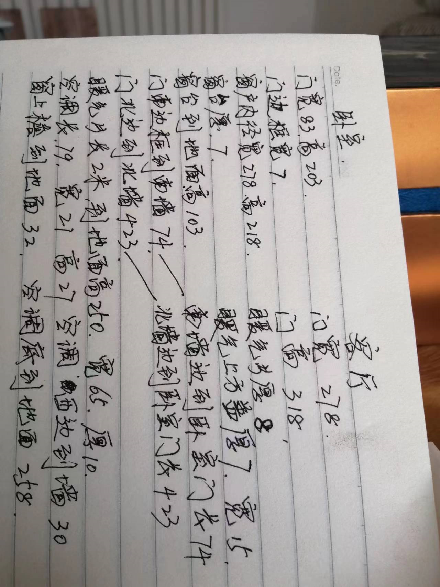

---
title:
tags:
  - 装修
---

# 装修笔记

## 目前问题

主卧

1. 吊顶样式
2. 主卧 立柜上空间怎么处理
   * 封起来 ，需要挪空调，空间不能再利用，
   * 其他方案？
3. 主卧是否可以墙板，客厅乳胶漆
4. 立柜是做开扇还是推拉扇？
5. 梳妆台往南怎么摆放
6. 梳妆台往北怎么摆放
7. 卧室南边是否放沙发，其他方案？
8. 地面是否要再铺木地板？

客厅

1. 吊顶样式
2. 客厅电视墙怎么弄
3. 客厅西南角如果放空调  有点不方便， 最好能放立柜，如果放立柜 空调放东南角 冰箱放哪？
4. 地面是否要再铺木地板？

## 已确定方案

* 主卧

  * 立柜摆放位置
  * 暖气位置
  * 床位置
  * 床头柜位置
  * 梳妆台位置

  

## 步骤

1. 测绘

   * 房屋长，宽，高

   * 窗户长宽高，以及窗边 到左右下 距离，窗沿厚

   * 门 内径 宽 ，高，边宽，门边到左右上距离

   * 暖气 长宽 厚，到左右下 距离

     

2. 硬装

   * 吊顶
   * 墙
   * 地面
   * 门
   * 窗

3. 软装

   * 卧室
   * 客厅
   * 厨房
   * 卫生间

## 数据

* 房屋

  * 主卧

    * 南北
    * 东西
    * 高
    * 窗
      * 东西
      * 高
      * 窗台
        * 厚
        * 宽
      * 窗下沿到地面
      * 窗到西墙
      * 窗到东墙
    * 门
      * 南北
      * 高
      * 门边宽
      * 门厚
      * 门边到南墙
      * 门边到北墙
      * 门边到顶
    * 暖气
      * 南北
      * 东西
      * 宽到墙
      * 距离地面
      * 到北墙
    * 空调
      * 东西
      * 南北
      * 下边距离地面
      * 上边距离顶
      * 距离西墙

  * 客厅

    * 南北
    * 东西
    * 高
    * 窗
      * 东西
      * 高
      * 窗台
        * 厚
        * 宽
      * 窗下沿到地面
      * 窗到西墙
      * 窗到东墙
    * 门
      * 南北
      * 高
      * 门边宽
      * 门厚
      * 门边到南墙
      * 门边到北墙
      * 门边到顶
    * 暖气
      * 南北
      * 东西
      * 宽到墙
      * 距离地面
      * 到北墙

    

## 吊顶细节

* 轻钢龙骨
* 木龙骨
* 灯带提前买好
* 投影仪 暗装盒

中央空调选型