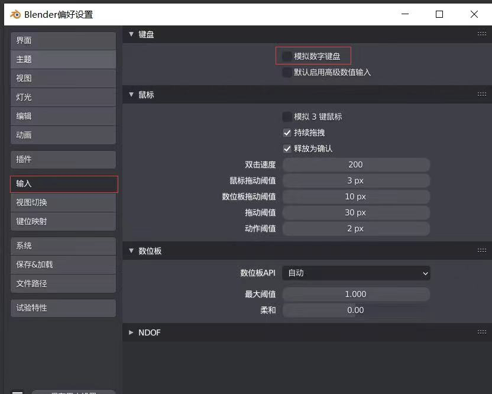

---
   title:
---

# blender快捷键

## 二级

旋转视角：【按住鼠标中键】

### 视角推拉：【滚动滚轮】
• 视角平移：【shift】+【中键】
• 移动：【G】
• 缩放：【S】
• 旋转：【R】
• 删除物体：【X】
• 插入关键帧:【I】
• 新建：【shift】+【A】
• 细分：【command】+【3】
• 设置父级目标：【command】+【p】
• Pagedown（修改为command+↓）→锁定到视图 可以锁定摄像机视图
• Pageup（修改为command+↑）

如果找不到数字键盘，可参考下图，开启【模拟数字键盘】。

视角操作

• 进入四视图：【control】+【option】+【Q】
• 视图切换：【~】
• 摄像机视角：【0】
• 隐藏属性工具栏：【N】

移动旋转缩放（使用快捷键）

• G 移动：【G】
• S 缩放：【S】
• R 旋转:【R】
• 沿对应轴移动：【G】+【XYZ】
• 沿对应轴缩放:【S】+【XYZ】
• 围绕对应轴旋转：【R】+【XYZ】
• 沿对应平面移动：【G】+【shift】+【XYZ】
• 沿对应平面缩放：【S】+【shift】+【XYZ】

移动旋转缩放（数据归零）

•坐标归零：【option】+【G】
•旋转归零：【option】+【R】
•缩放归零：【option】+【S】
•将物体坐标原点回到世界坐标原点：【command】+【A】→全部变换

编辑模式和点线面

• TAB 切换（编辑、顶点、面、边）模式 *需要安装M3插件
• 进入编辑模式之后，1→点模式，2→线模式，3→面模式

“选择”操作入门

• 四种选择工具切换（调整、框选、刷选、套索选择）：【W】
• 透显模式【option】+【Z】打开后可以选择背面的点线面
• 循环选择：【option】+【对应的点线面】
• 选择点、线、面→command/control 选择最短路径
• 选择点、线、面→shift 加选→command 减选
• 全选：【A】
• 取消全选：【AA】
• 反选：【command/control】+【i】

“细分”操作入门

• 细分：【右键→】
• 开启/退出辅助工具：【control】+【·】

“挤出”操作入门

• 挤出：【E】
• 辅助工具→视图叠加层→显示法线
• 长按挤出→沿法向挤出/挤出各个面/挤出至光标
• 沿法向挤出：【option】+【E】/【shift】+【空格】→【9】
• 挤出各个面：【option】+【E】/【shift】+【空格】→【0】
• 挤出至光标：【option】+【E】/【shift】+【空格】→【shift】+【1】

 "环切“操作入门

• “环切”：【command】+【R】
• 环切“并增加/减少分段数：【command】+【R】/【control】+【R】→【滚轮 】

 “倒角”操作入门

• “倒角”：【command】+【B】
• “倒角”并增加/减少分段数：【command】+【B】→【滚轮】
• 轮廓形状→内凹直角：【0】斜面：【0.25】圆角：【0.5】锐圆角：【0.75】 直角：【1】
• 调节轮廓形状：【command】+【B】→【P】
• 二次修改：【fn】+【F9】

“内插面”操作入门

• 内插面（也就是内部挤压）调整厚度【I】→调整深度：【control】
• ==多个面同时内插时，按一次【I】两边内插，按两次【I】4边内插==

“切刀和切分”操作入门（含环切进阶知识）

• 环切：【command】+【R】/【control】+【R】
• 偏移环切边：【command】+【shift】+【R】
• 按住【control】+【切割工具】可以自动吸附关键点，按【回车】完成切割
• 切分操作需要注意，必须选中【边】/【面】，或者【A】全选。黄色箭头是外侧，黄色箭头反向是内侧

“多边形工具”操作入门（仅了解即可）
“多边形工具”操作入门（仅了解即可）

• 吸附/【shift】 多选吸附的项目
• 在未开启吸附模式时，按住【control】可以强行开启吸附模式

“环绕和环绕副本工具”操作入门（类似于C4D的阵列）

• 弯管实例
• 注意调节好环绕中心点即可
• 环绕副本工具可以用来制作一些围绕旋转等效果

 “光滑和随机工具”操作入门

• 光滑的作用是让物体的边缘进行相应的收缩平滑，不仅对面有作用，对边线也起作用
• 随机工具作用类似于噪波

“边和点滑动工具”操作入门

• 【GG】 滑动边/点 不同于G，【GG】是让选中的点/边沿表面进行移动，而【G】是让选中的点/边自由移动不受表面的约束。
• 在选中面的状态下，【GG】可以让面进行放大/缩小，这个放大缩小是沿物体表面进行的，而选中面之后【S】虽然也是放大/小，但并不会沿物体表面，而是在这个面所在的平面进行的。
• 对于修改曲面上的点/线/面，【GG】可以做到不改变曲面趋势进行点/线/面的调节。

 “法线缩放和推拉工具”操作入门

• 沿法线进行缩放：【option】+【S】
• 要对“沿法向挤出”和“法线缩放”进行区分：“沿法向挤出”会创建新的面，而法线缩放不会。

 “切变和球形化工具”操作入门

• 切变得作用是保持其他结构不变的情况下，改变某一表面的朝向也就是法向
• 球形化作用是将选中的布线围绕中心点扩张，结合常用来在平面挖洞

 “断离工具”操作入门

• 断离边线可以实现从某个选中的点分裂出来一个新的点
• 断离区域可以配合环形选择将某个物体从中间断开

 “删除和融并”操作入门

• 删除→顶点：【X】
→边
→面
→仅边和面
→仅面
→融并顶点 （用于消除点而不会删除掉关联的面）
→融并边 （用于消除边而不会删除掉关联的面）
→融并面 （选中两个或两个以上的相邻面融并成一个面，可以理解为减面）
→有限融并
→边线塌陷
→循环边

 “点菜单”操作入门

• 顶点菜单：【control】+【V】 顶点菜单
• 填充（桥接？/封闭多边形孔洞）：【F】
• 合并（按照选择的顺序将点合并到一个点）：【option】+【M】

 “边菜单”操作入门

• 边菜单→挤出边线：【control】+【E】
→边线倒角
→桥接循环边 （用于将两个面打通通路，“挖隧道”或者“接骨”）
→细分 （对边线进行细分，增加分段）
→细分并排边
→反细分
→顺时针旋转边
→逆时针旋转边
→滑移边线 （本质就是GG）
→拆边
→边线折痕
→倒角边权重
→标记缝合边
→清除缝合边
→标记锐边
→清除锐边
→为顶点标记锐边
→为顶点清除锐边标记
→标记freestyle边
→清除freestyle边

 “面菜单”操作入门

• 面菜单→挤出面：【control】+【F】
→沿法向挤出面
→挤出各个面
→内插面
→尖分面
→面三角化
→三角面变四边面
→面实体化 （给面增加个厚度，或者加个壳shell）
→线框 （根据选中的面生成一个线框，这个线框具有厚度而且独立于选中的面）
→填充
→栅格填充
→完美建面
→交集（切割） （需要在编辑模式下创建的物体才有效果）
→交集（布尔） （需要在编辑模式下创建的物体才有效果）
→焊接边线到面
→平滑着色
→平直着色
→面数据

• 文字转网格：物体模式→物体→转换为→文字转网格->曲线→编辑模式→选中已转化的字符→【L】全选→【control】+【F】→完美建面→调整角度

## 材质

 * 关联材质：command+L

## 参考

* 5  [mac快捷键](https://huke88.com/article/7919.html)