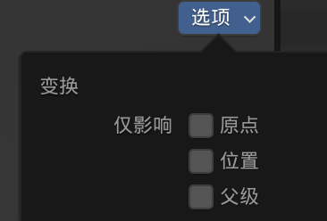

---
Title:
---

# 笔记

缩放后，一定要在物体模式里command+a，应用缩放/应用全部，否则倒角会不均匀

吸附：shife+s  (游标到选中项等）

control+L：把一个属性关联到其他属性上

alt+d：关联复制，esc取消，就复制到原位了	

衰减编辑点击后——G——滚动滚轮

添加到快速收藏夹-Q(是在物体模式）

给文本添加厚度——修改器——实体化修改器

面光——作用是照亮轮廓

##  积木组合笔记

### 常用快捷键

• 倒角：【 conmond】+【B 】
• 环切：【 conmond】+【R 】

• 视图切换：【~】

• 对齐摄像机至视图：【control】+【option】+【0】（先调整好最终视图）

## 积木动画笔记：

插入关键帧:【I】

显示/隐藏:【H】/【option】+【H】

父级:【command】+【p】

合并:【command】+【 J 】

关联选择:【command】+【 L 】

物体——关系——使其独立化——物体动画（可以使动画里的物体数据单一化）

## 金币基站建模：

沿法向挤出：【alt】+【e】（法向就是面的朝向）

阵列修改器

### 「借形的顺序操作」：

以借线为例：选中物体，要借的边——shift+d，esc取消（原位复制了一个）——分离：【p】——丛边创建面：【F】——e挤出

锁定某一个轴进行缩放：【S】+【shift】+【XYZ】（保留某一方向，调整另外两个轴的大小）

布尔运算：booltool插件——保存用户设置——在右侧编辑——先布尔再倒角

#### 做曲线：

选择小技巧：选起点的线，摁住contorl再选择终点的线，就能选中中间这一段

物体——转换— —曲线

#### 做管道：

借一条边——E——给点做倒角。common+B后，注意下方小字，选v(影响边)

shift+T，灯光随着鼠标转动

【command】+【+/—】（选中面后，扩展/缩减 选择）

直接倒角后（没用修改器的情况下）要改变布线，可以先删掉几条边（融并边）

