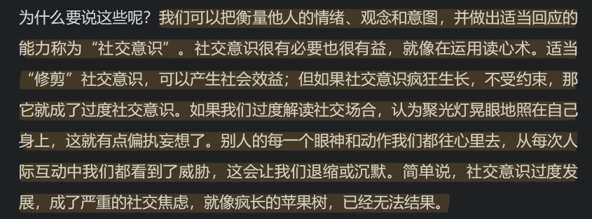

---
title:
---
# 如何克服社交焦虑

## 始愿

节约时间，提供读一本书的新思路

克服社交焦虑，了解社交焦虑的人的心理，帮助身边的人，和他们更融洽的相处

## 做法

以下内容直接copy 到一本新书阅读记录中

粗读 ，摘抄

###  出处

微信阅读

### 概述

带你了解社交焦虑，和社交焦虑的内在核心，用行动去改变社交焦虑，并给你指出一些陷阱，最后最好的状态是什么样的

### 架构

* 行为抑制
* 修剪社交意识
* 回应内在评判
* 自我同情

### 词汇

* 尖酸 
* 强硬
* 内心舒适
* 尴尬窘迫
* 高度紧张
* 汲取

### 语句

### 思路

### 有感触

* ！！！！就像河豚一样，你的刺只是因为你恐惧。（可以用作座右铭，让你勇敢去接近有刺的人）

* 不是我什么都不想说，而是不知道该怎么说。别人说话时似乎都很坦然、很自信，等我好不容易鼓起勇气张开嘴时，却发现话题已经变了。一直都是这样。
* 片刻沉默很容易被打破，但要打破数小时的沉默，几乎是不可能的。要是真的打破了，一定会有人转过头来惊呼：“呀，我忘了你也在！”
* 后来有一次开会前，我提前在手机里记了些笔记，我想先写出来再说会容易些，但还是没能做到
* 我要参加个朋友聚餐，于是准备试着说个祝酒词。我在脑子里一遍又一遍地排练过，之前我还编了个笑话，但起身后，说第一句话时就卡住了，大脑一片空白，根本说不出话来了。我说了句‘谢谢’，就坐了下来。我当时想，天哪，我真是个白痴！

1. 人（老师、老板等）对话时，我就会紧张。
2. 和别人进行眼神接触对我来说有困难。
3. 必须谈论自己或者自己的感受时，我会紧张。
4. 我发现很难和同事融洽相处。
5. 和别人单独相处时，我会紧张。
6. 我担心表达自己的观点会让自己显得很愚蠢。
7. 到店里退货让我感到焦虑。
8. 我发现自己很难对别人的观点提出异议。
9. 我总是担心自己在社交场合不知道该说什么。
10. 我和不熟悉的人交往时会很紧张。
11. 我觉得自己在和他人沟通时会说一些令人尴尬的话。
12. 在一群人中，我会担心被忽视。
13. 我不确定是否要和一个仅仅算得上认识的人打招呼。
14. 如果别人能听到我打电话，我就会不自在。
15. 在公共场所吃饭或喝酒，我会感到尴尬或焦虑。
16. 在公众面前表演、演奏或演讲让我感到焦虑。
17. 当别人看着我做事时，我会感到不自在。
18. 打电话、发邮件或发短信给不太熟悉的人时，我会焦虑。
19. 我在课堂上或会议上发言时有困难。
20. 上公共厕所让我感到焦虑和害羞。
21. 我很难与吸引我的人自如地交谈。
22. 考试让我焦虑。
23. 我在主持聚会或活动时，会感到有压力，会焦虑。
24. 我发现自己很难拒绝推销员或律师。
25. 我不喜欢成为大家关注的焦点。

* 请记住：基因不是命运。大脑的确通过基因编程和进化来影响我们的行为，但这种影响是双向的——行为同样会影响大脑。
* 当杏仁核发出警报时，没有焦虑的大脑立刻派了一辆“消防车”赶往现场，而社交焦虑大脑则派了一个人提着一桶水骑着自行车去扑火。（没有社会焦虑的人也会紧张， 不安，只不过他能够用更快的方式平静下来）
* 第一个工具叫替换。我们要反驳内在评判（至少是有礼貌的坚持，对抗也不是我的风格），目标是改变评判造成的威胁。之后，我会介绍第二个不同类型的工具：拥抱。我们要与内在评判讲和，而不是争辩，我们要给自己一些从不吝惜给予别人的同情。

* “5—4—3—2—”法。这种方法随处可练，可以帮你摆脱烦恼、立足现实。方法如下：利用你的5种感官。首先，环顾四周，说出你能看到的5样东西。比如，我看到的是笔记本电脑、一杯格雷伯爵茶、一台不好使的打印机、一叠蓝色便利贴和一本阿尔伯特·艾利斯的传记。然后，说出你能听到的4种声音：外面的汽车声、鸟鸣声、邻居家的空调声和某处的流水声。接下来，说出你可以触碰到的3样东西：穿着鞋的脚，椅子后背，键盘上的按键。之后说出你可以闻到的两样东西：茶的香气和传记书的霉味。最后，说出你可以尝的一样东西：我会啜一口格雷伯爵茶。但如果你手头没有什么东西，可以感受一下嘴里的味道（通常很恶心），或者，说一件关于你自己的好事（这个绝不会恶心）。
* 不仅待人如待己，也要待己如待人。