---
title:

---

# 持续交付2.0

## 始愿

 学习devops 先进设计，总结 devops 相关术语 以及设计方案

## 做法

以下内容直接copy 到一本新书阅读记录中

手机听 同文，电脑打开记录摘抄，

###  出处，作者

微信读书  ，

###  概述

读完书 最后做一个大概的总结，使人一眼就能了解到书的大概内容和能从中得到些什么。

### 架构

##### GOCD 简单的持续交付流程

产品研发团队的总人数保持在12人左右。在产品版本交付期中，迭代周期为一周。团队自身也使用该产品进行持续集成与持续交付实践。在==每个迭代结==束后，用最新版本替换团队自己正在使用的旧版本。每两个迭代将试用版本部署到公司==内部的公用服务器==上，供公司其他团队使用。若公司内部试用版本运行质量达标，一周后再将该版本交付给该产品的==试用企业==，进行外部企业用户早期体验

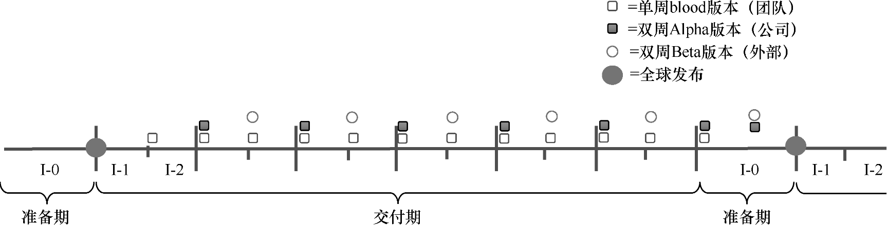

​				流水线发布周期

#### 制品库

外部软件包库，正式软件包库

临时镜像库，正式镜像库，外部镜像库

制品都有唯一标识，并且连同其来源，组成部件以及用途等一起保存为该制品的元信息，

如果制品库中的制品本身被删除或丢失，那么企业可以根据其保留在制品库中的元信息描述，通过原有的步数流水线再次生成原来的相同制品。

#### 多组件部署流水线

如果一个软件产品由多个组件构建而成，每个组件均有独自的代码仓库，并且每个组件由一个单独的团队负责开发与维护，那么，整个产品的部署流水线的设计通常与图7-13相似。每个组件的部署流水线成功以后，都能触发下游的产品集成部署流水线。

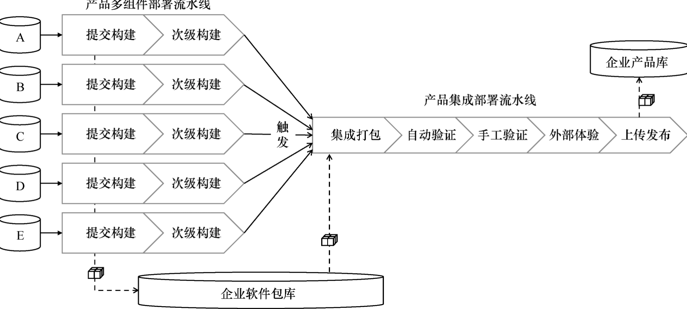

* 个人部署流水线

  每名工程师都创建了自己专属的部署流水线，用于个人在未推送代码到团队仓库之前的快速质量反馈。个人部署流水线并不会部署到团队共同拥有的环境中，而是仅覆盖个人开发环环境

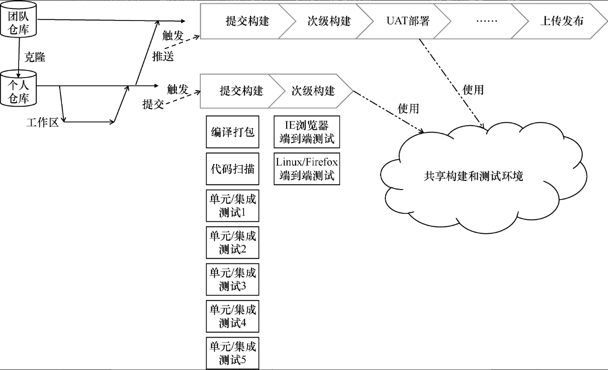

​				通过个人部署流水线加快反馈速度和反馈质量

每名工程师均通过部署流水线提供的==模板功能克隆一份团队部署流水线==，将其他阶段全部删除，仅保留前面两个阶段，即“提交构建”和“次级构建”的内容。令这个部署流水线监听工程师自己的代码仓库代码变化，并自动化触发。每当开发人员提交代码到个人仓库时，都会自动触发其个人专属的部署流水线。

好处

（1）该部署流水线与团队部署流水线共享构建和测试集群环境。由于这些环境是统一管理的，因此能够确保任何时刻，每个人的构建与自动化测试环境均与团队所属的环境一致。

（2）保证每名工程师都能利用更强大的测试资源，加快个人验证的速度。

（3）个人部署流水线运行的测试用例与团队部署流水线前两个阶段的验证集合相同，假如团队部署流水线出现构建失败，则容易定位问题，例如工程师遗漏文件未提交。

**UAT测试 是测试工程师在已经通过的次级构建阶段中选择一个被测版本，根据需求完成情况手工触发。向UAT环境部署软件包，用于手工验收测试。 如果该版本通过了手工验收测试，则标记版本为已测试通过版本。 第五个阶段的性能测试也是手工触发**

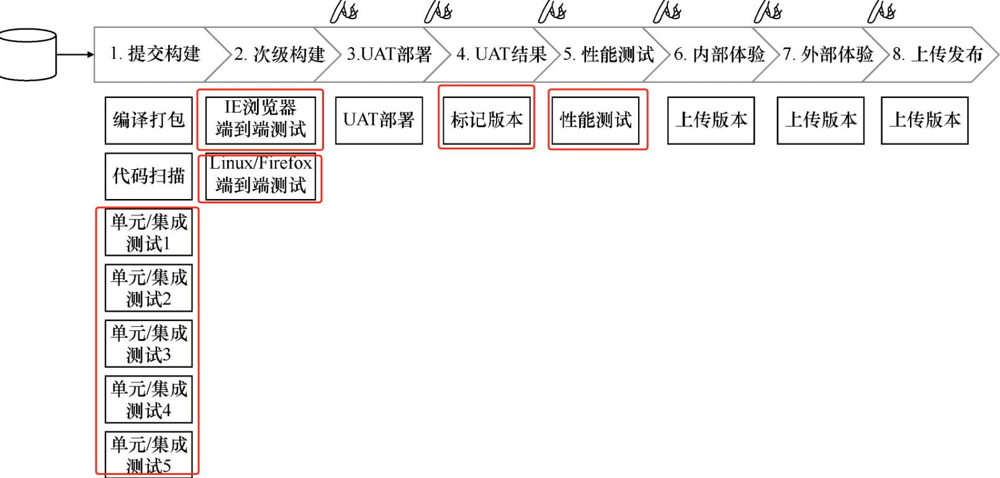

​								GoCD在2008年的部署流水线

第三个阶段开始，每个阶段都只有一个任务。第三个阶段是“UAT部署”，将软件包部署到手工UAT环境（用户验收环境，User Acceptance Environment）。第四个阶段是“UAT结果”，测试人员手工验证完成后，将其标记为“验收通过”。第五个阶段是“性能测试”，就是做自动化性能测试。第六个阶段是“内部体验”，就是将Alpha版本部署到企业内部服务器，给内部其他团队试用。第七个阶段是“外部体验”，就是将Beta版本发给外部的企业用户体验。第八个阶段是“上传发布”，就是上传版本。将确定的商业发布版本上传到指定服务器，供用户登录产品网站自行下载。

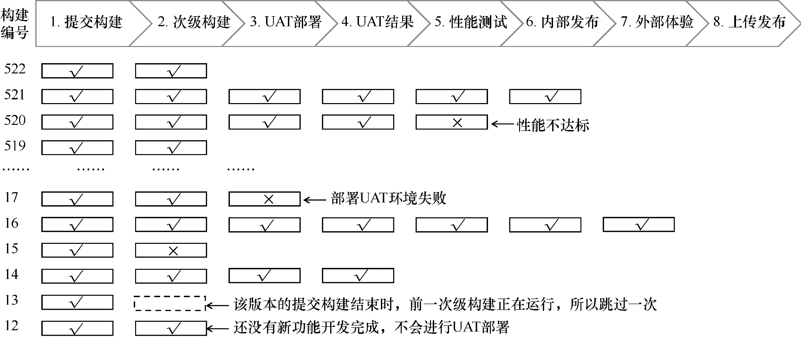

GoCD在2008年的部署流水线2

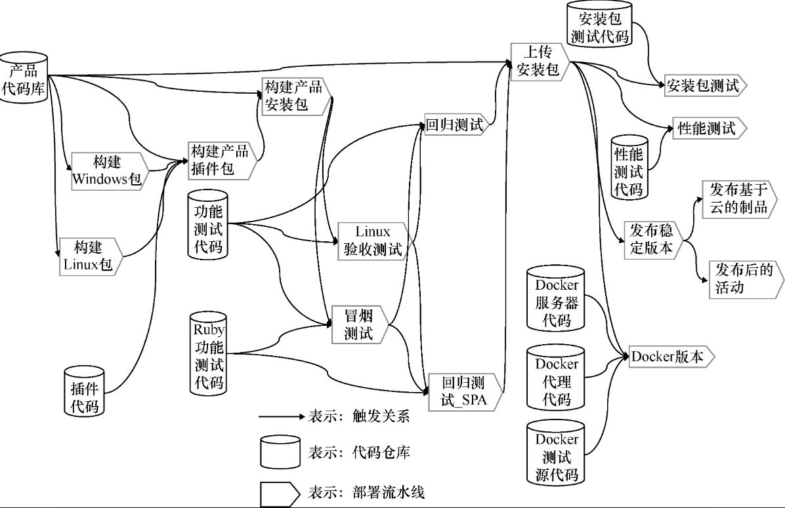

###### 部署流水线平台的构成

主要三部分

* 唯一授信源  （制品库中的任意制品都可以在代码仓库源找到其对应的源代码。而代码仓库中的信息应该能在需求/缺陷管理平台中找到其对应的需求出处。）
* 部署流水线工具本身
* 基础支撑服务层

平台要具有追溯能力 1. 对事件的追溯能力 ，流水线中发生的任何事件都应该能被追溯，什么人，什么事件，执行了什么操作，为什么执行，以及操作过程 和相应的脚步是什么。 2. 对流水线产物的追溯能力，包括流水线的任意产物 其对应源，构建时脚本，与环境，以及其 所依赖的其他组件以及相应的版本信息等。

对历史构建重建能力

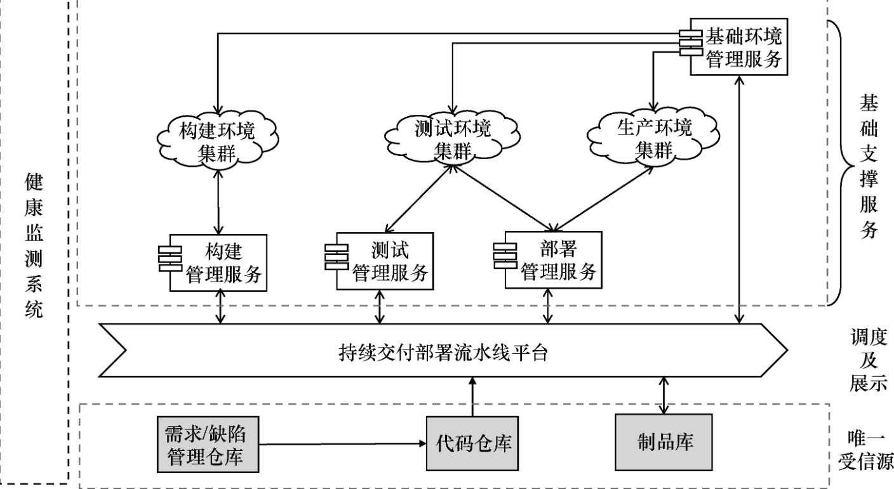

​					复杂的部署流水线设计

在图7-15“构建Linux包”这个部署流水线中，包含两个阶段。第一个阶段是“build-no_server”。在这个阶段，一共有39个任务并行执行，既并行构建组成Server所需的多个Jar包，也并行执行Java测试用例和JavaScript单元测试用例。这体现了部署流水线“尽量并行化”原则。第二个阶段是“build-server”，使用经第一个阶段已初步验证通过的多个Jar包组装成Server包。

在图7-15“Linux验收测试”这个部署流水线中，也包含两个阶段。第一个阶段是运行高优先级的功能测试，第二个阶段是对插件部分的自动化功能测试，这体现了部署流水线的“快速反馈优先”原则。

性能测试

在性能测试部署流水线中，共包含8个阶段，它们分别是生成测试用脚本、准备测试环境、启动Server、启动Agent、配置用例、等待就绪、运行和停止。

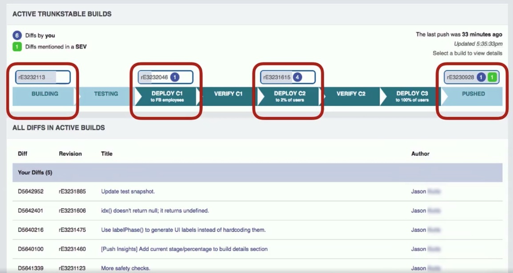

在Facebook公司，开发人员可以通过他们内部平台看到自己的代码已经发布到哪个阶段，有多少用户在使用（如图7-16所示）。此时，开发工程师在不需要任何人帮助的情况下，就能够了解他的代码已经发布到哪个阶段了。

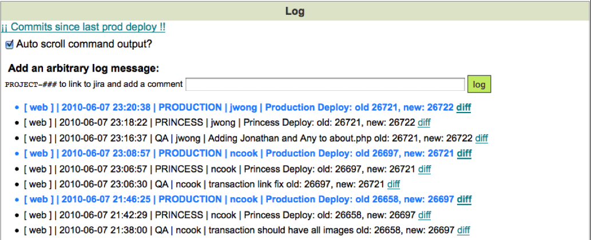

​			Etsy的代码diff与生产环境对比查找工具

在互联网电商公司Etsy，开发工程师可以查看到自上次生产部署以后，每次的代码变更数量，并且非常方便地查找代码差异

为了实现“谁构建，谁运营”，企业对于DevOps工具的建设，应该坚决从开发工程师的工作场景出发，为其构建强大的DevOps工具。不仅是生产环境的运维工具，而且是整个工作流程中的业务软件监控工程基础设施，它包括：

基础的研发流程自助平台，如各类运行环境（构建、测试、生产）的自助平台；

数据自助平台（包括三层监测数据）；

用于业务快速试错的实验测量平台；针对移动设备，建立用户触达平台。

要想让部署流水线发挥最大的作用，研发团队需要尽可能遵守以下5条原则。

（1）任何软件包的取用皆须通过受控源，各角色之间禁止通过私有渠道（如电子邮件、即时通信工具等）获取。

（2）尽可能将一切流程自动化，并持续优化执行时间。

（3）每次提交都能够自动触发部署流水线。

（4）尽可能地少用手动触发方式。

（5）必须执行立即暂停原则（stop the line）。

持续集成

持续集成是一种软件开发实践，团队成员频繁将他们的工作成果集成在一起（通常每人每天至少提交一次，这样每天就会有多次集成）；每次提交后，自动触发运行一次包含自动化验证集的构建任务，以便能尽早发现集成问题。

由此可见，持续集成是一种质量反馈机制，其目的是“尽早发现代码中的质量问题”。

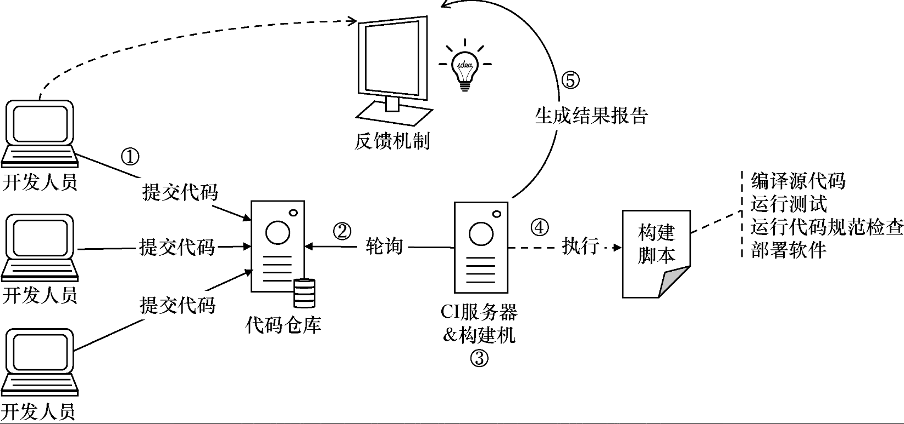

（1）开发人员将代码提交到代码仓库。（2）持续集成服务器按一定的时间间隔（如每隔1分钟）对代码仓库进行轮询，发现有代码变更。（3）持续集成服务器自动将最新代码检出到已准备好的专用服务器上（如果应用规模不大，可以与持续集成服务器是同一台机器）。

（4）在专用服务器上运行由持续集成服务器指定的构建脚本或命令，对最新代码进行检查（如代码动静态扫描、编译打包、运行单元测试、部署并运行功能测试等）。（5）运行结束后，将验证结果（成功或者失败）反馈给开发团队。为了能够做到“省时省力”，可以通过自动化方式运行大量的质量检验项（包括自动化测试、代码规范检查、代码安全扫描等）。“持续集成”这一实践直接体现了快速验证环的基本工作原则，即“质量内建，快速反馈”。每当工程师完成一项开发任务后，必须通过运行一系列的自动化质量检查，验证其所写代码的质量是否达到了团队能接受的软件质量标准。

##### 9.2 六步提交法

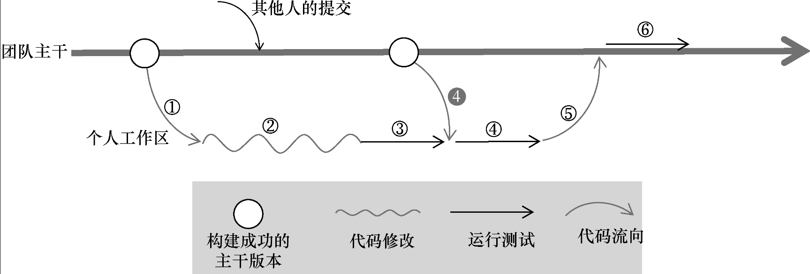

　								持续集成六步提交法

（1）检出最近成功的代码。工程师开始工作时（例如工作日早上刚刚开工认领了一个新的开发任务），就要将最近一次构建验证成功的代码版本从团队的开发主干上检出（check out）到自己的开发工作区中。

（2）修改代码。在个人工作区中对代码进行修改（包括实现产品新功能的代码，甚至编写对应功能的自动化测试用例）。

（3）第一次个人构建。当开发工作完成并准备提交时，首先执行一个自动化验证集，对自己工作区的新代码执行第一次个人构建（有时也被称为本地构建），用于验证自己修改的代码质量是否达标。

（4）第二次个人构建。从“检出代码”到“第一次个人构建完成”这段时间内，很可能在开发主干上有其他成员已提交了新代码，并通过了持续集成的质量验证。此时，就需要将这个版本的代码与自己本地修改的代码进行合并（merge），然后再次执行一次质量验证，确保自己的代码与其他人的代码都没有问题。

（5）提交代码到团队主干。当第二次个人构建成功以后，提交代码到团队开发主干。

（6）提交构建。持续集成服务器发现这次代码变更，立即开始执行提交构建，运行自动化质量验证。如果这次构建失败，则应该立即着手修复，并马上通知团队成员，禁止其再向团队开发主干提交代码，并且不要检出这个版本。

###### 六步提交法中的3次验证有什么作用

第3步的个人验证目标是验证开发者自己修改过的代码是否正确。第4步的个人验证是确保其他人的代码与自己的代码合并后，两部分的代码质量都没有问题。第6步的提交构建验证是在一个干净且受控环境中执行与第4步个人构建相同的内容，以确保开发人员的本次提交是完整且无质量问题的，没有遗漏。

###### 每次构建应该包含哪些质量验证内容

* 个人验证环节
* 提交构建验证

（1）构建结束后生成的二进制包是否包含了正确的内容，例如配置文件的完整性。

（2）这个构建结果是否能够正确安装并正常启动运行起来。

（3）启动后最基本的功能是否可以使用，如用户登录等。

代码规范检查

遗留代码 怎么解决：

（1）减少规范，关注重点。大部分规范检查工具都会将问题分为多种类型，如严重、重要或警告。团队应该一起讨论，提取最重要的代码规范，早期只关注严重类型的问题，以后再逐步增加代码描述规则。

（2）执行“童子军营地原则”。假如遗留代码量比较大，并且在生产环境中已经运行很久，且最近不会修改它们，那么可以暂时不修改它们。即使不能立即将问题全部清除，也要保证每次提交代码时，都不让问题的数量继续增长，假如每次都能够递减就更好了。

它的目标是高质量、低风险地快速发布软件价值”。其核心模式是部署流水线，核心原则包括：质量内建（built quality in）；小批量开发（work in small batches）；尽可能将所有事情自动化，让计算机做重复的事情，而人来解决问题；持续不断且不遗余力地改进；软件交付是所有人的责任。

### 词汇

### 语句

### 思路

### 有感触

## 日历

10.07

简单的流水线执行过程，了解到了流水线各个步骤都做哪些事，也看到我们没有单元测试和性能测试，没有内部体验 也就是alpha版本，

持续集成的流水线提交构建都会被自动触发，我们没有自动触发，为了保证环境干净，可以只是开发环境自动触发，以上环境手动触发，来保证，代码库分支的干净，如果遇到问题，需要在很短的时间来解决，(10分钟) 解决不了则回滚，期间其他人员禁止拉取代码。

整个流程上，首先要保证主干分支干净，也就是说自动触发的构建出现问题 则立即有人去解决，然后测试并不是从分支里重新构建，而是从自动构建里选择通过的构建，自己按需控制如何开始测试，然后测试通过后，同样标记版本为测试通过制品，供后边 性能测试 啊 ，部署 啊之类的使用。

* 我们没有做到与业务逻辑松耦合，也就是流水线工具应该与具体的构建业务箱分离，比如将构建部署脚本保存在流水线平台，这块可以改进下支持自定义脚本，并且保存在各自的代码库中。
* 唯一授信源 我们目前不能保证任意制品可以在代码仓库源找到其对应的 源代码，而代码仓库中的信息应该能在需求缺陷管理平台中找到对应的需求出处。

持续交付讲了两部分内容

1. 制品库
2. 流水线

制品库讲了 制品库的分类，各个类别的作用以及这样做的意义。

| service           | Table Name                             | weekUp               | MonthUp               | halfYearUp             | YearUP                 |
| :---------------- | :------------------------------------- | :------------------- | :-------------------- | :--------------------- | :--------------------- |
| erp-devops-server | publish\_server\_node                  | &lt;513行&lt;22683KB | &lt;1025行&lt;45366KB | &lt;2564行&lt;113416KB | &lt;5127行&lt;226832KB |
| erp-devops-server | internal\_audit\_attachment            | &lt;207行&lt;462KB   | &lt;414行&lt;925KB    | &lt;1035行&lt;2312KB   | &lt;2070行&lt;4624KB   |
| erp-devops-server | publish\_approval\_task                | &lt;1903行&lt;258KB  | &lt;3806行&lt;515KB   | &lt;9516行&lt;1288KB   | &lt;19031行&lt;2576KB  |
| erp-devops-server | deploy\_version\_log                   | &lt;826行&lt;194KB   | &lt;1653行&lt;387KB   | &lt;4132行&lt;968KB    | &lt;8263行&lt;1936KB   |
| erp-devops-server | internal\_audit\_routine\_log\_result  | &lt;78行&lt;166KB    | &lt;157行&lt;333KB    | &lt;392行&lt;832KB     | &lt;783行&lt;1664KB    |
| erp-devops-server | package\_version                       | &lt;1行&lt;155KB     | &lt;1行&lt;310KB      | &lt;4行&lt;776KB       | &lt;7行&lt;1552KB      |
| erp-devops-server | operation\_log                         | &lt;245行&lt;35KB    | &lt;489行&lt;70KB     | &lt;1223行&lt;176KB    | &lt;2446行&lt;352KB    |
| erp-devops-server | publish\_approval\_node                | &lt;303行&lt;32KB    | &lt;605行&lt;64KB     | &lt;1514行&lt;160KB    | &lt;3027行&lt;320KB    |
| erp-devops-server | publish\_server                        | &lt;191行&lt;24KB    | &lt;381行&lt;48KB     | &lt;954行&lt;120KB     | &lt;1907行&lt;240KB    |
| erp-devops-server | internal\_audit\_routine\_result       | &lt;13行&lt;19KB     | &lt;25行&lt;38KB      | &lt;63行&lt;96KB       | &lt;126行&lt;192KB     |
| erp-devops-server | publish                                | &lt;64行&lt;16KB     | &lt;127行&lt;32KB     | &lt;319行&lt;80KB      | &lt;637行&lt;160KB     |
| erp-devops-server | machine\_info                          | &lt;33行&lt;14KB     | &lt;66行&lt;29KB      | &lt;166行&lt;72KB      | &lt;331行&lt;144KB     |
| erp-devops-server | internal\_audit\_attachment\_file      | &lt;36行&lt;8KB      | &lt;72行&lt;16KB      | &lt;181行&lt;40KB      | &lt;362行&lt;80KB      |
| erp-devops-server | mobile\_package\_version               | &lt;25行&lt;8KB      | &lt;51行&lt;16KB      | &lt;127行&lt;40KB      | &lt;254行&lt;80KB      |
| erp-devops-server | nginx\_conf\_upstream\_server          | &lt;0行&lt;6KB       | &lt;0行&lt;13KB       | &lt;0行&lt;32KB        | &lt;0行&lt;64KB        |
| erp-devops-server | app\_internal\_audit\_dic              | &lt;16行&lt;6KB      | &lt;33行&lt;13KB      | &lt;82行&lt;32KB       | &lt;164行&lt;64KB      |
| erp-devops-server | nginx\_conf\_location                  | &lt;0行&lt;6KB       | &lt;0行&lt;13KB       | &lt;0行&lt;32KB        | &lt;0行&lt;64KB        |
| erp-devops-server | internal\_audit\_backup\_log\_result   | &lt;10行&lt;6KB      | &lt;19行&lt;13KB      | &lt;48行&lt;32KB       | &lt;95行&lt;64KB       |
| erp-devops-server | nginx\_node                            | &lt;1行&lt;5KB       | &lt;1行&lt;10KB       | &lt;3行&lt;24KB        | &lt;6行&lt;48KB        |
| erp-devops-server | server\_node                           | &lt;27行&lt;5KB      | &lt;54行&lt;10KB      | &lt;136行&lt;24KB      | &lt;271行&lt;48KB      |
| erp-devops-server | project\_leader                        | &lt;22行&lt;5KB      | &lt;44行&lt;10KB      | &lt;110行&lt;24KB      | &lt;219行&lt;48KB      |
| erp-devops-server | nginx\_conf\_server                    | &lt;0行&lt;5KB       | &lt;0行&lt;10KB       | &lt;0行&lt;24KB        | &lt;0行&lt;48KB        |
| erp-devops-server | nginx\_conf\_upstream                  | &lt;0行&lt;3KB       | &lt;0行&lt;6KB        | &lt;0行&lt;16KB        | &lt;0行&lt;32KB        |
| erp-devops-server | db\_user                               | &lt;1行&lt;2KB       | &lt;1行&lt;3KB        | &lt;3行&lt;8KB         | &lt;5行&lt;16KB        |
| erp-devops-server | machine\_location                      | &lt;2行&lt;2KB       | &lt;3行&lt;3KB        | &lt;8行&lt;8KB         | &lt;15行&lt;16KB       |
| erp-devops-server | internal\_audit\_backup                | &lt;0行&lt;2KB       | &lt;1行&lt;3KB        | &lt;2行&lt;8KB         | &lt;3行&lt;16KB        |
| erp-devops-server | db\_source\_user                       | &lt;0行&lt;2KB       | &lt;1行&lt;3KB        | &lt;2行&lt;8KB         | &lt;3行&lt;16KB        |
| erp-devops-server | package\_info                          | &lt;0行&lt;2KB       | &lt;0行&lt;3KB        | &lt;0行&lt;8KB         | &lt;0行&lt;16KB        |
| erp-devops-server | user\_role                             | &lt;9行&lt;2KB       | &lt;17行&lt;3KB       | &lt;44行&lt;8KB        | &lt;87行&lt;16KB       |
| erp-devops-server | db\_source                             | &lt;1行&lt;2KB       | &lt;1行&lt;3KB        | &lt;4行&lt;8KB         | &lt;7行&lt;16KB        |
| erp-devops-server | user                                   | &lt;2行&lt;2KB       | &lt;4行&lt;3KB        | &lt;11行&lt;8KB        | &lt;22行&lt;16KB       |
| erp-devops-server | machine\_brand                         | &lt;1行&lt;2KB       | &lt;2行&lt;3KB        | &lt;4行&lt;8KB         | &lt;8行&lt;16KB        |
| erp-devops-server | db\_node                               | &lt;0行&lt;2KB       | &lt;1行&lt;3KB        | &lt;2行&lt;8KB         | &lt;4行&lt;16KB        |
| erp-devops-server | team\_user                             | &lt;8行&lt;2KB       | &lt;17行&lt;3KB       | &lt;42行&lt;8KB        | &lt;83行&lt;16KB       |
| erp-devops-server | internal\_audit\_system                | &lt;0行&lt;2KB       | &lt;1行&lt;3KB        | &lt;2行&lt;8KB         | &lt;3行&lt;16KB        |
| erp-devops-server | home\_page\_team\_statistics           | &lt;0行&lt;2KB       | &lt;0行&lt;3KB        | &lt;0行&lt;8KB         | &lt;0行&lt;16KB        |
| erp-devops-server | nginx\_info                            | &lt;0行&lt;2KB       | &lt;0行&lt;3KB        | &lt;0行&lt;8KB         | &lt;0行&lt;16KB        |
| erp-devops-server | db\_info                               | &lt;1行&lt;2KB       | &lt;2行&lt;3KB        | &lt;4行&lt;8KB         | &lt;8行&lt;16KB        |
| erp-devops-server | team                                   | &lt;1行&lt;2KB       | &lt;3行&lt;3KB        | &lt;7行&lt;8KB         | &lt;14行&lt;16KB       |
| erp-devops-server | internal\_audit\_server\_form          | &lt;0行&lt;2KB       | &lt;1行&lt;3KB        | &lt;2行&lt;8KB         | &lt;3行&lt;16KB        |
| erp-devops-server | home\_page\_statistics                 | &lt;0行&lt;2KB       | &lt;0行&lt;3KB        | &lt;0行&lt;8KB         | &lt;0行&lt;16KB        |
| erp-devops-server | project\_machine\_pool                 | &lt;9行&lt;2KB       | &lt;18行&lt;3KB       | &lt;44行&lt;8KB        | &lt;88行&lt;16KB       |
| erp-devops-server | home\_page\_month\_publish\_statistics | &lt;5行&lt;2KB       | &lt;10行&lt;3KB       | &lt;24行&lt;8KB        | &lt;48行&lt;16KB       |
| erp-devops-server | app\_accept\_audit\_result             | &lt;0行&lt;2KB       | &lt;0行&lt;3KB        | &lt;0行&lt;8KB         | &lt;0行&lt;16KB        |
| erp-devops-server | server\_info                           | &lt;4行&lt;2KB       | &lt;9行&lt;3KB        | &lt;22行&lt;8KB        | &lt;44行&lt;16KB       |
| erp-devops-server | home\_page\_day\_publish\_statistics   | &lt;2行&lt;2KB       | &lt;4行&lt;3KB        | &lt;9行&lt;8KB         | &lt;18行&lt;16KB       |
| erp-devops-server | internal\_audit\_routine               | &lt;2行&lt;2KB       | &lt;3行&lt;3KB        | &lt;8行&lt;8KB         | &lt;15行&lt;16KB       |
| erp-devops-server | server\_domain\_name                   | &lt;2行&lt;2KB       | &lt;4行&lt;3KB        | &lt;10行&lt;8KB        | &lt;20行&lt;16KB       |
| erp-devops-server | project\_info                          | &lt;2行&lt;2KB       | &lt;3行&lt;3KB        | &lt;9行&lt;8KB         | &lt;17行&lt;16KB       |
| erp-devops-server | environment\_info                      | &lt;0行&lt;2KB       | &lt;0行&lt;3KB        | &lt;1行&lt;8KB         | &lt;2行&lt;16KB        |
| erp-devops-server | internal\_audit\_result                | &lt;0行&lt;2KB       | &lt;1行&lt;3KB        | &lt;2行&lt;8KB         | &lt;3行&lt;16KB        |
| erp-devops-server | server\_db\_source                     | &lt;2行&lt;2KB       | &lt;4行&lt;3KB        | &lt;11行&lt;8KB        | &lt;22行&lt;16KB       |
| erp-devops-server | project\_environment                   | &lt;6行&lt;2KB       | &lt;12行&lt;3KB       | &lt;30行&lt;8KB        | &lt;60行&lt;16KB       |
| erp-devops-server | domain\_name                           | &lt;3行&lt;2KB       | &lt;6行&lt;3KB        | &lt;14行&lt;8KB        | &lt;28行&lt;16KB       |
| erp-devops-server | role\_permission                       | &lt;3行&lt;2KB       | &lt;6行&lt;3KB        | &lt;14行&lt;8KB        | &lt;28行&lt;16KB       |
| erp-devops-server | internal\_audit\_backup\_result        | &lt;4行&lt;2KB       | &lt;7行&lt;3KB        | &lt;19行&lt;8KB        | &lt;37行&lt;16KB       |
| erp-devops-server | permission                             | &lt;3行&lt;2KB       | &lt;6行&lt;3KB        | &lt;16行&lt;8KB        | &lt;32行&lt;16KB       |
| erp-devops-server | machine\_os\_version                   | &lt;2行&lt;2KB       | &lt;4行&lt;3KB        | &lt;11行&lt;8KB        | &lt;22行&lt;16KB       |
| erp-devops-server | role                                   | &lt;1行&lt;2KB       | &lt;1行&lt;3KB        | &lt;3行&lt;8KB         | &lt;6行&lt;16KB        |
